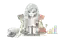
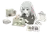
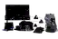
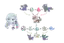

# KAFKA SIGNAL Site Basics v0.1.0

KAFKA2306の公開Pagesで使う、サイト別の基本イラスト素材です。

各画像は共通のKAFKA SIGNAL identityを維持しながら、各製品の中心タスクを示します。画像単体で判断、公式性、証拠、計算結果を表現してはいけません。必ずテキスト、データ、出典、操作要素を主としてください。

## 収録内容

| ID | 対象 | ファイル | 基本用途 |
|---|---|---|---|
| crewtrade-research | CrewTrade | [crewtrade-research.svg](assets/crewtrade-research.svg) | カタログ導入、空状態、研究テーマ案内 |
| bonus-comparison | bonus | [bonus-comparison.svg](assets/bonus-comparison.svg) | 比較導入、比較対象未選択状態 |
| boothitemmanager-catalogue | boothitemmanager | [boothitemmanager-catalogue.svg](assets/boothitemmanager-catalogue.svg) | 初回案内、空状態、来歴説明 |
| semiconductor-evidence | semiconductor-earnings-model | [semiconductor-evidence.svg](assets/semiconductor-evidence.svg) | サイト導入、証拠不足状態、方法論案内 |
| bodogenomikata2-rulebook | bodogenomikata2 | [bodogenomikata2-rulebook.svg](assets/bodogenomikata2-rulebook.svg) | ルール検索導入、ゲーム未選択、証拠不足 |
| investor-risk-review | investor | [investor-risk-review.svg](assets/investor-risk-review.svg) | research queue導入、空状態、release note |
| investor2-hypothesis-lifecycle | investor2 | [investor2-hypothesis-lifecycle.svg](assets/investor2-hypothesis-lifecycle.svg) | 仮説ライフサイクル導入、仮説未選択 |
| travel-wayweave | travel | [travel-wayweave.svg](assets/travel-wayweave.svg) | Wayweave導入、保存旅程なし、季節特集 |
| anime-year-browser | anime | [anime-year-browser.svg](assets/anime-year-browser.svg) | 年別ブラウザ導入、履歴なし、検索結果なし |
| vrc-event-tonight | vrc_cast_event_calender | [vrc-event-tonight.svg](assets/vrc-event-tonight.svg) | 今夜のイベント導入、イベントなし、初回案内 |
| pal-atlas-breeding | pal-atlas | [pal-atlas-breeding.svg](assets/pal-atlas-breeding.svg) | 配合案内、保存レシピなし、検索導入 |

## 保管形式

保管版は64×43の自己完結SVGインデックスプレビュー（内部に透過WebPを埋め込み）です。これは資産の識別、一覧表示、再生成参照専用であり、通常のサイト表示には使用しません。実装時は`manifest.json`の生成プロンプトと元PNG SHA-256を参照して高解像度版を再生成または派生生成します。

各SVGは外部画像やCDNに依存せず、そのままブラウザで表示できます。SVG内部の`data:image/webp;base64,...`を取り出せば、埋め込みWebPも復元できます。

## 共通キャラクター契約

カフカは次の特徴を正準とします。

- 長いライトブルーの髪
- 毛先へ向かうラベンダーのグラデーション
- ブルーバイオレットの瞳
- 小さな銀色の三角形キャットヘアピン
- 右側の三つ編み
- 三つ編みを結ぶ黒いリボン
- 静かで思慮深い表情
- 子どもっぽい誇張、過剰な可愛さ、権威を演じる表情を避ける

Apache Kafka、既存アニメ、ゲーム、企業キャラクターと混同させません。

## 利用原則

### 使用可能

- ページ導入
- 初回オンボーディング
- 空状態
- 方法論やデータ構造の説明
- release note
- 季節特集や編集表紙

### 制限または禁止

- 金融数値、投資判断、注文、リスク警告の権威として使用しない
- 公式ルール、イベント主催者、販売者、旅行公式機関の代弁者として使用しない
- 商品写真、公式写真、ポスター画像、ゲーム画像へ重ねない
- キャラクター、色、アイコンだけで状態や意味を伝えない
- 主要CTAや警告を装飾画像へ埋め込まない
- 画像内の英字や記号を正本データとして読ませない

## 個別素材

### CrewTrade

- ID: `crewtrade-research`
- SHA-256: `2763f489e69606a0e96b91a1f7b71ff62f803a2e7b374b505031e81a610e83a0`
- 用途: 研究カタログ導入、証拠不足の空状態
- 禁止: 財務指標や研究結論の根拠として表示

### bonus

- ID: `bonus-comparison`
- SHA-256: `006a6709579835eb9e9f822897587a64539ce9a68b168a696c25eb8a0f6f7e56`
- 用途: 比較対象を選ぶ導入、比較未開始状態
- 禁止: 推定額の信頼性をキャラクターや天秤で保証

### boothitemmanager

- ID: `boothitemmanager-catalogue`
- SHA-256: `e2cc039b5eb9f45d65466da504221e8153f9b882e160b3e648cecd2149cc02aa`
- 用途: 商品整理、比較、来歴説明
- 禁止: 実在商品、ブランド、販売者の代替画像

### semiconductor-earnings-model

- ID: `semiconductor-evidence`
- SHA-256: `26e6650a97dad3192788fdb9f9550dc80320f0115c7eec17327516095019b8d5`
- 用途: 証拠中心の調査導入、方法論説明
- 禁止: 実績、ガイダンス、コンセンサス、推計の区別を画像へ依存

### bodogenomikata2

- ID: `bodogenomikata2-rulebook`
- SHA-256: `0eaf84b3dc3d3dba4f58940929e769a55c81c731688f0a2830fe9bfa5290674c`
- 用途: ルール検索導入、証拠不足、ゲーム未選択
- 禁止: 公式裁定の話者または出典として使用

### investor

- ID: `investor-risk-review`
- SHA-256: `1d0eac5fc05112a72a27bc9a49571612ee8856d5d53e48e8857b59aef0f60f16`
- 用途: research queue導入、証拠確認の空状態
- 禁止: パフォーマンス、リスク、注文、kill switchの近くで使用

### investor2

- ID: `investor2-hypothesis-lifecycle`
- SHA-256: `af96c704a3ec4a4302023ad0e8f471d9118600ac8dbc56ed35c57900cd1bf436`
- 用途: 仮説、実験、OOS、判定の流れを説明
- 禁止: promote、freeze、rejectをキャラクターの感情で示す

### travel

- ID: `travel-wayweave`
- SHA-256: `8db2b65d3339b2ed4e51c6b040f744fe7c73b9fb056a5f781c63e9b3cb7fa3f4`
- 用途: Wayweave導入、保存旅程なし、季節特集
- 禁止: 公式観光写真の代替、公式機関の推奨表現

### anime

- ID: `anime-year-browser`
- SHA-256: `0aa4d251c4b24e124fd692504982004509c2c01fd2660a6e47d931ee9c11dacb`
- 用途: 年別ブラウザ導入、履歴なし、検索結果なし
- 禁止: 実在作品ポスターやキャラクターの代替、模倣

### vrc_cast_event_calender

- ID: `vrc-event-tonight`
- SHA-256: `39b590417290e4cb97bf06c8662baf085c7cbc9f9e8d3652868fd5b2b34abf5f`
- 用途: 今夜のイベント導入、イベントなし、初回案内
- 禁止: 主催者、公式告知、参加方法の代弁

### pal-atlas

- ID: `pal-atlas-breeding`
- SHA-256: `e30e181d38c08cba6eb7dff4aee77098c6f01b885cd491b3a5234cf5344a9905`
- 用途: 配合導入、保存レシピなし、探索説明
- 禁止: Palworld、Pokémon、その他既存ゲームIPの公式・模倣キャラクターとして使用

## 状態

この初版は生成素材の来歴・プロンプト・用途を保管する`draft-reviewed`です。64×43プレビューは本番表示用ではありません。利用時には各サイトの背景色、実寸、クロップ、埋め込み文字、視認性を画面上で再確認し、高解像度版を再生成または修正します。

関連Issue: [prompt-vault #15](https://github.com/KAFKA2306/prompt-vault/issues/15)
