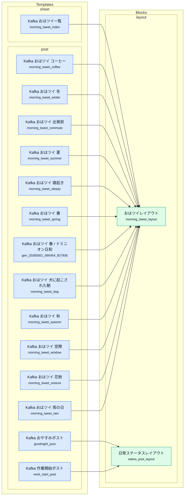
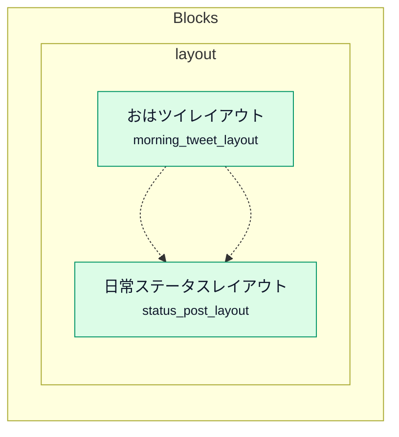

# Prompt Vault DB Graph

複数の視点を順番に並べた静的グラフ。まず全体、次に用途別、最後に焦点ビューを見る。

## Overview
- Prompt Vault DB Graph

### Template Composition

```mermaid
flowchart LR
  classDef template fill:#dbeafe,stroke:#2563eb,color:#0f172a,stroke-width:1px;
  classDef block fill:#dcfce7,stroke:#059669,color:#0f172a,stroke-width:1px;
  subgraph templates["Templates"]
    direction TB
    subgraph family_01["sheet"]
      direction TB
      t_generated_tweet_backed_ai_imagegen_meeting_20260504["AI Imagegen Meeting<br/><small>generated_tweet_backed_ai_imagegen_meeting_20260504</small>"]:::template
      t_generated_tweet_backed_creator_workflow_desk_20260504["Creator Workflow Desk<br/><small>generated_tweet_backed_creator_workflow_desk_20260504</small>"]:::template
      t_generated_tweet_backed_doha_airport_oasis_20260505["Doha Airport The Orchard<br/><small>generated_tweet_backed_doha_airport_oasis_20260505</small>"]:::template
      t_generated_artifact_fischen_bgg_strategy_sheet_20260505["Fischen BGG Strategy Sheet<br/><small>generated_artifact_fischen_bgg_strategy_sheet_20260505</small>"]:::template
      t_generated_artifact_hermes_agent_reference_20260505["Hermes Agent Reference<br/><small>generated_artifact_hermes_agent_reference_20260505</small>"]:::template
      t_generated_artifact_kafka_monogatari_poster_20260505["Kafka Monogatari Poster<br/><small>generated_artifact_kafka_monogatari_poster_20260505</small>"]:::template
      t_generated_artifact_kafka_morning_soft_light_20260505["Kafka Morning Soft Light<br/><small>generated_artifact_kafka_morning_soft_light_20260505</small>"]:::template
      t_trpg_character_sheet["Kafka TRPGキャラシート<br/><small>trpg_character_sheet</small>"]:::template
      t_vrchat_outfit_creation_sheet["Kafka VRChat衣装制作シート<br/><small>vrchat_outfit_creation_sheet</small>"]:::template
      t_morning_tweet_index["Kafka おはツイ一覧<br/><small>morning_tweet_index</small>"]:::template
      t_character_design_sheet["Kafka キャラデザインシート<br/><small>character_design_sheet</small>"]:::template
      t_timeline_sheet["Kafka タイムライン<br/><small>timeline_sheet</small>"]:::template
      t_checklist_sheet["Kafka チェックリスト<br/><small>checklist_sheet</small>"]:::template
      t_tweet_backed_imagegen_index["Kafka ツイート根拠イメージ一覧<br/><small>tweet_backed_imagegen_index</small>"]:::template
      t_tweet_backed_prompt_index["Kafka ツイート根拠プロンプト一覧<br/><small>tweet_backed_prompt_index</small>"]:::template
      t_before_after_sheet["Kafka ビフォーアフター<br/><small>before_after_sheet</small>"]:::template
      t_moodboard_sheet["Kafka ムードボード<br/><small>moodboard_sheet</small>"]:::template
      t_persona_poster["Kafka 人格ポスター<br/><small>persona_poster</small>"]:::template
      t_persona_sheet["Kafka 人格固定カード<br/><small>persona_sheet</small>"]:::template
      t_decision_tree_sheet["Kafka 分岐フロー<br/><small>decision_tree_sheet</small>"]:::template
      t_splendor_outfit_sheet["Kafka 宝石の煌き衣装シート<br/><small>splendor_outfit_sheet</small>"]:::template
      t_archive_contact_sheet["Kafka 成果物一覧<br/><small>archive_contact_sheet</small>"]:::template
      t_archive_index["Kafka 成果物回収カード<br/><small>archive_index</small>"]:::template
      t_comparison_sheet["Kafka 比較カード<br/><small>comparison_sheet</small>"]:::template
      t_kafka_outfit_exploration_sheet["Kafka 衣装比較シート<br/><small>kafka_outfit_exploration_sheet</small>"]:::template
      t_memory_note_board["Kafka 記憶メモボード<br/><small>memory_note_board</small>"]:::template
      t_summary_sheet["Kafka 配信後まとめカード<br/><small>summary_sheet</small>"]:::template
      t_poststream_review_board["Kafka 配信後レビュー盤<br/><small>poststream_review_board</small>"]:::template
      t_generated_artifact_life_portfolio_overview_20260505["Life Portfolio Overview<br/><small>generated_artifact_life_portfolio_overview_20260505</small>"]:::template
      t_generated_artifact_prompt_vault_update_guide_20260505["Prompt Vault Update Guide<br/><small>generated_artifact_prompt_vault_update_guide_20260505</small>"]:::template
      t_generated_artifact_rsi_overview_20260505["RSI Overview<br/><small>generated_artifact_rsi_overview_20260505</small>"]:::template
      t_generated_artifact_rendering_quality_check_20260505["Rendering Quality Check<br/><small>generated_artifact_rendering_quality_check_20260505</small>"]:::template
      t_generated_artifact_singularity_resilience_overview_20260505["Singularity Resilience Overview<br/><small>generated_artifact_singularity_resilience_overview_20260505</small>"]:::template
      t_generated_artifact_tax_truth_sheet_20260505["Tax Truth Sheet<br/><small>generated_artifact_tax_truth_sheet_20260505</small>"]:::template
      t_generated_tweet_backed_vrchat_avatar_mod_workbench_20260504["VRChat Avatar Mod Workbench<br/><small>generated_tweet_backed_vrchat_avatar_mod_workbench_20260504</small>"]:::template
      t_generated_tweet_backed_vrchat_event_gathering_20260504["VRChat Event Gathering<br/><small>generated_tweet_backed_vrchat_event_gathering_20260504</small>"]:::template
      t_generated_tweet_backed_vrchat_world_exploration_20260504["VRChat World Exploration<br/><small>generated_tweet_backed_vrchat_world_exploration_20260504</small>"]:::template
      t_generated_artifact_work_norms_ai_sheet_20260505["Work Norms AI Sheet<br/><small>generated_artifact_work_norms_ai_sheet_20260505</small>"]:::template
      t_generated_artifact_tweetsdb_graph_notes_20260505["tweetsdb Graph Notes<br/><small>generated_artifact_tweetsdb_graph_notes_20260505</small>"]:::template
      t_shafuka_character_sheet["しゃふか キャラデザインシート<br/><small>shafuka_character_sheet</small>"]:::template
      t_miyu_character_sheet["みゆ キャラデザインシート<br/><small>miyu_character_sheet</small>"]:::template
      t_generated_gen_20260501_100128_125507["一覧対比カード<br/><small>generated_gen_20260501_100128_125507</small>"]:::template
      t_generated_gen_20260501_100713_847333["公開前点検<br/><small>generated_gen_20260501_100713_847333</small>"]:::template
      t_generated_gen_20260501_100144_822642["分岐案内<br/><small>generated_gen_20260501_100144_822642</small>"]:::template
      t_generated_gen_20260501_100137_684091["崩れの時系列<br/><small>generated_gen_20260501_100137_684091</small>"]:::template
      t_generated_gen_20260501_100447_145315["崩れの経緯<br/><small>generated_gen_20260501_100447_145315</small>"]:::template
      t_generated_gen_20260501_100454_860314["淡色サンプル<br/><small>generated_gen_20260501_100454_860314</small>"]:::template
      t_tax_investment_truth_sheet["税の真実比較シート<br/><small>tax_investment_truth_sheet</small>"]:::template
      t_generated_gen_20260501_095825_409023["見比べカード<br/><small>generated_gen_20260501_095825_409023</small>"]:::template
      t_generated_gen_20260501_100157_839919["非スタンプ案<br/><small>generated_gen_20260501_100157_839919</small>"]:::template
    end
    subgraph family_02["post"]
      direction TB
      t_joinwars_post["Kafka JoinWars投稿<br/><small>joinwars_post</small>"]:::template
      t_morning_tweet_coffee["Kafka おはツイ コーヒー<br/><small>morning_tweet_coffee</small>"]:::template
      t_morning_tweet_winter["Kafka おはツイ 冬<br/><small>morning_tweet_winter</small>"]:::template
      t_morning_tweet_commute["Kafka おはツイ 出発前<br/><small>morning_tweet_commute</small>"]:::template
      t_morning_tweet_summer["Kafka おはツイ 夏<br/><small>morning_tweet_summer</small>"]:::template
      t_morning_tweet_sleepy["Kafka おはツイ 寝起き<br/><small>morning_tweet_sleepy</small>"]:::template
      t_morning_tweet_spring["Kafka おはツイ 春<br/><small>morning_tweet_spring</small>"]:::template
      t_gen_20260501_090454_827936["Kafka おはツイ 春 / ドミニオン日和<br/><small>gen_20260501_090454_827936</small>"]:::template
      t_morning_tweet_dog["Kafka おはツイ 犬に起こされた朝<br/><small>morning_tweet_dog</small>"]:::template
      t_morning_tweet_autumn["Kafka おはツイ 秋<br/><small>morning_tweet_autumn</small>"]:::template
      t_morning_tweet_window["Kafka おはツイ 窓際<br/><small>morning_tweet_window</small>"]:::template
      t_morning_tweet_sneeze["Kafka おはツイ 花粉<br/><small>morning_tweet_sneeze</small>"]:::template
      t_morning_tweet_rain["Kafka おはツイ 雨の日<br/><small>morning_tweet_rain</small>"]:::template
      t_goodnight_post["Kafka おやすみポスト<br/><small>goodnight_post</small>"]:::template
      t_trio_vacation_dining["Kafka しゃふか みゆ バカンス食事<br/><small>trio_vacation_dining</small>"]:::template
      t_cardgame_post["Kafka カードゲーム投稿<br/><small>cardgame_post</small>"]:::template
      t_gaming_post["Kafka ゲーム遊びシーン<br/><small>gaming_post</small>"]:::template
      t_cosplay_post["Kafka コスプレ投稿<br/><small>cosplay_post</small>"]:::template
      t_germany_expat_aruaru_post["Kafka ドイツ生活あるある<br/><small>germany_expat_aruaru_post</small>"]:::template
      t_germany_expat_daily_post["Kafka ドイツ生活あるある 日常編<br/><small>germany_expat_daily_post</small>"]:::template
      t_poker_post["Kafka ポーカー投稿<br/><small>poker_post</small>"]:::template
      t_travel_venice_post["Kafka ヴェネツィア旅行<br/><small>travel_venice_post</small>"]:::template
      t_travel_kyoto_post["Kafka 京都旅行<br/><small>travel_kyoto_post</small>"]:::template
      t_work_start_post["Kafka 作業開始ポスト<br/><small>work_start_post</small>"]:::template
      t_travel_hokkaido_post["Kafka 北海道旅行<br/><small>travel_hokkaido_post</small>"]:::template
      t_travel_tokyo_post["Kafka 東京旅行<br/><small>travel_tokyo_post</small>"]:::template
      t_travel_okinawa_post["Kafka 沖縄旅行<br/><small>travel_okinawa_post</small>"]:::template
      t_reading_post_seaside["Kafka 海辺の読書投稿<br/><small>reading_post_seaside</small>"]:::template
      t_reading_post_general["Kafka 読書投稿<br/><small>reading_post_general</small>"]:::template
      t_reading_post_anne["Kafka 赤毛のアン読書投稿<br/><small>reading_post_anne</small>"]:::template
      t_kansai_hanami_post["Kafka 関西お花見めぐり<br/><small>kansai_hanami_post</small>"]:::template
      t_kansai_hanami_route_post["Kafka 関西お花見ルート<br/><small>kansai_hanami_route_post</small>"]:::template
      t_gen_20260501_085644_421588["ロシア鉄道・ボドゲ実演ポスト<br/><small>gen_20260501_085644_421588</small>"]:::template
    end
    subgraph family_03["reply"]
      direction TB
      t_generated_gen_20260501_092726_250951["KAFKA ごはんスタンプ<br/><small>generated_gen_20260501_092726_250951</small>"]:::template
      t_stamp_sheet["Kafka スタンプ<br/><small>stamp_sheet</small>"]:::template
      t_reaction_image["Kafka 反応画像<br/><small>reaction_image</small>"]:::template
      t_reply_stamp_sheet["Kafka 返信スタンプ（一覧）<br/><small>reply_stamp_sheet</small>"]:::template
      t_sound_strong_reaction["Kafka 音が強い<br/><small>sound_strong_reaction</small>"]:::template
      t_generated_gen_20260501_093234_339628["もぐもぐカフカ<br/><small>generated_gen_20260501_093234_339628</small>"]:::template
      t_generated_gen_20260501_093426_180104["コメント返し<br/><small>generated_gen_20260501_093426_180104</small>"]:::template
      t_generated_gen_20260501_093534_246196["コメント返し<br/><small>generated_gen_20260501_093534_246196</small>"]:::template
      t_generated_gen_20260501_093426_682458["ドミニオン対戦<br/><small>generated_gen_20260501_093426_682458</small>"]:::template
      t_generated_gen_20260501_093726_505516["作業開始<br/><small>generated_gen_20260501_093726_505516</small>"]:::template
      t_generated_gen_20260501_093750_437816["勝利の一瞬<br/><small>generated_gen_20260501_093750_437816</small>"]:::template
      t_generated_gen_20260501_093722_155749["指差し説明<br/><small>generated_gen_20260501_093722_155749</small>"]:::template
      t_generated_gen_20260501_093428_144020["朝ごはんタイム<br/><small>generated_gen_20260501_093428_144020</small>"]:::template
      t_generated_gen_20260501_095318_007639["比較カード<br/><small>generated_gen_20260501_095318_007639</small>"]:::template
      t_generated_gen_20260501_093735_282597["読書のひととき<br/><small>generated_gen_20260501_093735_282597</small>"]:::template
      t_generated_gen_20260501_094000_869940["返信ぎゅっ<br/><small>generated_gen_20260501_094000_869940</small>"]:::template
    end
    subgraph family_04["banner"]
      direction TB
      t_topic_redirect_banner["Kafka 話題切り替えバナー<br/><small>topic_redirect_banner</small>"]:::template
      t_announcement_thumbnail["Kafka 配信告知サムネイル<br/><small>announcement_thumbnail</small>"]:::template
      t_stream_start_banner["Kafka 配信開始バナー<br/><small>stream_start_banner</small>"]:::template
      t_gen_20260501_090151_919050["ドミニオン・ルール紹介ガイド<br/><small>gen_20260501_090151_919050</small>"]:::template
      t_gen_20260501_090149_072100["ロシア鉄道・ボドゲ解説ガイド<br/><small>gen_20260501_090149_072100</small>"]:::template
    end
    subgraph family_05["brand"]
      direction TB
      t_icon_mark_sheet["Kafka アイコンデザイン<br/><small>icon_mark_sheet</small>"]:::template
      t_frame_sheet["Kafka フレームデザイン<br/><small>frame_sheet</small>"]:::template
      t_logo_only_sheet["Kafka ロゴデザイン<br/><small>logo_only_sheet</small>"]:::template
      t_wordmark_sheet["Kafka ワードマークデザイン<br/><small>wordmark_sheet</small>"]:::template
      t_orbit_logo_sheet["Kafka 宇宙ロゴデザイン<br/><small>orbit_logo_sheet</small>"]:::template
    end
    subgraph family_06["comic"]
      direction TB
      t_twitter_comic["Kafka Twitter再調査漫画<br/><small>twitter_comic</small>"]:::template
      t_splendor_play_comic["Kafka 宝石の煌き漫画<br/><small>splendor_play_comic</small>"]:::template
      t_us_latest_concerns_news["Kafka 米国最新懸念ニュース<br/><small>us_latest_concerns_news</small>"]:::template
    end
    subgraph family_07["news"]
      direction TB
      t_us_april_stock_rally_news["4月の米国株ラリー漫画<br/><small>us_april_stock_rally_news</small>"]:::template
      t_boj_press_news_card["日銀 植田総裁 記者会見漫画<br/><small>boj_press_news_card</small>"]:::template
    end
    subgraph family_08["system"]
      direction TB
      t_comment_reply_guide["Kafka コメント返しガイド<br/><small>comment_reply_guide</small>"]:::template
      t_ai_tuber_core_pack["Kafka 起動カード<br/><small>ai_tuber_core_pack</small>"]:::template
    end
  end
  subgraph blocks["Blocks"]
    direction TB
    subgraph fam_01["scene"]
      direction TB
      b_vacation_dining_trio_scene["3人バカンス食事<br/><small>vacation_dining_trio_scene</small>"]:::block
      b_joinwars_scene_kafka["JoinWars背景<br/><small>joinwars_scene_kafka</small>"]:::block
      b_goodnight_scene_kafka["おやすみ背景<br/><small>goodnight_scene_kafka</small>"]:::block
      b_gaming_scene_kafka["ゲーム遊び背景<br/><small>gaming_scene_kafka</small>"]:::block
      b_cosplay_scene_kafka["コスプレ撮影背景<br/><small>cosplay_scene_kafka</small>"]:::block
      b_germany_expat_daily_scene["ドイツの日常<br/><small>germany_expat_daily_scene</small>"]:::block
      b_germany_expat_scene["ドイツの街角<br/><small>germany_expat_scene</small>"]:::block
      b_fantasy_card_game_scene_kafka["ファンタジーカード盤面<br/><small>fantasy_card_game_scene_kafka</small>"]:::block
      b_poker_table_scene_kafka["ポーカーテーブル背景<br/><small>poker_table_scene_kafka</small>"]:::block
      b_travel_bg_venice["ヴェネツィアの風景<br/><small>travel_bg_venice</small>"]:::block
      b_travel_bg_kyoto["京都の風景<br/><small>travel_bg_kyoto</small>"]:::block
      b_work_start_scene_kafka["作業開始背景<br/><small>work_start_scene_kafka</small>"]:::block
      b_morning_background_winter_kafka["冬朝背景<br/><small>morning_background_winter_kafka</small>"]:::block
      b_morning_scene_commute_kafka["出発前の朝背景<br/><small>morning_scene_commute_kafka</small>"]:::block
      b_travel_bg_hokkaido["北海道の風景<br/><small>travel_bg_hokkaido</small>"]:::block
      b_morning_background_summer_kafka["夏朝背景<br/><small>morning_background_summer_kafka</small>"]:::block
      b_splendor_game_scene_kafka["宝石の煌き対戦背景<br/><small>splendor_game_scene_kafka</small>"]:::block
      b_morning_scene_sleepy_kafka["寝起きの朝背景<br/><small>morning_scene_sleepy_kafka</small>"]:::block
      b_morning_background_spring_kafka["春朝背景<br/><small>morning_background_spring_kafka</small>"]:::block
      b_morning_scene_coffee_kafka["朝コーヒー背景<br/><small>morning_scene_coffee_kafka</small>"]:::block
      b_travel_bg_tokyo["東京の風景<br/><small>travel_bg_tokyo</small>"]:::block
      b_travel_bg_okinawa["沖縄の風景<br/><small>travel_bg_okinawa</small>"]:::block
      b_reading_scene_seaside_kafka["海辺の読書背景<br/><small>reading_scene_seaside_kafka</small>"]:::block
      b_morning_scene_dog_kafka["犬と朝の背景<br/><small>morning_scene_dog_kafka</small>"]:::block
      b_morning_background_autumn_kafka["秋朝背景<br/><small>morning_background_autumn_kafka</small>"]:::block
      b_morning_scene_window_kafka["窓際の朝背景<br/><small>morning_scene_window_kafka</small>"]:::block
      b_reading_scene_general_kafka["読書背景<br/><small>reading_scene_general_kafka</small>"]:::block
      b_reading_scene_anne_kafka["赤毛のアン読書背景<br/><small>reading_scene_anne_kafka</small>"]:::block
      b_kansai_hanami_route_scene["関西お花見ルート<br/><small>kansai_hanami_route_scene</small>"]:::block
      b_kansai_hanami_scene["関西のお花見<br/><small>kansai_hanami_scene</small>"]:::block
      b_morning_scene_rain_kafka["雨の日の朝背景<br/><small>morning_scene_rain_kafka</small>"]:::block
    end
    subgraph fam_02["layout"]
      direction TB
      b_sticker_sheet_layout["4x4 ステッカーシート<br/><small>sticker_sheet_layout</small>"]:::block
      b_joinwars_layout["JoinWars用レイアウト<br/><small>joinwars_layout</small>"]:::block
      b_character_sheet_kafka["Kafka キャラデザインシート<br/><small>character_sheet_kafka</small>"]:::block
      b_trpg_character_sheet_layout["TRPGキャラシート<br/><small>trpg_character_sheet_layout</small>"]:::block
      b_vrchat_outfit_sheet_layout["VRChat衣装シート<br/><small>vrchat_outfit_sheet_layout</small>"]:::block
      b_morning_tweet_layout["おはツイレイアウト<br/><small>morning_tweet_layout</small>"]:::block
      b_character_sheet_shafuka["しゃふか キャラデザインシート<br/><small>character_sheet_shafuka</small>"]:::block
      b_character_sheet_miyu["みゆ キャラデザインシート<br/><small>character_sheet_miyu</small>"]:::block
      b_archive_index_vlog["アーカイブ索引<br/><small>archive_index_vlog</small>"]:::block
      b_cardgame_post_layout["カードゲームレイアウト<br/><small>cardgame_post_layout</small>"]:::block
      b_gaming_post_layout["ゲーム投稿レイアウト<br/><small>gaming_post_layout</small>"]:::block
      b_cosplay_post_layout["コスプレレイアウト<br/><small>cosplay_post_layout</small>"]:::block
      b_persona_sheet_vlog["パーソナ設定シート<br/><small>persona_sheet_vlog</small>"]:::block
      b_poker_post_layout["ポーカーレイアウト<br/><small>poker_post_layout</small>"]:::block
      b_persona_poster_viz["人格ポスター<br/><small>persona_poster_viz</small>"]:::block
      b_splendor_outfit_sheet_layout["宝石の煌き衣装シート<br/><small>splendor_outfit_sheet_layout</small>"]:::block
      b_archive_contact_sheet_viz["成果物一覧（コンタクトシート）<br/><small>archive_contact_sheet_viz</small>"]:::block
      b_summary_sheet_vlog["振り返りサマリー<br/><small>summary_sheet_vlog</small>"]:::block
      b_status_post_layout["日常ステータスレイアウト<br/><small>status_post_layout</small>"]:::block
      b_comic_layout["漫画レイアウト<br/><small>comic_layout</small>"]:::block
      b_prompt_archive_sheet_vlog["生成台帳<br/><small>prompt_archive_sheet_vlog</small>"]:::block
      b_us_concerns_layout["米国最新懸念レイアウト<br/><small>us_concerns_layout</small>"]:::block
      b_market_rally_layout["米国株ラリーレイアウト<br/><small>market_rally_layout</small>"]:::block
      b_outfit_exploration_layout["衣装比較シート<br/><small>outfit_exploration_layout</small>"]:::block
      b_memory_note_board_viz["記憶メモ（記録用ボード）<br/><small>memory_note_board_viz</small>"]:::block
      b_topic_redirect_banner_viz["話題切り替え用バナー<br/><small>topic_redirect_banner_viz</small>"]:::block
      b_reading_post_layout["読書シーン用レイアウト<br/><small>reading_post_layout</small>"]:::block
      b_reply_stamp_sheet_viz["返信スタンプ（グリッド）<br/><small>reply_stamp_sheet_viz</small>"]:::block
      b_poststream_review_board_viz["配信振り返り（レビュー用）<br/><small>poststream_review_board_viz</small>"]:::block
      b_stream_start_banner_viz["配信開始バナー<br/><small>stream_start_banner_viz</small>"]:::block
    end
    subgraph fam_03["text"]
      direction TB
      b_joinwars_status_text_pack["JoinWars文言<br/><small>joinwars_status_text_pack</small>"]:::block
      b_trpg_status_text_pack["TRPGステータス文言<br/><small>trpg_status_text_pack</small>"]:::block
      b_morning_tweet_text_pack["おはツイ文言<br/><small>morning_tweet_text_pack</small>"]:::block
      b_card_game_status_text_pack["カードゲーム文言<br/><small>card_game_status_text_pack</small>"]:::block
      b_gaming_status_text_pack["ゲーム文言<br/><small>gaming_status_text_pack</small>"]:::block
      b_cosplay_status_text_pack["コスプレ文言<br/><small>cosplay_status_text_pack</small>"]:::block
      b_poker_status_text_pack["ポーカーポスト文言<br/><small>poker_status_text_pack</small>"]:::block
      b_announcement_text_pack["告知文言<br/><small>announcement_text_pack</small>"]:::block
      b_splendor_game_text_pack["宝石の煌きゲーム文言<br/><small>splendor_game_text_pack</small>"]:::block
      b_daily_status_text_pack["日常ステータス文言<br/><small>daily_status_text_pack</small>"]:::block
      b_text_style_jp["日本語文字<br/><small>text_style_jp</small>"]:::block
      b_morning_dog_text_pack["朝の犬文言<br/><small>morning_dog_text_pack</small>"]:::block
      b_morning_situation_text_pack["朝シチュエーション文言<br/><small>morning_situation_text_pack</small>"]:::block
      b_text_content_pack["短い日本語セリフ<br/><small>text_content_pack</small>"]:::block
      b_tax_truth_text_pack["税の真実文言<br/><small>tax_truth_text_pack</small>"]:::block
      b_reading_status_text_pack["読書文言<br/><small>reading_status_text_pack</small>"]:::block
    end
    subgraph fam_04["costume"]
      direction TB
      b_joinwars_style_kafka["JoinWars衣装<br/><small>joinwars_style_kafka</small>"]:::block
      b_vrchat_outfit_kafka["VRChat衣装<br/><small>vrchat_outfit_kafka</small>"]:::block
      b_cosplay_event_outfit_kafka["コスプレ衣装<br/><small>cosplay_event_outfit_kafka</small>"]:::block
      b_fantasy_card_game_style_kafka["ファンタジーカードゲーム衣装<br/><small>fantasy_card_game_style_kafka</small>"]:::block
      b_poker_dealer_style_kafka["ポーカーディーラー衣装<br/><small>poker_dealer_style_kafka</small>"]:::block
      b_seasonal_outfit_winter_kafka["冬衣装<br/><small>seasonal_outfit_winter_kafka</small>"]:::block
      b_seasonal_outfit_summer_kafka["夏衣装<br/><small>seasonal_outfit_summer_kafka</small>"]:::block
      b_splendor_outfit_kafka["宝石の煌き衣装<br/><small>splendor_outfit_kafka</small>"]:::block
      b_spring_fashion_kafka["春のお出かけ服<br/><small>spring_fashion_kafka</small>"]:::block
      b_seasonal_outfit_spring_kafka["春衣装<br/><small>seasonal_outfit_spring_kafka</small>"]:::block
      b_morning_home_outfit_kafka["朝の部屋着<br/><small>morning_home_outfit_kafka</small>"]:::block
      b_seasonal_outfit_autumn_kafka["秋衣装<br/><small>seasonal_outfit_autumn_kafka</small>"]:::block
      b_outfit_kafka["衣装<br/><small>outfit_kafka</small>"]:::block
      b_reading_outfit_kafka["読書衣装<br/><small>reading_outfit_kafka</small>"]:::block
    end
    subgraph fam_05["pose"]
      direction TB
      b_morning_pose_coffee_kafka["コーヒーおはツイ姿勢<br/><small>morning_pose_coffee_kafka</small>"]:::block
      b_morning_pose_winter_kafka["冬おはツイ姿勢<br/><small>morning_pose_winter_kafka</small>"]:::block
      b_morning_pose_commute_kafka["出発前おはツイ姿勢<br/><small>morning_pose_commute_kafka</small>"]:::block
      b_morning_pose_summer_kafka["夏おはツイ姿勢<br/><small>morning_pose_summer_kafka</small>"]:::block
      b_morning_pose_sleepy_kafka["寝起きおはツイ姿勢<br/><small>morning_pose_sleepy_kafka</small>"]:::block
      b_morning_pose_spring_kafka["春おはツイ姿勢<br/><small>morning_pose_spring_kafka</small>"]:::block
      b_morning_pose_dog_kafka["犬に起こされる姿勢<br/><small>morning_pose_dog_kafka</small>"]:::block
      b_morning_pose_autumn_kafka["秋おはツイ姿勢<br/><small>morning_pose_autumn_kafka</small>"]:::block
      b_morning_pose_window_kafka["窓際おはツイ姿勢<br/><small>morning_pose_window_kafka</small>"]:::block
      b_reading_pose_kafka["読書ポーズ<br/><small>reading_pose_kafka</small>"]:::block
      b_morning_pose_rain_kafka["雨の日おはツイ姿勢<br/><small>morning_pose_rain_kafka</small>"]:::block
    end
    subgraph fam_06["negative"]
      direction TB
      b_negative_layout["レイアウトネガティブ<br/><small>negative_layout</small>"]:::block
      b_negative_shadow["影ネガティブ<br/><small>negative_shadow</small>"]:::block
      b_negative_text["文字ネガティブ<br/><small>negative_text</small>"]:::block
      b_negative_artifact["生成物アーティファクトネガティブ<br/><small>negative_artifact</small>"]:::block
      b_negative_skin["肌ネガティブ<br/><small>negative_skin</small>"]:::block
      b_negative_color["色ネガティブ<br/><small>negative_color</small>"]:::block
      b_negative_anatomy["身体・構造ネガティブ<br/><small>negative_anatomy</small>"]:::block
    end
    subgraph fam_07["research"]
      direction TB
      b_rsi_source_research["RSI 再調査メモ<br/><small>rsi_source_research</small>"]:::block
      b_singularity_resilience_research["シンギュラリティ耐性メモ<br/><small>singularity_resilience_research</small>"]:::block
      b_life_portfolio_diagnosis_research["人生ポートフォリオ診断メモ<br/><small>life_portfolio_diagnosis_research</small>"]:::block
      b_source_research["再調査メモ<br/><small>source_research</small>"]:::block
      b_work_norms_ai_research["労働規範とAI再調査<br/><small>work_norms_ai_research</small>"]:::block
      b_finance_source_research["金融ニュース再調査<br/><small>finance_source_research</small>"]:::block
    end
    subgraph fam_08["structure"]
      direction TB
      b_timeline_layout["タイムライン<br/><small>timeline_layout</small>"]:::block
      b_checklist_layout["チェックリスト<br/><small>checklist_layout</small>"]:::block
      b_before_after_layout["ビフォーアフター<br/><small>before_after_layout</small>"]:::block
      b_decision_tree_layout["分岐フロー<br/><small>decision_tree_layout</small>"]:::block
      b_comparison_layout["比較カード<br/><small>comparison_layout</small>"]:::block
      b_tax_truth_layout["税の真実レイアウト<br/><small>tax_truth_layout</small>"]:::block
    end
    subgraph fam_09["brand"]
      direction TB
      b_icon_mark_only_kafka["アイコン単独<br/><small>icon_mark_only_kafka</small>"]:::block
      b_frame_only_kafka["フレーム単独<br/><small>frame_only_kafka</small>"]:::block
      b_logo_only_kafka["ロゴ単独<br/><small>logo_only_kafka</small>"]:::block
      b_logo_orbit_kafka["宇宙ロゴ単独<br/><small>logo_orbit_kafka</small>"]:::block
      b_wordmark_only_kafka["文字ロゴ単独<br/><small>wordmark_only_kafka</small>"]:::block
    end
    subgraph fam_10["news"]
      direction TB
      b_news_card_layout["ニュースカード<br/><small>news_card_layout</small>"]:::block
      b_news_comic_layout["ニュース漫画レイアウト<br/><small>news_comic_layout</small>"]:::block
      b_comic_panels["漫画コマ構成<br/><small>comic_panels</small>"]:::block
      b_us_concerns_panels["米国最新懸念のコマ文<br/><small>us_concerns_panels</small>"]:::block
      b_market_rally_panels["米国株ラリーのコマ文<br/><small>market_rally_panels</small>"]:::block
    end
    subgraph fam_11["character"]
      direction TB
      b_character_kafka["KAFKA<br/><small>character_kafka</small>"]:::block
      b_kafka_identity_lock["Kafka identity lock<br/><small>kafka_identity_lock</small>"]:::block
      b_character_shafuka["しゃふか<br/><small>character_shafuka</small>"]:::block
      b_character_miyu["みゆ<br/><small>character_miyu</small>"]:::block
    end
    subgraph fam_12["expression"]
      direction TB
      b_expressions_pack["反応集<br/><small>expressions_pack</small>"]:::block
      b_reaction_focus["表情強調<br/><small>reaction_focus</small>"]:::block
    end
    subgraph fam_13["logging"]
      direction TB
      b_review_record_pack["レビュー記録<br/><small>review_record_pack</small>"]:::block
      b_research_log_pack["振り返りログ<br/><small>research_log_pack</small>"]:::block
    end
    subgraph fam_14["persona"]
      direction TB
      b_kafka_monogatari_pack["Kafka モノガタリ<br/><small>kafka_monogatari_pack</small>"]:::block
      b_persona_pack["自律人格<br/><small>persona_pack</small>"]:::block
    end
    subgraph fam_15["reply"]
      direction TB
      b_chat_reply_pack["コメント返し<br/><small>chat_reply_pack</small>"]:::block
      b_safe_reply_pack["話題切り替え<br/><small>safe_reply_pack</small>"]:::block
    end
    subgraph fam_16["safety"]
      direction TB
      b_moderation_pack["モデレーション<br/><small>moderation_pack</small>"]:::block
      b_negative_common["共通ネガティブ<br/><small>negative_common</small>"]:::block
    end
    subgraph fam_17["style"]
      direction TB
      b_clean_quality_rendering["クリーン品質レンダリング<br/><small>clean_quality_rendering</small>"]:::block
      b_rendering["レンダリング<br/><small>rendering</small>"]:::block
    end
    subgraph fam_18["audio"]
      direction TB
      b_voice_pipeline_pack["音声パイプライン<br/><small>voice_pipeline_pack</small>"]:::block
    end
    subgraph fam_19["avatar"]
      direction TB
      b_avatar_mode_pack["アバターモード<br/><small>avatar_mode_pack</small>"]:::block
    end
    subgraph fam_20["control"]
      direction TB
      b_control_panel_pack["操作パネル<br/><small>control_panel_pack</small>"]:::block
    end
    subgraph fam_21["core"]
      direction TB
      b_master_style["マスタースタイル<br/><small>master_style</small>"]:::block
    end
    subgraph fam_22["effects"]
      direction TB
      b_effects_pack["装飾効果<br/><small>effects_pack</small>"]:::block
    end
    subgraph fam_23["extension"]
      direction TB
      b_plugin_pack["外部連携<br/><small>plugin_pack</small>"]:::block
    end
    subgraph fam_24["memory"]
      direction TB
      b_memory_pack["記憶管理<br/><small>memory_pack</small>"]:::block
    end
    subgraph fam_25["mood"]
      direction TB
      b_moodboard_layout["ムードボード<br/><small>moodboard_layout</small>"]:::block
    end
    subgraph fam_26["signage"]
      direction TB
      b_demo_mode_pack["デモモード<br/><small>demo_mode_pack</small>"]:::block
    end
    subgraph fam_27["stream"]
      direction TB
      b_chat_platform_pack["配信チャット<br/><small>chat_platform_pack</small>"]:::block
    end
    subgraph fam_28["system"]
      direction TB
      b_local_offline_pack["ローカル優先<br/><small>local_offline_pack</small>"]:::block
    end
    subgraph fam_29["tone"]
      direction TB
      b_speech_mode_kafka["かふからしい発話モード<br/><small>speech_mode_kafka</small>"]:::block
    end
  end
  t_us_april_stock_rally_news --> b_finance_source_research
  t_us_april_stock_rally_news --> b_master_style
  t_us_april_stock_rally_news --> b_character_kafka
  t_us_april_stock_rally_news --> b_outfit_kafka
  t_us_april_stock_rally_news --> b_market_rally_layout
  t_us_april_stock_rally_news --> b_market_rally_panels
  t_us_april_stock_rally_news --> b_reaction_focus
  t_us_april_stock_rally_news --> b_expressions_pack
  t_us_april_stock_rally_news --> b_text_style_jp
  t_us_april_stock_rally_news --> b_effects_pack
  t_us_april_stock_rally_news --> b_negative_common
  t_generated_tweet_backed_ai_imagegen_meeting_20260504 --> b_master_style
  t_generated_tweet_backed_ai_imagegen_meeting_20260504 --> b_character_kafka
  t_generated_tweet_backed_ai_imagegen_meeting_20260504 --> b_kafka_identity_lock
  t_generated_tweet_backed_ai_imagegen_meeting_20260504 --> b_outfit_kafka
  t_generated_tweet_backed_ai_imagegen_meeting_20260504 --> b_clean_quality_rendering
  t_generated_tweet_backed_ai_imagegen_meeting_20260504 --> b_moodboard_layout
  t_generated_tweet_backed_ai_imagegen_meeting_20260504 --> b_text_style_jp
  t_generated_tweet_backed_ai_imagegen_meeting_20260504 --> b_negative_common
  t_generated_tweet_backed_creator_workflow_desk_20260504 --> b_master_style
  t_generated_tweet_backed_creator_workflow_desk_20260504 --> b_character_kafka
  t_generated_tweet_backed_creator_workflow_desk_20260504 --> b_kafka_identity_lock
  t_generated_tweet_backed_creator_workflow_desk_20260504 --> b_outfit_kafka
  t_generated_tweet_backed_creator_workflow_desk_20260504 --> b_clean_quality_rendering
  t_generated_tweet_backed_creator_workflow_desk_20260504 --> b_checklist_layout
  t_generated_tweet_backed_creator_workflow_desk_20260504 --> b_text_style_jp
  t_generated_tweet_backed_creator_workflow_desk_20260504 --> b_negative_common
  t_generated_tweet_backed_doha_airport_oasis_20260505 --> b_master_style
  t_generated_tweet_backed_doha_airport_oasis_20260505 --> b_character_kafka
  t_generated_tweet_backed_doha_airport_oasis_20260505 --> b_kafka_identity_lock
  t_generated_tweet_backed_doha_airport_oasis_20260505 --> b_outfit_kafka
  t_generated_tweet_backed_doha_airport_oasis_20260505 --> b_clean_quality_rendering
  t_generated_tweet_backed_doha_airport_oasis_20260505 --> b_moodboard_layout
  t_generated_tweet_backed_doha_airport_oasis_20260505 --> b_text_style_jp
  t_generated_tweet_backed_doha_airport_oasis_20260505 --> b_negative_common
  t_generated_artifact_fischen_bgg_strategy_sheet_20260505 --> b_master_style
  t_generated_artifact_fischen_bgg_strategy_sheet_20260505 --> b_character_kafka
  t_generated_artifact_fischen_bgg_strategy_sheet_20260505 --> b_review_record_pack
  t_generated_artifact_fischen_bgg_strategy_sheet_20260505 --> b_checklist_layout
  t_generated_artifact_fischen_bgg_strategy_sheet_20260505 --> b_text_style_jp
  t_generated_artifact_fischen_bgg_strategy_sheet_20260505 --> b_negative_common
  t_generated_artifact_hermes_agent_reference_20260505 --> b_master_style
  t_generated_artifact_hermes_agent_reference_20260505 --> b_character_kafka
  t_generated_artifact_hermes_agent_reference_20260505 --> b_archive_index_vlog
  t_generated_artifact_hermes_agent_reference_20260505 --> b_review_record_pack
  t_generated_artifact_hermes_agent_reference_20260505 --> b_moodboard_layout
  t_generated_artifact_hermes_agent_reference_20260505 --> b_text_style_jp
  t_generated_artifact_hermes_agent_reference_20260505 --> b_negative_common
  t_generated_gen_20260501_092726_250951 --> b_master_style
  t_generated_gen_20260501_092726_250951 --> b_character_kafka
  t_generated_gen_20260501_092726_250951 --> b_effects_pack
  t_generated_gen_20260501_092726_250951 --> b_negative_common
  t_generated_gen_20260501_092726_250951 --> b_morning_scene_coffee_kafka
  t_generated_gen_20260501_092726_250951 --> b_morning_scene_rain_kafka
  t_joinwars_post --> b_master_style
  t_joinwars_post --> b_character_kafka
  t_joinwars_post --> b_joinwars_layout
  t_joinwars_post --> b_joinwars_scene_kafka
  t_joinwars_post --> b_joinwars_style_kafka
  t_joinwars_post --> b_joinwars_status_text_pack
  t_joinwars_post --> b_text_style_jp
  t_joinwars_post --> b_negative_common
  t_generated_artifact_kafka_monogatari_poster_20260505 --> b_master_style
  t_generated_artifact_kafka_monogatari_poster_20260505 --> b_character_kafka
  t_generated_artifact_kafka_monogatari_poster_20260505 --> b_outfit_kafka
  t_generated_artifact_kafka_monogatari_poster_20260505 --> b_clean_quality_rendering
  t_generated_artifact_kafka_monogatari_poster_20260505 --> b_moodboard_layout
  t_generated_artifact_kafka_monogatari_poster_20260505 --> b_text_style_jp
  t_generated_artifact_kafka_monogatari_poster_20260505 --> b_negative_common
  t_generated_artifact_kafka_morning_soft_light_20260505 --> b_master_style
  t_generated_artifact_kafka_morning_soft_light_20260505 --> b_character_kafka
  t_generated_artifact_kafka_morning_soft_light_20260505 --> b_outfit_kafka
  t_generated_artifact_kafka_morning_soft_light_20260505 --> b_clean_quality_rendering
  t_generated_artifact_kafka_morning_soft_light_20260505 --> b_moodboard_layout
  t_generated_artifact_kafka_morning_soft_light_20260505 --> b_text_style_jp
  t_generated_artifact_kafka_morning_soft_light_20260505 --> b_negative_common
  t_trpg_character_sheet --> b_master_style
  t_trpg_character_sheet --> b_character_kafka
  t_trpg_character_sheet --> b_outfit_kafka
  t_trpg_character_sheet --> b_trpg_character_sheet_layout
  t_trpg_character_sheet --> b_trpg_status_text_pack
  t_trpg_character_sheet --> b_text_style_jp
  t_trpg_character_sheet --> b_negative_common
  t_twitter_comic --> b_source_research
  t_twitter_comic --> b_master_style
  t_twitter_comic --> b_character_kafka
  t_twitter_comic --> b_comic_layout
  t_twitter_comic --> b_reaction_focus
  t_twitter_comic --> b_text_style_jp
  t_twitter_comic --> b_text_content_pack
  t_twitter_comic --> b_effects_pack
  t_twitter_comic --> b_negative_common
  t_vrchat_outfit_creation_sheet --> b_master_style
  t_vrchat_outfit_creation_sheet --> b_character_kafka
  t_vrchat_outfit_creation_sheet --> b_kafka_identity_lock
  t_vrchat_outfit_creation_sheet --> b_vrchat_outfit_kafka
  t_vrchat_outfit_creation_sheet --> b_vrchat_outfit_sheet_layout
  t_vrchat_outfit_creation_sheet --> b_text_style_jp
  t_vrchat_outfit_creation_sheet --> b_negative_common
  t_morning_tweet_coffee --> b_master_style
  t_morning_tweet_coffee --> b_character_kafka
  t_morning_tweet_coffee --> b_outfit_kafka
  t_morning_tweet_coffee --> b_morning_pose_coffee_kafka
  t_morning_tweet_coffee --> b_morning_scene_coffee_kafka
  t_morning_tweet_coffee --> b_morning_tweet_layout
  t_morning_tweet_coffee --> b_morning_situation_text_pack
  t_morning_tweet_coffee --> b_text_style_jp
  t_morning_tweet_coffee --> b_negative_common
  t_morning_tweet_winter --> b_master_style
  t_morning_tweet_winter --> b_character_kafka
  t_morning_tweet_winter --> b_seasonal_outfit_winter_kafka
  t_morning_tweet_winter --> b_morning_pose_winter_kafka
  t_morning_tweet_winter --> b_morning_background_winter_kafka
  t_morning_tweet_winter --> b_morning_tweet_layout
  t_morning_tweet_winter --> b_morning_tweet_text_pack
  t_morning_tweet_winter --> b_text_style_jp
  t_morning_tweet_winter --> b_effects_pack
  t_morning_tweet_winter --> b_negative_common
  t_morning_tweet_commute --> b_master_style
  t_morning_tweet_commute --> b_character_kafka
  t_morning_tweet_commute --> b_outfit_kafka
  t_morning_tweet_commute --> b_morning_pose_commute_kafka
  t_morning_tweet_commute --> b_morning_scene_commute_kafka
  t_morning_tweet_commute --> b_morning_tweet_layout
  t_morning_tweet_commute --> b_morning_situation_text_pack
  t_morning_tweet_commute --> b_text_style_jp
  t_morning_tweet_commute --> b_negative_common
  t_morning_tweet_summer --> b_master_style
  t_morning_tweet_summer --> b_character_kafka
  t_morning_tweet_summer --> b_seasonal_outfit_summer_kafka
  t_morning_tweet_summer --> b_morning_pose_summer_kafka
  t_morning_tweet_summer --> b_morning_background_summer_kafka
  t_morning_tweet_summer --> b_morning_tweet_layout
  t_morning_tweet_summer --> b_morning_tweet_text_pack
  t_morning_tweet_summer --> b_text_style_jp
  t_morning_tweet_summer --> b_effects_pack
  t_morning_tweet_summer --> b_negative_common
  t_morning_tweet_sleepy --> b_master_style
  t_morning_tweet_sleepy --> b_character_kafka
  t_morning_tweet_sleepy --> b_outfit_kafka
  t_morning_tweet_sleepy --> b_morning_pose_sleepy_kafka
  t_morning_tweet_sleepy --> b_morning_scene_sleepy_kafka
  t_morning_tweet_sleepy --> b_morning_tweet_layout
  t_morning_tweet_sleepy --> b_morning_situation_text_pack
  t_morning_tweet_sleepy --> b_text_style_jp
  t_morning_tweet_sleepy --> b_negative_common
  t_morning_tweet_spring --> b_master_style
  t_morning_tweet_spring --> b_character_kafka
  t_morning_tweet_spring --> b_seasonal_outfit_spring_kafka
  t_morning_tweet_spring --> b_morning_pose_spring_kafka
  t_morning_tweet_spring --> b_morning_background_spring_kafka
  t_morning_tweet_spring --> b_morning_tweet_layout
  t_morning_tweet_spring --> b_morning_tweet_text_pack
  t_morning_tweet_spring --> b_text_style_jp
  t_morning_tweet_spring --> b_effects_pack
  t_morning_tweet_spring --> b_negative_common
  t_gen_20260501_090454_827936 --> b_master_style
  t_gen_20260501_090454_827936 --> b_character_kafka
  t_gen_20260501_090454_827936 --> b_seasonal_outfit_spring_kafka
  t_gen_20260501_090454_827936 --> b_morning_pose_spring_kafka
  t_gen_20260501_090454_827936 --> b_morning_background_spring_kafka
  t_gen_20260501_090454_827936 --> b_morning_tweet_layout
  t_gen_20260501_090454_827936 --> b_morning_tweet_text_pack
  t_gen_20260501_090454_827936 --> b_text_style_jp
  t_gen_20260501_090454_827936 --> b_effects_pack
  t_gen_20260501_090454_827936 --> b_negative_common
  t_morning_tweet_dog --> b_master_style
  t_morning_tweet_dog --> b_character_kafka
  t_morning_tweet_dog --> b_morning_home_outfit_kafka
  t_morning_tweet_dog --> b_morning_pose_dog_kafka
  t_morning_tweet_dog --> b_morning_scene_dog_kafka
  t_morning_tweet_dog --> b_morning_tweet_layout
  t_morning_tweet_dog --> b_morning_dog_text_pack
  t_morning_tweet_dog --> b_text_style_jp
  t_morning_tweet_dog --> b_effects_pack
  t_morning_tweet_dog --> b_negative_common
  t_morning_tweet_autumn --> b_master_style
  t_morning_tweet_autumn --> b_character_kafka
  t_morning_tweet_autumn --> b_seasonal_outfit_autumn_kafka
  t_morning_tweet_autumn --> b_morning_pose_autumn_kafka
  t_morning_tweet_autumn --> b_morning_background_autumn_kafka
  t_morning_tweet_autumn --> b_morning_tweet_layout
  t_morning_tweet_autumn --> b_morning_tweet_text_pack
  t_morning_tweet_autumn --> b_text_style_jp
  t_morning_tweet_autumn --> b_effects_pack
  t_morning_tweet_autumn --> b_negative_common
  t_morning_tweet_window --> b_master_style
  t_morning_tweet_window --> b_character_kafka
  t_morning_tweet_window --> b_outfit_kafka
  t_morning_tweet_window --> b_morning_pose_window_kafka
  t_morning_tweet_window --> b_morning_scene_window_kafka
  t_morning_tweet_window --> b_morning_tweet_layout
  t_morning_tweet_window --> b_morning_situation_text_pack
  t_morning_tweet_window --> b_text_style_jp
  t_morning_tweet_window --> b_negative_common
  t_morning_tweet_sneeze --> b_master_style
  t_morning_tweet_sneeze --> b_character_kafka
  t_morning_tweet_sneeze --> b_outfit_kafka
  t_morning_tweet_sneeze --> b_morning_tweet_layout
  t_morning_tweet_sneeze --> b_morning_situation_text_pack
  t_morning_tweet_sneeze --> b_morning_tweet_text_pack
  t_morning_tweet_sneeze --> b_reaction_focus
  t_morning_tweet_sneeze --> b_text_style_jp
  t_morning_tweet_sneeze --> b_effects_pack
  t_morning_tweet_sneeze --> b_negative_common
  t_morning_tweet_rain --> b_master_style
  t_morning_tweet_rain --> b_character_kafka
  t_morning_tweet_rain --> b_outfit_kafka
  t_morning_tweet_rain --> b_morning_pose_rain_kafka
  t_morning_tweet_rain --> b_morning_scene_rain_kafka
  t_morning_tweet_rain --> b_morning_tweet_layout
  t_morning_tweet_rain --> b_morning_situation_text_pack
  t_morning_tweet_rain --> b_text_style_jp
  t_morning_tweet_rain --> b_negative_common
  t_morning_tweet_index --> b_master_style
  t_morning_tweet_index --> b_character_kafka
  t_morning_tweet_index --> b_morning_tweet_layout
  t_morning_tweet_index --> b_morning_tweet_text_pack
  t_morning_tweet_index --> b_morning_situation_text_pack
  t_morning_tweet_index --> b_text_style_jp
  t_morning_tweet_index --> b_negative_common
  t_goodnight_post --> b_master_style
  t_goodnight_post --> b_character_kafka
  t_goodnight_post --> b_outfit_kafka
  t_goodnight_post --> b_goodnight_scene_kafka
  t_goodnight_post --> b_status_post_layout
  t_goodnight_post --> b_daily_status_text_pack
  t_goodnight_post --> b_text_style_jp
  t_goodnight_post --> b_negative_common
  t_trio_vacation_dining --> b_master_style
  t_trio_vacation_dining --> b_character_kafka
  t_trio_vacation_dining --> b_character_shafuka
  t_trio_vacation_dining --> b_character_miyu
  t_trio_vacation_dining --> b_vacation_dining_trio_scene
  t_trio_vacation_dining --> b_effects_pack
  t_trio_vacation_dining --> b_negative_common
  t_icon_mark_sheet --> b_master_style
  t_icon_mark_sheet --> b_icon_mark_only_kafka
  t_icon_mark_sheet --> b_negative_common
  t_cardgame_post --> b_master_style
  t_cardgame_post --> b_character_kafka
  t_cardgame_post --> b_cardgame_post_layout
  t_cardgame_post --> b_fantasy_card_game_scene_kafka
  t_cardgame_post --> b_fantasy_card_game_style_kafka
  t_cardgame_post --> b_card_game_status_text_pack
  t_cardgame_post --> b_text_style_jp
  t_cardgame_post --> b_negative_common
  t_character_design_sheet --> b_character_sheet_kafka
  t_character_design_sheet --> b_kafka_identity_lock
  t_gaming_post --> b_master_style
  t_gaming_post --> b_character_kafka
  t_gaming_post --> b_gaming_post_layout
  t_gaming_post --> b_gaming_scene_kafka
  t_gaming_post --> b_gaming_status_text_pack
  t_gaming_post --> b_text_style_jp
  t_gaming_post --> b_negative_common
  t_cosplay_post --> b_master_style
  t_cosplay_post --> b_character_kafka
  t_cosplay_post --> b_cosplay_post_layout
  t_cosplay_post --> b_cosplay_scene_kafka
  t_cosplay_post --> b_cosplay_event_outfit_kafka
  t_cosplay_post --> b_cosplay_status_text_pack
  t_cosplay_post --> b_text_style_jp
  t_cosplay_post --> b_negative_common
  t_comment_reply_guide --> b_master_style
  t_comment_reply_guide --> b_character_kafka
  t_comment_reply_guide --> b_chat_reply_pack
  t_comment_reply_guide --> b_speech_mode_kafka
  t_comment_reply_guide --> b_safe_reply_pack
  t_comment_reply_guide --> b_text_style_jp
  t_comment_reply_guide --> b_expressions_pack
  t_comment_reply_guide --> b_negative_common
  t_stamp_sheet --> b_master_style
  t_stamp_sheet --> b_character_kafka
  t_stamp_sheet --> b_outfit_kafka
  t_stamp_sheet --> b_sticker_sheet_layout
  t_stamp_sheet --> b_expressions_pack
  t_stamp_sheet --> b_text_style_jp
  t_stamp_sheet --> b_text_content_pack
  t_stamp_sheet --> b_effects_pack
  t_stamp_sheet --> b_negative_common
  t_timeline_sheet --> b_master_style
  t_timeline_sheet --> b_character_kafka
  t_timeline_sheet --> b_timeline_layout
  t_timeline_sheet --> b_text_style_jp
  t_timeline_sheet --> b_negative_common
  t_checklist_sheet --> b_master_style
  t_checklist_sheet --> b_character_kafka
  t_checklist_sheet --> b_checklist_layout
  t_checklist_sheet --> b_text_style_jp
  t_checklist_sheet --> b_negative_common
  t_tweet_backed_imagegen_index --> b_master_style
  t_tweet_backed_imagegen_index --> b_character_kafka
  t_tweet_backed_imagegen_index --> b_archive_index_vlog
  t_tweet_backed_imagegen_index --> b_prompt_archive_sheet_vlog
  t_tweet_backed_imagegen_index --> b_text_style_jp
  t_tweet_backed_imagegen_index --> b_negative_common
  t_tweet_backed_prompt_index --> b_master_style
  t_tweet_backed_prompt_index --> b_character_kafka
  t_tweet_backed_prompt_index --> b_archive_index_vlog
  t_tweet_backed_prompt_index --> b_prompt_archive_sheet_vlog
  t_tweet_backed_prompt_index --> b_text_style_jp
  t_tweet_backed_prompt_index --> b_negative_common
  t_germany_expat_aruaru_post --> b_master_style
  t_germany_expat_aruaru_post --> b_character_kafka
  t_germany_expat_aruaru_post --> b_outfit_kafka
  t_germany_expat_aruaru_post --> b_germany_expat_scene
  t_germany_expat_aruaru_post --> b_text_style_jp
  t_germany_expat_aruaru_post --> b_negative_common
  t_germany_expat_daily_post --> b_master_style
  t_germany_expat_daily_post --> b_character_kafka
  t_germany_expat_daily_post --> b_germany_expat_daily_scene
  t_germany_expat_daily_post --> b_text_style_jp
  t_germany_expat_daily_post --> b_negative_common
  t_before_after_sheet --> b_master_style
  t_before_after_sheet --> b_character_kafka
  t_before_after_sheet --> b_before_after_layout
  t_before_after_sheet --> b_text_style_jp
  t_before_after_sheet --> b_negative_common
  t_frame_sheet --> b_master_style
  t_frame_sheet --> b_frame_only_kafka
  t_frame_sheet --> b_negative_common
  t_poker_post --> b_master_style
  t_poker_post --> b_character_kafka
  t_poker_post --> b_poker_post_layout
  t_poker_post --> b_poker_table_scene_kafka
  t_poker_post --> b_poker_dealer_style_kafka
  t_poker_post --> b_poker_status_text_pack
  t_poker_post --> b_text_style_jp
  t_poker_post --> b_negative_common
  t_moodboard_sheet --> b_master_style
  t_moodboard_sheet --> b_character_kafka
  t_moodboard_sheet --> b_moodboard_layout
  t_moodboard_sheet --> b_text_style_jp
  t_moodboard_sheet --> b_negative_common
  t_logo_only_sheet --> b_master_style
  t_logo_only_sheet --> b_logo_only_kafka
  t_logo_only_sheet --> b_wordmark_only_kafka
  t_logo_only_sheet --> b_icon_mark_only_kafka
  t_logo_only_sheet --> b_negative_common
  t_wordmark_sheet --> b_master_style
  t_wordmark_sheet --> b_wordmark_only_kafka
  t_wordmark_sheet --> b_text_style_jp
  t_wordmark_sheet --> b_negative_common
  t_travel_venice_post --> b_master_style
  t_travel_venice_post --> b_character_kafka
  t_travel_venice_post --> b_outfit_kafka
  t_travel_venice_post --> b_travel_bg_venice
  t_travel_venice_post --> b_text_style_jp
  t_travel_venice_post --> b_negative_common
  t_travel_kyoto_post --> b_master_style
  t_travel_kyoto_post --> b_character_kafka
  t_travel_kyoto_post --> b_outfit_kafka
  t_travel_kyoto_post --> b_travel_bg_kyoto
  t_travel_kyoto_post --> b_text_style_jp
  t_travel_kyoto_post --> b_negative_common
  t_persona_poster --> b_master_style
  t_persona_poster --> b_character_kafka
  t_persona_poster --> b_outfit_kafka
  t_persona_poster --> b_persona_poster_viz
  t_persona_poster --> b_persona_pack
  t_persona_poster --> b_text_style_jp
  t_persona_poster --> b_negative_common
  t_persona_poster -.-> b_persona_poster_viz
  t_persona_poster -.-> b_persona_pack
  t_persona_poster -.-> b_text_style_jp
  t_persona_sheet --> b_master_style
  t_persona_sheet --> b_character_kafka
  t_persona_sheet --> b_persona_sheet_vlog
  t_persona_sheet --> b_persona_pack
  t_persona_sheet --> b_speech_mode_kafka
  t_persona_sheet --> b_text_style_jp
  t_persona_sheet --> b_negative_common
  t_work_start_post --> b_master_style
  t_work_start_post --> b_character_kafka
  t_work_start_post --> b_outfit_kafka
  t_work_start_post --> b_work_start_scene_kafka
  t_work_start_post --> b_status_post_layout
  t_work_start_post --> b_daily_status_text_pack
  t_work_start_post --> b_text_style_jp
  t_work_start_post --> b_negative_common
  t_decision_tree_sheet --> b_master_style
  t_decision_tree_sheet --> b_character_kafka
  t_decision_tree_sheet --> b_decision_tree_layout
  t_decision_tree_sheet --> b_text_style_jp
  t_decision_tree_sheet --> b_negative_common
  t_travel_hokkaido_post --> b_master_style
  t_travel_hokkaido_post --> b_character_kafka
  t_travel_hokkaido_post --> b_outfit_kafka
  t_travel_hokkaido_post --> b_travel_bg_hokkaido
  t_travel_hokkaido_post --> b_text_style_jp
  t_travel_hokkaido_post --> b_negative_common
  t_reaction_image --> b_master_style
  t_reaction_image --> b_character_kafka
  t_reaction_image --> b_outfit_kafka
  t_reaction_image --> b_reaction_focus
  t_reaction_image --> b_text_style_jp
  t_reaction_image --> b_text_content_pack
  t_reaction_image --> b_effects_pack
  t_reaction_image --> b_negative_common
  t_reaction_image -.-> b_reaction_focus
  t_reaction_image -.-> b_text_style_jp
  t_reaction_image -.-> b_text_content_pack
  t_reaction_image -.-> b_effects_pack
  t_orbit_logo_sheet --> b_master_style
  t_orbit_logo_sheet --> b_logo_orbit_kafka
  t_orbit_logo_sheet --> b_wordmark_only_kafka
  t_orbit_logo_sheet --> b_icon_mark_only_kafka
  t_orbit_logo_sheet --> b_negative_common
  t_splendor_play_comic --> b_master_style
  t_splendor_play_comic --> b_character_kafka
  t_splendor_play_comic --> b_comic_layout
  t_splendor_play_comic --> b_reaction_focus
  t_splendor_play_comic --> b_splendor_game_scene_kafka
  t_splendor_play_comic --> b_splendor_game_text_pack
  t_splendor_play_comic --> b_text_style_jp
  t_splendor_play_comic --> b_effects_pack
  t_splendor_play_comic --> b_negative_common
  t_splendor_outfit_sheet --> b_master_style
  t_splendor_outfit_sheet --> b_character_kafka
  t_splendor_outfit_sheet --> b_splendor_outfit_kafka
  t_splendor_outfit_sheet --> b_splendor_outfit_sheet_layout
  t_splendor_outfit_sheet --> b_text_style_jp
  t_splendor_outfit_sheet --> b_negative_common
  t_archive_contact_sheet --> b_master_style
  t_archive_contact_sheet --> b_character_kafka
  t_archive_contact_sheet --> b_archive_contact_sheet_viz
  t_archive_contact_sheet --> b_archive_index_vlog
  t_archive_contact_sheet --> b_prompt_archive_sheet_vlog
  t_archive_contact_sheet --> b_negative_common
  t_archive_contact_sheet -.-> b_archive_contact_sheet_viz
  t_archive_contact_sheet -.-> b_archive_index_vlog
  t_archive_contact_sheet -.-> b_prompt_archive_sheet_vlog
  t_archive_index --> b_master_style
  t_archive_index --> b_character_kafka
  t_archive_index --> b_archive_index_vlog
  t_archive_index --> b_prompt_archive_sheet_vlog
  t_archive_index --> b_speech_mode_kafka
  t_archive_index --> b_negative_common
  t_travel_tokyo_post --> b_master_style
  t_travel_tokyo_post --> b_character_kafka
  t_travel_tokyo_post --> b_outfit_kafka
  t_travel_tokyo_post --> b_travel_bg_tokyo
  t_travel_tokyo_post --> b_text_style_jp
  t_travel_tokyo_post --> b_negative_common
  t_comparison_sheet --> b_master_style
  t_comparison_sheet --> b_character_kafka
  t_comparison_sheet --> b_comparison_layout
  t_comparison_sheet --> b_text_style_jp
  t_comparison_sheet --> b_negative_common
  t_travel_okinawa_post --> b_master_style
  t_travel_okinawa_post --> b_character_kafka
  t_travel_okinawa_post --> b_outfit_kafka
  t_travel_okinawa_post --> b_travel_bg_okinawa
  t_travel_okinawa_post --> b_text_style_jp
  t_travel_okinawa_post --> b_negative_common
  t_reading_post_seaside --> b_master_style
  t_reading_post_seaside --> b_character_kafka
  t_reading_post_seaside --> b_reading_post_layout
  t_reading_post_seaside --> b_reading_scene_seaside_kafka
  t_reading_post_seaside --> b_reading_pose_kafka
  t_reading_post_seaside --> b_reading_outfit_kafka
  t_reading_post_seaside --> b_reading_status_text_pack
  t_reading_post_seaside --> b_text_style_jp
  t_reading_post_seaside --> b_negative_common
  t_us_latest_concerns_news --> b_source_research
  t_us_latest_concerns_news --> b_master_style
  t_us_latest_concerns_news --> b_character_kafka
  t_us_latest_concerns_news --> b_us_concerns_layout
  t_us_latest_concerns_news --> b_us_concerns_panels
  t_us_latest_concerns_news --> b_reaction_focus
  t_us_latest_concerns_news --> b_text_style_jp
  t_us_latest_concerns_news --> b_rendering
  t_us_latest_concerns_news --> b_effects_pack
  t_us_latest_concerns_news --> b_negative_common
  t_kafka_outfit_exploration_sheet --> b_master_style
  t_kafka_outfit_exploration_sheet --> b_character_kafka
  t_kafka_outfit_exploration_sheet --> b_kafka_identity_lock
  t_kafka_outfit_exploration_sheet --> b_outfit_kafka
  t_kafka_outfit_exploration_sheet --> b_outfit_exploration_layout
  t_kafka_outfit_exploration_sheet --> b_text_style_jp
  t_kafka_outfit_exploration_sheet --> b_negative_common
  t_memory_note_board --> b_master_style
  t_memory_note_board --> b_character_kafka
  t_memory_note_board --> b_memory_note_board_viz
  t_memory_note_board --> b_memory_pack
  t_memory_note_board --> b_research_log_pack
  t_memory_note_board --> b_negative_common
  t_memory_note_board -.-> b_memory_note_board_viz
  t_memory_note_board -.-> b_memory_pack
  t_memory_note_board -.-> b_research_log_pack
  t_topic_redirect_banner --> b_master_style
  t_topic_redirect_banner --> b_character_kafka
  t_topic_redirect_banner --> b_topic_redirect_banner_viz
  t_topic_redirect_banner --> b_safe_reply_pack
  t_topic_redirect_banner --> b_text_style_jp
  t_topic_redirect_banner --> b_negative_common
  t_reading_post_general --> b_master_style
  t_reading_post_general --> b_character_kafka
  t_reading_post_general --> b_reading_post_layout
  t_reading_post_general --> b_reading_scene_general_kafka
  t_reading_post_general --> b_reading_pose_kafka
  t_reading_post_general --> b_reading_outfit_kafka
  t_reading_post_general --> b_reading_status_text_pack
  t_reading_post_general --> b_text_style_jp
  t_reading_post_general --> b_negative_common
  t_reading_post_anne --> b_master_style
  t_reading_post_anne --> b_character_kafka
  t_reading_post_anne --> b_reading_post_layout
  t_reading_post_anne --> b_reading_scene_anne_kafka
  t_reading_post_anne --> b_reading_pose_kafka
  t_reading_post_anne --> b_reading_outfit_kafka
  t_reading_post_anne --> b_reading_status_text_pack
  t_reading_post_anne --> b_text_style_jp
  t_reading_post_anne --> b_negative_common
  t_ai_tuber_core_pack --> b_master_style
  t_ai_tuber_core_pack --> b_character_kafka
  t_ai_tuber_core_pack --> b_persona_pack
  t_ai_tuber_core_pack --> b_speech_mode_kafka
  t_ai_tuber_core_pack --> b_local_offline_pack
  t_ai_tuber_core_pack --> b_voice_pipeline_pack
  t_ai_tuber_core_pack --> b_chat_platform_pack
  t_ai_tuber_core_pack --> b_avatar_mode_pack
  t_ai_tuber_core_pack --> b_control_panel_pack
  t_ai_tuber_core_pack --> b_demo_mode_pack
  t_ai_tuber_core_pack --> b_moderation_pack
  t_ai_tuber_core_pack --> b_plugin_pack
  t_reply_stamp_sheet --> b_master_style
  t_reply_stamp_sheet --> b_character_kafka
  t_reply_stamp_sheet --> b_outfit_kafka
  t_reply_stamp_sheet --> b_reply_stamp_sheet_viz
  t_reply_stamp_sheet --> b_chat_reply_pack
  t_reply_stamp_sheet --> b_expressions_pack
  t_reply_stamp_sheet --> b_text_style_jp
  t_reply_stamp_sheet --> b_negative_common
  t_announcement_thumbnail --> b_master_style
  t_announcement_thumbnail --> b_character_kafka
  t_announcement_thumbnail --> b_kafka_identity_lock
  t_announcement_thumbnail --> b_reaction_focus
  t_announcement_thumbnail --> b_announcement_text_pack
  t_announcement_thumbnail --> b_text_style_jp
  t_announcement_thumbnail --> b_effects_pack
  t_announcement_thumbnail --> b_negative_common
  t_summary_sheet --> b_master_style
  t_summary_sheet --> b_character_kafka
  t_summary_sheet --> b_summary_sheet_vlog
  t_summary_sheet --> b_speech_mode_kafka
  t_summary_sheet --> b_memory_pack
  t_summary_sheet --> b_research_log_pack
  t_summary_sheet --> b_negative_common
  t_poststream_review_board --> b_master_style
  t_poststream_review_board --> b_character_kafka
  t_poststream_review_board --> b_poststream_review_board_viz
  t_poststream_review_board --> b_research_log_pack
  t_poststream_review_board --> b_memory_pack
  t_poststream_review_board --> b_negative_common
  t_poststream_review_board -.-> b_poststream_review_board_viz
  t_poststream_review_board -.-> b_research_log_pack
  t_poststream_review_board -.-> b_memory_pack
  t_stream_start_banner --> b_master_style
  t_stream_start_banner --> b_character_kafka
  t_stream_start_banner --> b_reaction_focus
  t_stream_start_banner --> b_stream_start_banner_viz
  t_stream_start_banner --> b_announcement_text_pack
  t_stream_start_banner --> b_text_style_jp
  t_stream_start_banner --> b_effects_pack
  t_stream_start_banner --> b_negative_common
  t_kansai_hanami_post --> b_master_style
  t_kansai_hanami_post --> b_character_kafka
  t_kansai_hanami_post --> b_spring_fashion_kafka
  t_kansai_hanami_post --> b_kansai_hanami_scene
  t_kansai_hanami_post --> b_text_style_jp
  t_kansai_hanami_post --> b_negative_common
  t_kansai_hanami_route_post --> b_master_style
  t_kansai_hanami_route_post --> b_character_kafka
  t_kansai_hanami_route_post --> b_spring_fashion_kafka
  t_kansai_hanami_route_post --> b_kansai_hanami_route_scene
  t_kansai_hanami_route_post --> b_text_style_jp
  t_kansai_hanami_route_post --> b_negative_common
  t_sound_strong_reaction --> b_master_style
  t_sound_strong_reaction --> b_character_kafka
  t_sound_strong_reaction --> b_outfit_kafka
  t_sound_strong_reaction --> b_reaction_focus
  t_sound_strong_reaction --> b_text_style_jp
  t_sound_strong_reaction --> b_text_content_pack
  t_sound_strong_reaction --> b_effects_pack
  t_sound_strong_reaction --> b_negative_common
  t_generated_artifact_life_portfolio_overview_20260505 --> b_master_style
  t_generated_artifact_life_portfolio_overview_20260505 --> b_character_kafka
  t_generated_artifact_life_portfolio_overview_20260505 --> b_comparison_layout
  t_generated_artifact_life_portfolio_overview_20260505 --> b_timeline_layout
  t_generated_artifact_life_portfolio_overview_20260505 --> b_text_style_jp
  t_generated_artifact_life_portfolio_overview_20260505 --> b_negative_common
  t_generated_artifact_prompt_vault_update_guide_20260505 --> b_master_style
  t_generated_artifact_prompt_vault_update_guide_20260505 --> b_character_kafka
  t_generated_artifact_prompt_vault_update_guide_20260505 --> b_prompt_archive_sheet_vlog
  t_generated_artifact_prompt_vault_update_guide_20260505 --> b_archive_index_vlog
  t_generated_artifact_prompt_vault_update_guide_20260505 --> b_checklist_layout
  t_generated_artifact_prompt_vault_update_guide_20260505 --> b_text_style_jp
  t_generated_artifact_prompt_vault_update_guide_20260505 --> b_negative_common
  t_generated_artifact_rsi_overview_20260505 --> b_master_style
  t_generated_artifact_rsi_overview_20260505 --> b_character_kafka
  t_generated_artifact_rsi_overview_20260505 --> b_rsi_source_research
  t_generated_artifact_rsi_overview_20260505 --> b_source_research
  t_generated_artifact_rsi_overview_20260505 --> b_comparison_layout
  t_generated_artifact_rsi_overview_20260505 --> b_text_style_jp
  t_generated_artifact_rsi_overview_20260505 --> b_negative_common
  t_generated_artifact_rendering_quality_check_20260505 --> b_master_style
  t_generated_artifact_rendering_quality_check_20260505 --> b_character_kafka
  t_generated_artifact_rendering_quality_check_20260505 --> b_clean_quality_rendering
  t_generated_artifact_rendering_quality_check_20260505 --> b_rendering
  t_generated_artifact_rendering_quality_check_20260505 --> b_comparison_layout
  t_generated_artifact_rendering_quality_check_20260505 --> b_text_style_jp
  t_generated_artifact_rendering_quality_check_20260505 --> b_negative_common
  t_generated_artifact_singularity_resilience_overview_20260505 --> b_master_style
  t_generated_artifact_singularity_resilience_overview_20260505 --> b_character_kafka
  t_generated_artifact_singularity_resilience_overview_20260505 --> b_review_record_pack
  t_generated_artifact_singularity_resilience_overview_20260505 --> b_comparison_layout
  t_generated_artifact_singularity_resilience_overview_20260505 --> b_moodboard_layout
  t_generated_artifact_singularity_resilience_overview_20260505 --> b_text_style_jp
  t_generated_artifact_singularity_resilience_overview_20260505 --> b_negative_common
  t_generated_artifact_tax_truth_sheet_20260505 --> b_master_style
  t_generated_artifact_tax_truth_sheet_20260505 --> b_character_kafka
  t_generated_artifact_tax_truth_sheet_20260505 --> b_source_research
  t_generated_artifact_tax_truth_sheet_20260505 --> b_comparison_layout
  t_generated_artifact_tax_truth_sheet_20260505 --> b_text_style_jp
  t_generated_artifact_tax_truth_sheet_20260505 --> b_negative_common
  t_generated_tweet_backed_vrchat_avatar_mod_workbench_20260504 --> b_master_style
  t_generated_tweet_backed_vrchat_avatar_mod_workbench_20260504 --> b_character_kafka
  t_generated_tweet_backed_vrchat_avatar_mod_workbench_20260504 --> b_kafka_identity_lock
  t_generated_tweet_backed_vrchat_avatar_mod_workbench_20260504 --> b_outfit_kafka
  t_generated_tweet_backed_vrchat_avatar_mod_workbench_20260504 --> b_clean_quality_rendering
  t_generated_tweet_backed_vrchat_avatar_mod_workbench_20260504 --> b_comparison_layout
  t_generated_tweet_backed_vrchat_avatar_mod_workbench_20260504 --> b_text_style_jp
  t_generated_tweet_backed_vrchat_avatar_mod_workbench_20260504 --> b_negative_common
  t_generated_tweet_backed_vrchat_event_gathering_20260504 --> b_master_style
  t_generated_tweet_backed_vrchat_event_gathering_20260504 --> b_character_kafka
  t_generated_tweet_backed_vrchat_event_gathering_20260504 --> b_kafka_identity_lock
  t_generated_tweet_backed_vrchat_event_gathering_20260504 --> b_outfit_kafka
  t_generated_tweet_backed_vrchat_event_gathering_20260504 --> b_clean_quality_rendering
  t_generated_tweet_backed_vrchat_event_gathering_20260504 --> b_moodboard_layout
  t_generated_tweet_backed_vrchat_event_gathering_20260504 --> b_text_style_jp
  t_generated_tweet_backed_vrchat_event_gathering_20260504 --> b_negative_common
  t_generated_tweet_backed_vrchat_world_exploration_20260504 --> b_master_style
  t_generated_tweet_backed_vrchat_world_exploration_20260504 --> b_character_kafka
  t_generated_tweet_backed_vrchat_world_exploration_20260504 --> b_kafka_identity_lock
  t_generated_tweet_backed_vrchat_world_exploration_20260504 --> b_outfit_kafka
  t_generated_tweet_backed_vrchat_world_exploration_20260504 --> b_clean_quality_rendering
  t_generated_tweet_backed_vrchat_world_exploration_20260504 --> b_timeline_layout
  t_generated_tweet_backed_vrchat_world_exploration_20260504 --> b_text_style_jp
  t_generated_tweet_backed_vrchat_world_exploration_20260504 --> b_negative_common
  t_generated_artifact_work_norms_ai_sheet_20260505 --> b_master_style
  t_generated_artifact_work_norms_ai_sheet_20260505 --> b_character_kafka
  t_generated_artifact_work_norms_ai_sheet_20260505 --> b_checklist_layout
  t_generated_artifact_work_norms_ai_sheet_20260505 --> b_text_style_jp
  t_generated_artifact_work_norms_ai_sheet_20260505 --> b_negative_common
  t_generated_artifact_tweetsdb_graph_notes_20260505 --> b_master_style
  t_generated_artifact_tweetsdb_graph_notes_20260505 --> b_character_kafka
  t_generated_artifact_tweetsdb_graph_notes_20260505 --> b_review_record_pack
  t_generated_artifact_tweetsdb_graph_notes_20260505 --> b_comparison_layout
  t_generated_artifact_tweetsdb_graph_notes_20260505 --> b_text_style_jp
  t_generated_artifact_tweetsdb_graph_notes_20260505 --> b_negative_common
  t_shafuka_character_sheet --> b_character_sheet_shafuka
  t_miyu_character_sheet --> b_character_sheet_miyu
  t_generated_gen_20260501_093234_339628 --> b_master_style
  t_generated_gen_20260501_093234_339628 --> b_character_kafka
  t_generated_gen_20260501_093234_339628 --> b_outfit_kafka
  t_generated_gen_20260501_093234_339628 --> b_sticker_sheet_layout
  t_generated_gen_20260501_093234_339628 --> b_expressions_pack
  t_generated_gen_20260501_093234_339628 --> b_text_style_jp
  t_generated_gen_20260501_093234_339628 --> b_text_content_pack
  t_generated_gen_20260501_093234_339628 --> b_effects_pack
  t_generated_gen_20260501_093234_339628 --> b_negative_common
  t_generated_gen_20260501_093426_180104 --> b_master_style
  t_generated_gen_20260501_093426_180104 --> b_character_kafka
  t_generated_gen_20260501_093426_180104 --> b_outfit_kafka
  t_generated_gen_20260501_093426_180104 --> b_sticker_sheet_layout
  t_generated_gen_20260501_093426_180104 --> b_expressions_pack
  t_generated_gen_20260501_093426_180104 --> b_text_style_jp
  t_generated_gen_20260501_093426_180104 --> b_text_content_pack
  t_generated_gen_20260501_093426_180104 --> b_effects_pack
  t_generated_gen_20260501_093426_180104 --> b_negative_common
  t_generated_gen_20260501_093534_246196 --> b_master_style
  t_generated_gen_20260501_093534_246196 --> b_character_kafka
  t_generated_gen_20260501_093534_246196 --> b_outfit_kafka
  t_generated_gen_20260501_093534_246196 --> b_sticker_sheet_layout
  t_generated_gen_20260501_093534_246196 --> b_expressions_pack
  t_generated_gen_20260501_093534_246196 --> b_text_style_jp
  t_generated_gen_20260501_093534_246196 --> b_text_content_pack
  t_generated_gen_20260501_093534_246196 --> b_effects_pack
  t_generated_gen_20260501_093534_246196 --> b_negative_common
  t_gen_20260501_090151_919050 --> b_master_style
  t_gen_20260501_090151_919050 --> b_character_kafka
  t_gen_20260501_090151_919050 --> b_chat_reply_pack
  t_gen_20260501_090151_919050 --> b_speech_mode_kafka
  t_gen_20260501_090151_919050 --> b_safe_reply_pack
  t_gen_20260501_090151_919050 --> b_text_style_jp
  t_gen_20260501_090151_919050 --> b_expressions_pack
  t_gen_20260501_090151_919050 --> b_negative_common
  t_generated_gen_20260501_093426_682458 --> b_master_style
  t_generated_gen_20260501_093426_682458 --> b_character_kafka
  t_generated_gen_20260501_093426_682458 --> b_outfit_kafka
  t_generated_gen_20260501_093426_682458 --> b_sticker_sheet_layout
  t_generated_gen_20260501_093426_682458 --> b_expressions_pack
  t_generated_gen_20260501_093426_682458 --> b_text_style_jp
  t_generated_gen_20260501_093426_682458 --> b_text_content_pack
  t_generated_gen_20260501_093426_682458 --> b_effects_pack
  t_generated_gen_20260501_093426_682458 --> b_negative_common
  t_gen_20260501_085644_421588 --> b_master_style
  t_gen_20260501_085644_421588 --> b_character_kafka
  t_gen_20260501_085644_421588 --> b_poker_post_layout
  t_gen_20260501_085644_421588 --> b_poker_table_scene_kafka
  t_gen_20260501_085644_421588 --> b_poker_dealer_style_kafka
  t_gen_20260501_085644_421588 --> b_poker_status_text_pack
  t_gen_20260501_085644_421588 --> b_text_style_jp
  t_gen_20260501_085644_421588 --> b_negative_common
  t_gen_20260501_090149_072100 --> b_master_style
  t_gen_20260501_090149_072100 --> b_character_kafka
  t_gen_20260501_090149_072100 --> b_poker_post_layout
  t_gen_20260501_090149_072100 --> b_poker_table_scene_kafka
  t_gen_20260501_090149_072100 --> b_poker_dealer_style_kafka
  t_gen_20260501_090149_072100 --> b_poker_status_text_pack
  t_gen_20260501_090149_072100 --> b_text_style_jp
  t_gen_20260501_090149_072100 --> b_negative_common
  t_generated_gen_20260501_100128_125507 --> b_master_style
  t_generated_gen_20260501_100128_125507 --> b_character_kafka
  t_generated_gen_20260501_100128_125507 --> b_comparison_layout
  t_generated_gen_20260501_100128_125507 --> b_text_style_jp
  t_generated_gen_20260501_100128_125507 --> b_negative_common
  t_generated_gen_20260501_093726_505516 --> b_master_style
  t_generated_gen_20260501_093726_505516 --> b_character_kafka
  t_generated_gen_20260501_093726_505516 --> b_outfit_kafka
  t_generated_gen_20260501_093726_505516 --> b_sticker_sheet_layout
  t_generated_gen_20260501_093726_505516 --> b_expressions_pack
  t_generated_gen_20260501_093726_505516 --> b_text_style_jp
  t_generated_gen_20260501_093726_505516 --> b_text_content_pack
  t_generated_gen_20260501_093726_505516 --> b_effects_pack
  t_generated_gen_20260501_093726_505516 --> b_negative_common
  t_generated_gen_20260501_100713_847333 --> b_master_style
  t_generated_gen_20260501_100713_847333 --> b_character_kafka
  t_generated_gen_20260501_100713_847333 --> b_checklist_layout
  t_generated_gen_20260501_100713_847333 --> b_text_style_jp
  t_generated_gen_20260501_100713_847333 --> b_negative_common
  t_generated_gen_20260501_100144_822642 --> b_master_style
  t_generated_gen_20260501_100144_822642 --> b_character_kafka
  t_generated_gen_20260501_100144_822642 --> b_decision_tree_layout
  t_generated_gen_20260501_100144_822642 --> b_text_style_jp
  t_generated_gen_20260501_100144_822642 --> b_negative_common
  t_generated_gen_20260501_093750_437816 --> b_master_style
  t_generated_gen_20260501_093750_437816 --> b_character_kafka
  t_generated_gen_20260501_093750_437816 --> b_outfit_kafka
  t_generated_gen_20260501_093750_437816 --> b_sticker_sheet_layout
  t_generated_gen_20260501_093750_437816 --> b_expressions_pack
  t_generated_gen_20260501_093750_437816 --> b_text_style_jp
  t_generated_gen_20260501_093750_437816 --> b_text_content_pack
  t_generated_gen_20260501_093750_437816 --> b_effects_pack
  t_generated_gen_20260501_093750_437816 --> b_negative_common
  t_generated_gen_20260501_100137_684091 --> b_master_style
  t_generated_gen_20260501_100137_684091 --> b_character_kafka
  t_generated_gen_20260501_100137_684091 --> b_timeline_layout
  t_generated_gen_20260501_100137_684091 --> b_text_style_jp
  t_generated_gen_20260501_100137_684091 --> b_negative_common
  t_generated_gen_20260501_100447_145315 --> b_master_style
  t_generated_gen_20260501_100447_145315 --> b_character_kafka
  t_generated_gen_20260501_100447_145315 --> b_timeline_layout
  t_generated_gen_20260501_100447_145315 --> b_text_style_jp
  t_generated_gen_20260501_100447_145315 --> b_negative_common
  t_generated_gen_20260501_093722_155749 --> b_master_style
  t_generated_gen_20260501_093722_155749 --> b_character_kafka
  t_generated_gen_20260501_093722_155749 --> b_outfit_kafka
  t_generated_gen_20260501_093722_155749 --> b_sticker_sheet_layout
  t_generated_gen_20260501_093722_155749 --> b_expressions_pack
  t_generated_gen_20260501_093722_155749 --> b_text_style_jp
  t_generated_gen_20260501_093722_155749 --> b_text_content_pack
  t_generated_gen_20260501_093722_155749 --> b_effects_pack
  t_generated_gen_20260501_093722_155749 --> b_negative_common
  t_boj_press_news_card --> b_source_research
  t_boj_press_news_card --> b_master_style
  t_boj_press_news_card --> b_character_kafka
  t_boj_press_news_card --> b_kafka_identity_lock
  t_boj_press_news_card --> b_outfit_kafka
  t_boj_press_news_card --> b_news_comic_layout
  t_boj_press_news_card --> b_comic_panels
  t_boj_press_news_card --> b_comic_layout
  t_boj_press_news_card --> b_reaction_focus
  t_boj_press_news_card --> b_expressions_pack
  t_boj_press_news_card --> b_text_style_jp
  t_boj_press_news_card --> b_effects_pack
  t_boj_press_news_card --> b_rendering
  t_boj_press_news_card --> b_negative_common
  t_generated_gen_20260501_093428_144020 --> b_master_style
  t_generated_gen_20260501_093428_144020 --> b_character_kafka
  t_generated_gen_20260501_093428_144020 --> b_outfit_kafka
  t_generated_gen_20260501_093428_144020 --> b_sticker_sheet_layout
  t_generated_gen_20260501_093428_144020 --> b_expressions_pack
  t_generated_gen_20260501_093428_144020 --> b_text_style_jp
  t_generated_gen_20260501_093428_144020 --> b_text_content_pack
  t_generated_gen_20260501_093428_144020 --> b_effects_pack
  t_generated_gen_20260501_093428_144020 --> b_negative_common
  t_generated_gen_20260501_095318_007639 --> b_master_style
  t_generated_gen_20260501_095318_007639 --> b_character_kafka
  t_generated_gen_20260501_095318_007639 --> b_outfit_kafka
  t_generated_gen_20260501_095318_007639 --> b_sticker_sheet_layout
  t_generated_gen_20260501_095318_007639 --> b_expressions_pack
  t_generated_gen_20260501_095318_007639 --> b_text_style_jp
  t_generated_gen_20260501_095318_007639 --> b_text_content_pack
  t_generated_gen_20260501_095318_007639 --> b_effects_pack
  t_generated_gen_20260501_095318_007639 --> b_negative_common
  t_generated_gen_20260501_100454_860314 --> b_master_style
  t_generated_gen_20260501_100454_860314 --> b_character_kafka
  t_generated_gen_20260501_100454_860314 --> b_kafka_identity_lock
  t_generated_gen_20260501_100454_860314 --> b_outfit_kafka
  t_generated_gen_20260501_100454_860314 --> b_clean_quality_rendering
  t_generated_gen_20260501_100454_860314 --> b_moodboard_layout
  t_generated_gen_20260501_100454_860314 --> b_text_style_jp
  t_generated_gen_20260501_100454_860314 --> b_negative_common
  t_tax_investment_truth_sheet --> b_finance_source_research
  t_tax_investment_truth_sheet --> b_master_style
  t_tax_investment_truth_sheet --> b_character_kafka
  t_tax_investment_truth_sheet --> b_tax_truth_layout
  t_tax_investment_truth_sheet --> b_tax_truth_text_pack
  t_tax_investment_truth_sheet --> b_text_style_jp
  t_tax_investment_truth_sheet --> b_negative_common
  t_generated_gen_20260501_095825_409023 --> b_master_style
  t_generated_gen_20260501_095825_409023 --> b_character_kafka
  t_generated_gen_20260501_095825_409023 --> b_comparison_layout
  t_generated_gen_20260501_095825_409023 --> b_text_style_jp
  t_generated_gen_20260501_095825_409023 --> b_negative_common
  t_generated_gen_20260501_093735_282597 --> b_master_style
  t_generated_gen_20260501_093735_282597 --> b_character_kafka
  t_generated_gen_20260501_093735_282597 --> b_outfit_kafka
  t_generated_gen_20260501_093735_282597 --> b_sticker_sheet_layout
  t_generated_gen_20260501_093735_282597 --> b_expressions_pack
  t_generated_gen_20260501_093735_282597 --> b_text_style_jp
  t_generated_gen_20260501_093735_282597 --> b_text_content_pack
  t_generated_gen_20260501_093735_282597 --> b_effects_pack
  t_generated_gen_20260501_093735_282597 --> b_negative_common
  t_generated_gen_20260501_094000_869940 --> b_master_style
  t_generated_gen_20260501_094000_869940 --> b_character_kafka
  t_generated_gen_20260501_094000_869940 --> b_outfit_kafka
  t_generated_gen_20260501_094000_869940 --> b_sticker_sheet_layout
  t_generated_gen_20260501_094000_869940 --> b_expressions_pack
  t_generated_gen_20260501_094000_869940 --> b_text_style_jp
  t_generated_gen_20260501_094000_869940 --> b_text_content_pack
  t_generated_gen_20260501_094000_869940 --> b_effects_pack
  t_generated_gen_20260501_094000_869940 --> b_negative_common
  t_generated_gen_20260501_100157_839919 --> b_master_style
  t_generated_gen_20260501_100157_839919 --> b_character_kafka
  t_generated_gen_20260501_100157_839919 --> b_kafka_identity_lock
  t_generated_gen_20260501_100157_839919 --> b_outfit_kafka
  t_generated_gen_20260501_100157_839919 --> b_clean_quality_rendering
  t_generated_gen_20260501_100157_839919 --> b_moodboard_layout
  t_generated_gen_20260501_100157_839919 --> b_text_style_jp
  t_generated_gen_20260501_100157_839919 --> b_negative_common
```

### Block Relations

```mermaid
flowchart LR
  classDef template fill:#dbeafe,stroke:#2563eb,color:#0f172a,stroke-width:1px;
  classDef block fill:#dcfce7,stroke:#059669,color:#0f172a,stroke-width:1px;
  subgraph blocks["Blocks"]
    direction TB
    subgraph fam_01["scene"]
      direction TB
      b_vacation_dining_trio_scene["3人バカンス食事<br/><small>vacation_dining_trio_scene</small>"]:::block
      b_joinwars_scene_kafka["JoinWars背景<br/><small>joinwars_scene_kafka</small>"]:::block
      b_goodnight_scene_kafka["おやすみ背景<br/><small>goodnight_scene_kafka</small>"]:::block
      b_gaming_scene_kafka["ゲーム遊び背景<br/><small>gaming_scene_kafka</small>"]:::block
      b_cosplay_scene_kafka["コスプレ撮影背景<br/><small>cosplay_scene_kafka</small>"]:::block
      b_germany_expat_daily_scene["ドイツの日常<br/><small>germany_expat_daily_scene</small>"]:::block
      b_germany_expat_scene["ドイツの街角<br/><small>germany_expat_scene</small>"]:::block
      b_fantasy_card_game_scene_kafka["ファンタジーカード盤面<br/><small>fantasy_card_game_scene_kafka</small>"]:::block
      b_poker_table_scene_kafka["ポーカーテーブル背景<br/><small>poker_table_scene_kafka</small>"]:::block
      b_travel_bg_venice["ヴェネツィアの風景<br/><small>travel_bg_venice</small>"]:::block
      b_travel_bg_kyoto["京都の風景<br/><small>travel_bg_kyoto</small>"]:::block
      b_work_start_scene_kafka["作業開始背景<br/><small>work_start_scene_kafka</small>"]:::block
      b_morning_background_winter_kafka["冬朝背景<br/><small>morning_background_winter_kafka</small>"]:::block
      b_morning_scene_commute_kafka["出発前の朝背景<br/><small>morning_scene_commute_kafka</small>"]:::block
      b_travel_bg_hokkaido["北海道の風景<br/><small>travel_bg_hokkaido</small>"]:::block
      b_morning_background_summer_kafka["夏朝背景<br/><small>morning_background_summer_kafka</small>"]:::block
      b_splendor_game_scene_kafka["宝石の煌き対戦背景<br/><small>splendor_game_scene_kafka</small>"]:::block
      b_morning_scene_sleepy_kafka["寝起きの朝背景<br/><small>morning_scene_sleepy_kafka</small>"]:::block
      b_morning_background_spring_kafka["春朝背景<br/><small>morning_background_spring_kafka</small>"]:::block
      b_morning_scene_coffee_kafka["朝コーヒー背景<br/><small>morning_scene_coffee_kafka</small>"]:::block
      b_travel_bg_tokyo["東京の風景<br/><small>travel_bg_tokyo</small>"]:::block
      b_travel_bg_okinawa["沖縄の風景<br/><small>travel_bg_okinawa</small>"]:::block
      b_reading_scene_seaside_kafka["海辺の読書背景<br/><small>reading_scene_seaside_kafka</small>"]:::block
      b_morning_scene_dog_kafka["犬と朝の背景<br/><small>morning_scene_dog_kafka</small>"]:::block
      b_morning_background_autumn_kafka["秋朝背景<br/><small>morning_background_autumn_kafka</small>"]:::block
      b_morning_scene_window_kafka["窓際の朝背景<br/><small>morning_scene_window_kafka</small>"]:::block
      b_reading_scene_general_kafka["読書背景<br/><small>reading_scene_general_kafka</small>"]:::block
      b_reading_scene_anne_kafka["赤毛のアン読書背景<br/><small>reading_scene_anne_kafka</small>"]:::block
      b_kansai_hanami_route_scene["関西お花見ルート<br/><small>kansai_hanami_route_scene</small>"]:::block
      b_kansai_hanami_scene["関西のお花見<br/><small>kansai_hanami_scene</small>"]:::block
      b_morning_scene_rain_kafka["雨の日の朝背景<br/><small>morning_scene_rain_kafka</small>"]:::block
    end
    subgraph fam_02["layout"]
      direction TB
      b_sticker_sheet_layout["4x4 ステッカーシート<br/><small>sticker_sheet_layout</small>"]:::block
      b_joinwars_layout["JoinWars用レイアウト<br/><small>joinwars_layout</small>"]:::block
      b_character_sheet_kafka["Kafka キャラデザインシート<br/><small>character_sheet_kafka</small>"]:::block
      b_trpg_character_sheet_layout["TRPGキャラシート<br/><small>trpg_character_sheet_layout</small>"]:::block
      b_vrchat_outfit_sheet_layout["VRChat衣装シート<br/><small>vrchat_outfit_sheet_layout</small>"]:::block
      b_morning_tweet_layout["おはツイレイアウト<br/><small>morning_tweet_layout</small>"]:::block
      b_character_sheet_shafuka["しゃふか キャラデザインシート<br/><small>character_sheet_shafuka</small>"]:::block
      b_character_sheet_miyu["みゆ キャラデザインシート<br/><small>character_sheet_miyu</small>"]:::block
      b_archive_index_vlog["アーカイブ索引<br/><small>archive_index_vlog</small>"]:::block
      b_cardgame_post_layout["カードゲームレイアウト<br/><small>cardgame_post_layout</small>"]:::block
      b_gaming_post_layout["ゲーム投稿レイアウト<br/><small>gaming_post_layout</small>"]:::block
      b_cosplay_post_layout["コスプレレイアウト<br/><small>cosplay_post_layout</small>"]:::block
      b_persona_sheet_vlog["パーソナ設定シート<br/><small>persona_sheet_vlog</small>"]:::block
      b_poker_post_layout["ポーカーレイアウト<br/><small>poker_post_layout</small>"]:::block
      b_persona_poster_viz["人格ポスター<br/><small>persona_poster_viz</small>"]:::block
      b_splendor_outfit_sheet_layout["宝石の煌き衣装シート<br/><small>splendor_outfit_sheet_layout</small>"]:::block
      b_archive_contact_sheet_viz["成果物一覧（コンタクトシート）<br/><small>archive_contact_sheet_viz</small>"]:::block
      b_summary_sheet_vlog["振り返りサマリー<br/><small>summary_sheet_vlog</small>"]:::block
      b_status_post_layout["日常ステータスレイアウト<br/><small>status_post_layout</small>"]:::block
      b_comic_layout["漫画レイアウト<br/><small>comic_layout</small>"]:::block
      b_prompt_archive_sheet_vlog["生成台帳<br/><small>prompt_archive_sheet_vlog</small>"]:::block
      b_us_concerns_layout["米国最新懸念レイアウト<br/><small>us_concerns_layout</small>"]:::block
      b_market_rally_layout["米国株ラリーレイアウト<br/><small>market_rally_layout</small>"]:::block
      b_outfit_exploration_layout["衣装比較シート<br/><small>outfit_exploration_layout</small>"]:::block
      b_memory_note_board_viz["記憶メモ（記録用ボード）<br/><small>memory_note_board_viz</small>"]:::block
      b_topic_redirect_banner_viz["話題切り替え用バナー<br/><small>topic_redirect_banner_viz</small>"]:::block
      b_reading_post_layout["読書シーン用レイアウト<br/><small>reading_post_layout</small>"]:::block
      b_reply_stamp_sheet_viz["返信スタンプ（グリッド）<br/><small>reply_stamp_sheet_viz</small>"]:::block
      b_poststream_review_board_viz["配信振り返り（レビュー用）<br/><small>poststream_review_board_viz</small>"]:::block
      b_stream_start_banner_viz["配信開始バナー<br/><small>stream_start_banner_viz</small>"]:::block
    end
    subgraph fam_03["text"]
      direction TB
      b_joinwars_status_text_pack["JoinWars文言<br/><small>joinwars_status_text_pack</small>"]:::block
      b_trpg_status_text_pack["TRPGステータス文言<br/><small>trpg_status_text_pack</small>"]:::block
      b_morning_tweet_text_pack["おはツイ文言<br/><small>morning_tweet_text_pack</small>"]:::block
      b_card_game_status_text_pack["カードゲーム文言<br/><small>card_game_status_text_pack</small>"]:::block
      b_gaming_status_text_pack["ゲーム文言<br/><small>gaming_status_text_pack</small>"]:::block
      b_cosplay_status_text_pack["コスプレ文言<br/><small>cosplay_status_text_pack</small>"]:::block
      b_poker_status_text_pack["ポーカーポスト文言<br/><small>poker_status_text_pack</small>"]:::block
      b_announcement_text_pack["告知文言<br/><small>announcement_text_pack</small>"]:::block
      b_splendor_game_text_pack["宝石の煌きゲーム文言<br/><small>splendor_game_text_pack</small>"]:::block
      b_daily_status_text_pack["日常ステータス文言<br/><small>daily_status_text_pack</small>"]:::block
      b_text_style_jp["日本語文字<br/><small>text_style_jp</small>"]:::block
      b_morning_dog_text_pack["朝の犬文言<br/><small>morning_dog_text_pack</small>"]:::block
      b_morning_situation_text_pack["朝シチュエーション文言<br/><small>morning_situation_text_pack</small>"]:::block
      b_text_content_pack["短い日本語セリフ<br/><small>text_content_pack</small>"]:::block
      b_tax_truth_text_pack["税の真実文言<br/><small>tax_truth_text_pack</small>"]:::block
      b_reading_status_text_pack["読書文言<br/><small>reading_status_text_pack</small>"]:::block
    end
    subgraph fam_04["costume"]
      direction TB
      b_joinwars_style_kafka["JoinWars衣装<br/><small>joinwars_style_kafka</small>"]:::block
      b_vrchat_outfit_kafka["VRChat衣装<br/><small>vrchat_outfit_kafka</small>"]:::block
      b_cosplay_event_outfit_kafka["コスプレ衣装<br/><small>cosplay_event_outfit_kafka</small>"]:::block
      b_fantasy_card_game_style_kafka["ファンタジーカードゲーム衣装<br/><small>fantasy_card_game_style_kafka</small>"]:::block
      b_poker_dealer_style_kafka["ポーカーディーラー衣装<br/><small>poker_dealer_style_kafka</small>"]:::block
      b_seasonal_outfit_winter_kafka["冬衣装<br/><small>seasonal_outfit_winter_kafka</small>"]:::block
      b_seasonal_outfit_summer_kafka["夏衣装<br/><small>seasonal_outfit_summer_kafka</small>"]:::block
      b_splendor_outfit_kafka["宝石の煌き衣装<br/><small>splendor_outfit_kafka</small>"]:::block
      b_spring_fashion_kafka["春のお出かけ服<br/><small>spring_fashion_kafka</small>"]:::block
      b_seasonal_outfit_spring_kafka["春衣装<br/><small>seasonal_outfit_spring_kafka</small>"]:::block
      b_morning_home_outfit_kafka["朝の部屋着<br/><small>morning_home_outfit_kafka</small>"]:::block
      b_seasonal_outfit_autumn_kafka["秋衣装<br/><small>seasonal_outfit_autumn_kafka</small>"]:::block
      b_outfit_kafka["衣装<br/><small>outfit_kafka</small>"]:::block
      b_reading_outfit_kafka["読書衣装<br/><small>reading_outfit_kafka</small>"]:::block
    end
    subgraph fam_05["pose"]
      direction TB
      b_morning_pose_coffee_kafka["コーヒーおはツイ姿勢<br/><small>morning_pose_coffee_kafka</small>"]:::block
      b_morning_pose_winter_kafka["冬おはツイ姿勢<br/><small>morning_pose_winter_kafka</small>"]:::block
      b_morning_pose_commute_kafka["出発前おはツイ姿勢<br/><small>morning_pose_commute_kafka</small>"]:::block
      b_morning_pose_summer_kafka["夏おはツイ姿勢<br/><small>morning_pose_summer_kafka</small>"]:::block
      b_morning_pose_sleepy_kafka["寝起きおはツイ姿勢<br/><small>morning_pose_sleepy_kafka</small>"]:::block
      b_morning_pose_spring_kafka["春おはツイ姿勢<br/><small>morning_pose_spring_kafka</small>"]:::block
      b_morning_pose_dog_kafka["犬に起こされる姿勢<br/><small>morning_pose_dog_kafka</small>"]:::block
      b_morning_pose_autumn_kafka["秋おはツイ姿勢<br/><small>morning_pose_autumn_kafka</small>"]:::block
      b_morning_pose_window_kafka["窓際おはツイ姿勢<br/><small>morning_pose_window_kafka</small>"]:::block
      b_reading_pose_kafka["読書ポーズ<br/><small>reading_pose_kafka</small>"]:::block
      b_morning_pose_rain_kafka["雨の日おはツイ姿勢<br/><small>morning_pose_rain_kafka</small>"]:::block
    end
    subgraph fam_06["negative"]
      direction TB
      b_negative_layout["レイアウトネガティブ<br/><small>negative_layout</small>"]:::block
      b_negative_shadow["影ネガティブ<br/><small>negative_shadow</small>"]:::block
      b_negative_text["文字ネガティブ<br/><small>negative_text</small>"]:::block
      b_negative_artifact["生成物アーティファクトネガティブ<br/><small>negative_artifact</small>"]:::block
      b_negative_skin["肌ネガティブ<br/><small>negative_skin</small>"]:::block
      b_negative_color["色ネガティブ<br/><small>negative_color</small>"]:::block
      b_negative_anatomy["身体・構造ネガティブ<br/><small>negative_anatomy</small>"]:::block
    end
    subgraph fam_07["research"]
      direction TB
      b_rsi_source_research["RSI 再調査メモ<br/><small>rsi_source_research</small>"]:::block
      b_singularity_resilience_research["シンギュラリティ耐性メモ<br/><small>singularity_resilience_research</small>"]:::block
      b_life_portfolio_diagnosis_research["人生ポートフォリオ診断メモ<br/><small>life_portfolio_diagnosis_research</small>"]:::block
      b_source_research["再調査メモ<br/><small>source_research</small>"]:::block
      b_work_norms_ai_research["労働規範とAI再調査<br/><small>work_norms_ai_research</small>"]:::block
      b_finance_source_research["金融ニュース再調査<br/><small>finance_source_research</small>"]:::block
    end
    subgraph fam_08["structure"]
      direction TB
      b_timeline_layout["タイムライン<br/><small>timeline_layout</small>"]:::block
      b_checklist_layout["チェックリスト<br/><small>checklist_layout</small>"]:::block
      b_before_after_layout["ビフォーアフター<br/><small>before_after_layout</small>"]:::block
      b_decision_tree_layout["分岐フロー<br/><small>decision_tree_layout</small>"]:::block
      b_comparison_layout["比較カード<br/><small>comparison_layout</small>"]:::block
      b_tax_truth_layout["税の真実レイアウト<br/><small>tax_truth_layout</small>"]:::block
    end
    subgraph fam_09["brand"]
      direction TB
      b_icon_mark_only_kafka["アイコン単独<br/><small>icon_mark_only_kafka</small>"]:::block
      b_frame_only_kafka["フレーム単独<br/><small>frame_only_kafka</small>"]:::block
      b_logo_only_kafka["ロゴ単独<br/><small>logo_only_kafka</small>"]:::block
      b_logo_orbit_kafka["宇宙ロゴ単独<br/><small>logo_orbit_kafka</small>"]:::block
      b_wordmark_only_kafka["文字ロゴ単独<br/><small>wordmark_only_kafka</small>"]:::block
    end
    subgraph fam_10["news"]
      direction TB
      b_news_card_layout["ニュースカード<br/><small>news_card_layout</small>"]:::block
      b_news_comic_layout["ニュース漫画レイアウト<br/><small>news_comic_layout</small>"]:::block
      b_comic_panels["漫画コマ構成<br/><small>comic_panels</small>"]:::block
      b_us_concerns_panels["米国最新懸念のコマ文<br/><small>us_concerns_panels</small>"]:::block
      b_market_rally_panels["米国株ラリーのコマ文<br/><small>market_rally_panels</small>"]:::block
    end
    subgraph fam_11["character"]
      direction TB
      b_character_kafka["KAFKA<br/><small>character_kafka</small>"]:::block
      b_kafka_identity_lock["Kafka identity lock<br/><small>kafka_identity_lock</small>"]:::block
      b_character_shafuka["しゃふか<br/><small>character_shafuka</small>"]:::block
      b_character_miyu["みゆ<br/><small>character_miyu</small>"]:::block
    end
    subgraph fam_12["expression"]
      direction TB
      b_expressions_pack["反応集<br/><small>expressions_pack</small>"]:::block
      b_reaction_focus["表情強調<br/><small>reaction_focus</small>"]:::block
    end
    subgraph fam_13["logging"]
      direction TB
      b_review_record_pack["レビュー記録<br/><small>review_record_pack</small>"]:::block
      b_research_log_pack["振り返りログ<br/><small>research_log_pack</small>"]:::block
    end
    subgraph fam_14["persona"]
      direction TB
      b_kafka_monogatari_pack["Kafka モノガタリ<br/><small>kafka_monogatari_pack</small>"]:::block
      b_persona_pack["自律人格<br/><small>persona_pack</small>"]:::block
    end
    subgraph fam_15["reply"]
      direction TB
      b_chat_reply_pack["コメント返し<br/><small>chat_reply_pack</small>"]:::block
      b_safe_reply_pack["話題切り替え<br/><small>safe_reply_pack</small>"]:::block
    end
    subgraph fam_16["safety"]
      direction TB
      b_moderation_pack["モデレーション<br/><small>moderation_pack</small>"]:::block
      b_negative_common["共通ネガティブ<br/><small>negative_common</small>"]:::block
    end
    subgraph fam_17["style"]
      direction TB
      b_clean_quality_rendering["クリーン品質レンダリング<br/><small>clean_quality_rendering</small>"]:::block
      b_rendering["レンダリング<br/><small>rendering</small>"]:::block
    end
    subgraph fam_18["audio"]
      direction TB
      b_voice_pipeline_pack["音声パイプライン<br/><small>voice_pipeline_pack</small>"]:::block
    end
    subgraph fam_19["avatar"]
      direction TB
      b_avatar_mode_pack["アバターモード<br/><small>avatar_mode_pack</small>"]:::block
    end
    subgraph fam_20["control"]
      direction TB
      b_control_panel_pack["操作パネル<br/><small>control_panel_pack</small>"]:::block
    end
    subgraph fam_21["core"]
      direction TB
      b_master_style["マスタースタイル<br/><small>master_style</small>"]:::block
    end
    subgraph fam_22["effects"]
      direction TB
      b_effects_pack["装飾効果<br/><small>effects_pack</small>"]:::block
    end
    subgraph fam_23["extension"]
      direction TB
      b_plugin_pack["外部連携<br/><small>plugin_pack</small>"]:::block
    end
    subgraph fam_24["memory"]
      direction TB
      b_memory_pack["記憶管理<br/><small>memory_pack</small>"]:::block
    end
    subgraph fam_25["mood"]
      direction TB
      b_moodboard_layout["ムードボード<br/><small>moodboard_layout</small>"]:::block
    end
    subgraph fam_26["signage"]
      direction TB
      b_demo_mode_pack["デモモード<br/><small>demo_mode_pack</small>"]:::block
    end
    subgraph fam_27["stream"]
      direction TB
      b_chat_platform_pack["配信チャット<br/><small>chat_platform_pack</small>"]:::block
    end
    subgraph fam_28["system"]
      direction TB
      b_local_offline_pack["ローカル優先<br/><small>local_offline_pack</small>"]:::block
    end
    subgraph fam_29["tone"]
      direction TB
      b_speech_mode_kafka["かふからしい発話モード<br/><small>speech_mode_kafka</small>"]:::block
    end
  end
  subgraph templates["Referenced Templates"]
    direction TB
      t_persona_sheet["Kafka 人格固定カード<br/><small>persona_sheet</small>"]:::template
  end
  b_kafka_identity_lock -.-> b_character_kafka
  b_kafka_monogatari_pack -.-> b_persona_pack
  b_kafka_monogatari_pack -.-> b_speech_mode_kafka
  b_chat_reply_pack -.-> b_kafka_monogatari_pack
  b_rsi_source_research -.-> b_source_research
  b_morning_tweet_layout -.-> b_status_post_layout
  b_gaming_post_layout -.-> b_status_post_layout
  b_chat_reply_pack -.-> b_safe_reply_pack
  b_chat_reply_pack -.-> b_speech_mode_kafka
  b_life_portfolio_diagnosis_research -.-> b_singularity_resilience_research
  b_rsi_source_research -.-> b_singularity_resilience_research
  b_singularity_resilience_research -.-> b_source_research
  b_comic_layout -.-> b_news_comic_layout
  b_news_card_layout -.-> b_news_comic_layout
  b_persona_sheet_vlog -.-> t_persona_sheet
  b_persona_poster_viz -.-> b_persona_sheet_vlog
  b_persona_pack -.-> b_persona_sheet_vlog
  b_persona_pack -.-> b_persona_poster_viz
  b_persona_poster_viz -.-> b_speech_mode_kafka
  b_life_portfolio_diagnosis_research -.-> b_source_research
  b_negative_anatomy -.-> b_negative_common
  b_negative_common -.-> b_negative_skin
  b_negative_common -.-> b_negative_shadow
  b_negative_color -.-> b_negative_common
  b_negative_common -.-> b_negative_layout
  b_negative_common -.-> b_negative_text
  b_negative_artifact -.-> b_negative_common
  b_singularity_resilience_research -.-> b_work_norms_ai_research
  b_life_portfolio_diagnosis_research -.-> b_work_norms_ai_research
  b_source_research -.-> b_work_norms_ai_research
  b_expressions_pack -.-> b_reaction_focus
  b_archive_contact_sheet_viz -.-> b_prompt_archive_sheet_vlog
  b_archive_contact_sheet_viz -.-> b_prompt_archive_sheet_vlog
  b_archive_contact_sheet_viz -.-> b_archive_index_vlog
  b_morning_tweet_layout -.-> b_status_post_layout
  b_persona_pack -.-> b_speech_mode_kafka
  b_reaction_focus -.-> b_expressions_pack
  b_reaction_focus -.-> b_text_content_pack
  b_memory_note_board_viz -.-> b_memory_pack
  b_memory_note_board_viz -.-> b_memory_pack
  b_archive_contact_sheet_viz -.-> b_memory_note_board_viz
  b_chat_reply_pack -.-> b_topic_redirect_banner_viz
  b_safe_reply_pack -.-> b_topic_redirect_banner_viz
  b_reply_stamp_sheet_viz -.-> b_reaction_focus
  b_reaction_focus -.-> b_reply_stamp_sheet_viz
  b_reply_stamp_sheet_viz -.-> b_text_style_jp
  b_poststream_review_board_viz -.-> b_research_log_pack
  b_memory_pack -.-> b_poststream_review_board_viz
  b_poststream_review_board_viz -.-> b_review_record_pack
```

## Templates / social
- Prompt Vault DB Graph | Templates | kind:social

### Template Composition

```mermaid
flowchart LR
  classDef template fill:#dbeafe,stroke:#2563eb,color:#0f172a,stroke-width:1px;
  classDef block fill:#dcfce7,stroke:#059669,color:#0f172a,stroke-width:1px;
  subgraph templates["Templates"]
    direction TB
    subgraph family_01["post"]
      direction TB
      t_joinwars_post["Kafka JoinWars投稿<br/><small>joinwars_post</small>"]:::template
      t_morning_tweet_coffee["Kafka おはツイ コーヒー<br/><small>morning_tweet_coffee</small>"]:::template
      t_morning_tweet_winter["Kafka おはツイ 冬<br/><small>morning_tweet_winter</small>"]:::template
      t_morning_tweet_commute["Kafka おはツイ 出発前<br/><small>morning_tweet_commute</small>"]:::template
      t_morning_tweet_summer["Kafka おはツイ 夏<br/><small>morning_tweet_summer</small>"]:::template
      t_morning_tweet_sleepy["Kafka おはツイ 寝起き<br/><small>morning_tweet_sleepy</small>"]:::template
      t_morning_tweet_spring["Kafka おはツイ 春<br/><small>morning_tweet_spring</small>"]:::template
      t_gen_20260501_090454_827936["Kafka おはツイ 春 / ドミニオン日和<br/><small>gen_20260501_090454_827936</small>"]:::template
      t_morning_tweet_dog["Kafka おはツイ 犬に起こされた朝<br/><small>morning_tweet_dog</small>"]:::template
      t_morning_tweet_autumn["Kafka おはツイ 秋<br/><small>morning_tweet_autumn</small>"]:::template
      t_morning_tweet_window["Kafka おはツイ 窓際<br/><small>morning_tweet_window</small>"]:::template
      t_morning_tweet_sneeze["Kafka おはツイ 花粉<br/><small>morning_tweet_sneeze</small>"]:::template
      t_morning_tweet_rain["Kafka おはツイ 雨の日<br/><small>morning_tweet_rain</small>"]:::template
      t_goodnight_post["Kafka おやすみポスト<br/><small>goodnight_post</small>"]:::template
      t_trio_vacation_dining["Kafka しゃふか みゆ バカンス食事<br/><small>trio_vacation_dining</small>"]:::template
      t_cardgame_post["Kafka カードゲーム投稿<br/><small>cardgame_post</small>"]:::template
      t_gaming_post["Kafka ゲーム遊びシーン<br/><small>gaming_post</small>"]:::template
      t_cosplay_post["Kafka コスプレ投稿<br/><small>cosplay_post</small>"]:::template
      t_germany_expat_aruaru_post["Kafka ドイツ生活あるある<br/><small>germany_expat_aruaru_post</small>"]:::template
      t_germany_expat_daily_post["Kafka ドイツ生活あるある 日常編<br/><small>germany_expat_daily_post</small>"]:::template
      t_poker_post["Kafka ポーカー投稿<br/><small>poker_post</small>"]:::template
      t_travel_venice_post["Kafka ヴェネツィア旅行<br/><small>travel_venice_post</small>"]:::template
      t_travel_kyoto_post["Kafka 京都旅行<br/><small>travel_kyoto_post</small>"]:::template
      t_work_start_post["Kafka 作業開始ポスト<br/><small>work_start_post</small>"]:::template
      t_travel_hokkaido_post["Kafka 北海道旅行<br/><small>travel_hokkaido_post</small>"]:::template
      t_travel_tokyo_post["Kafka 東京旅行<br/><small>travel_tokyo_post</small>"]:::template
      t_travel_okinawa_post["Kafka 沖縄旅行<br/><small>travel_okinawa_post</small>"]:::template
      t_reading_post_seaside["Kafka 海辺の読書投稿<br/><small>reading_post_seaside</small>"]:::template
      t_reading_post_general["Kafka 読書投稿<br/><small>reading_post_general</small>"]:::template
      t_reading_post_anne["Kafka 赤毛のアン読書投稿<br/><small>reading_post_anne</small>"]:::template
      t_kansai_hanami_post["Kafka 関西お花見めぐり<br/><small>kansai_hanami_post</small>"]:::template
      t_kansai_hanami_route_post["Kafka 関西お花見ルート<br/><small>kansai_hanami_route_post</small>"]:::template
      t_gen_20260501_085644_421588["ロシア鉄道・ボドゲ実演ポスト<br/><small>gen_20260501_085644_421588</small>"]:::template
    end
  end
  subgraph blocks["Blocks"]
    direction TB
    subgraph fam_01["scene"]
      direction TB
      b_vacation_dining_trio_scene["3人バカンス食事<br/><small>vacation_dining_trio_scene</small>"]:::block
      b_joinwars_scene_kafka["JoinWars背景<br/><small>joinwars_scene_kafka</small>"]:::block
      b_goodnight_scene_kafka["おやすみ背景<br/><small>goodnight_scene_kafka</small>"]:::block
      b_gaming_scene_kafka["ゲーム遊び背景<br/><small>gaming_scene_kafka</small>"]:::block
      b_cosplay_scene_kafka["コスプレ撮影背景<br/><small>cosplay_scene_kafka</small>"]:::block
      b_germany_expat_daily_scene["ドイツの日常<br/><small>germany_expat_daily_scene</small>"]:::block
      b_germany_expat_scene["ドイツの街角<br/><small>germany_expat_scene</small>"]:::block
      b_fantasy_card_game_scene_kafka["ファンタジーカード盤面<br/><small>fantasy_card_game_scene_kafka</small>"]:::block
      b_poker_table_scene_kafka["ポーカーテーブル背景<br/><small>poker_table_scene_kafka</small>"]:::block
      b_travel_bg_venice["ヴェネツィアの風景<br/><small>travel_bg_venice</small>"]:::block
      b_travel_bg_kyoto["京都の風景<br/><small>travel_bg_kyoto</small>"]:::block
      b_work_start_scene_kafka["作業開始背景<br/><small>work_start_scene_kafka</small>"]:::block
      b_morning_background_winter_kafka["冬朝背景<br/><small>morning_background_winter_kafka</small>"]:::block
      b_morning_scene_commute_kafka["出発前の朝背景<br/><small>morning_scene_commute_kafka</small>"]:::block
      b_travel_bg_hokkaido["北海道の風景<br/><small>travel_bg_hokkaido</small>"]:::block
      b_morning_background_summer_kafka["夏朝背景<br/><small>morning_background_summer_kafka</small>"]:::block
      b_splendor_game_scene_kafka["宝石の煌き対戦背景<br/><small>splendor_game_scene_kafka</small>"]:::block
      b_morning_scene_sleepy_kafka["寝起きの朝背景<br/><small>morning_scene_sleepy_kafka</small>"]:::block
      b_morning_background_spring_kafka["春朝背景<br/><small>morning_background_spring_kafka</small>"]:::block
      b_morning_scene_coffee_kafka["朝コーヒー背景<br/><small>morning_scene_coffee_kafka</small>"]:::block
      b_travel_bg_tokyo["東京の風景<br/><small>travel_bg_tokyo</small>"]:::block
      b_travel_bg_okinawa["沖縄の風景<br/><small>travel_bg_okinawa</small>"]:::block
      b_reading_scene_seaside_kafka["海辺の読書背景<br/><small>reading_scene_seaside_kafka</small>"]:::block
      b_morning_scene_dog_kafka["犬と朝の背景<br/><small>morning_scene_dog_kafka</small>"]:::block
      b_morning_background_autumn_kafka["秋朝背景<br/><small>morning_background_autumn_kafka</small>"]:::block
      b_morning_scene_window_kafka["窓際の朝背景<br/><small>morning_scene_window_kafka</small>"]:::block
      b_reading_scene_general_kafka["読書背景<br/><small>reading_scene_general_kafka</small>"]:::block
      b_reading_scene_anne_kafka["赤毛のアン読書背景<br/><small>reading_scene_anne_kafka</small>"]:::block
      b_kansai_hanami_route_scene["関西お花見ルート<br/><small>kansai_hanami_route_scene</small>"]:::block
      b_kansai_hanami_scene["関西のお花見<br/><small>kansai_hanami_scene</small>"]:::block
      b_morning_scene_rain_kafka["雨の日の朝背景<br/><small>morning_scene_rain_kafka</small>"]:::block
    end
    subgraph fam_02["layout"]
      direction TB
      b_sticker_sheet_layout["4x4 ステッカーシート<br/><small>sticker_sheet_layout</small>"]:::block
      b_joinwars_layout["JoinWars用レイアウト<br/><small>joinwars_layout</small>"]:::block
      b_character_sheet_kafka["Kafka キャラデザインシート<br/><small>character_sheet_kafka</small>"]:::block
      b_trpg_character_sheet_layout["TRPGキャラシート<br/><small>trpg_character_sheet_layout</small>"]:::block
      b_vrchat_outfit_sheet_layout["VRChat衣装シート<br/><small>vrchat_outfit_sheet_layout</small>"]:::block
      b_morning_tweet_layout["おはツイレイアウト<br/><small>morning_tweet_layout</small>"]:::block
      b_character_sheet_shafuka["しゃふか キャラデザインシート<br/><small>character_sheet_shafuka</small>"]:::block
      b_character_sheet_miyu["みゆ キャラデザインシート<br/><small>character_sheet_miyu</small>"]:::block
      b_archive_index_vlog["アーカイブ索引<br/><small>archive_index_vlog</small>"]:::block
      b_cardgame_post_layout["カードゲームレイアウト<br/><small>cardgame_post_layout</small>"]:::block
      b_gaming_post_layout["ゲーム投稿レイアウト<br/><small>gaming_post_layout</small>"]:::block
      b_cosplay_post_layout["コスプレレイアウト<br/><small>cosplay_post_layout</small>"]:::block
      b_persona_sheet_vlog["パーソナ設定シート<br/><small>persona_sheet_vlog</small>"]:::block
      b_poker_post_layout["ポーカーレイアウト<br/><small>poker_post_layout</small>"]:::block
      b_persona_poster_viz["人格ポスター<br/><small>persona_poster_viz</small>"]:::block
      b_splendor_outfit_sheet_layout["宝石の煌き衣装シート<br/><small>splendor_outfit_sheet_layout</small>"]:::block
      b_archive_contact_sheet_viz["成果物一覧（コンタクトシート）<br/><small>archive_contact_sheet_viz</small>"]:::block
      b_summary_sheet_vlog["振り返りサマリー<br/><small>summary_sheet_vlog</small>"]:::block
      b_status_post_layout["日常ステータスレイアウト<br/><small>status_post_layout</small>"]:::block
      b_comic_layout["漫画レイアウト<br/><small>comic_layout</small>"]:::block
      b_prompt_archive_sheet_vlog["生成台帳<br/><small>prompt_archive_sheet_vlog</small>"]:::block
      b_us_concerns_layout["米国最新懸念レイアウト<br/><small>us_concerns_layout</small>"]:::block
      b_market_rally_layout["米国株ラリーレイアウト<br/><small>market_rally_layout</small>"]:::block
      b_outfit_exploration_layout["衣装比較シート<br/><small>outfit_exploration_layout</small>"]:::block
      b_memory_note_board_viz["記憶メモ（記録用ボード）<br/><small>memory_note_board_viz</small>"]:::block
      b_topic_redirect_banner_viz["話題切り替え用バナー<br/><small>topic_redirect_banner_viz</small>"]:::block
      b_reading_post_layout["読書シーン用レイアウト<br/><small>reading_post_layout</small>"]:::block
      b_reply_stamp_sheet_viz["返信スタンプ（グリッド）<br/><small>reply_stamp_sheet_viz</small>"]:::block
      b_poststream_review_board_viz["配信振り返り（レビュー用）<br/><small>poststream_review_board_viz</small>"]:::block
      b_stream_start_banner_viz["配信開始バナー<br/><small>stream_start_banner_viz</small>"]:::block
    end
    subgraph fam_03["text"]
      direction TB
      b_joinwars_status_text_pack["JoinWars文言<br/><small>joinwars_status_text_pack</small>"]:::block
      b_trpg_status_text_pack["TRPGステータス文言<br/><small>trpg_status_text_pack</small>"]:::block
      b_morning_tweet_text_pack["おはツイ文言<br/><small>morning_tweet_text_pack</small>"]:::block
      b_card_game_status_text_pack["カードゲーム文言<br/><small>card_game_status_text_pack</small>"]:::block
      b_gaming_status_text_pack["ゲーム文言<br/><small>gaming_status_text_pack</small>"]:::block
      b_cosplay_status_text_pack["コスプレ文言<br/><small>cosplay_status_text_pack</small>"]:::block
      b_poker_status_text_pack["ポーカーポスト文言<br/><small>poker_status_text_pack</small>"]:::block
      b_announcement_text_pack["告知文言<br/><small>announcement_text_pack</small>"]:::block
      b_splendor_game_text_pack["宝石の煌きゲーム文言<br/><small>splendor_game_text_pack</small>"]:::block
      b_daily_status_text_pack["日常ステータス文言<br/><small>daily_status_text_pack</small>"]:::block
      b_text_style_jp["日本語文字<br/><small>text_style_jp</small>"]:::block
      b_morning_dog_text_pack["朝の犬文言<br/><small>morning_dog_text_pack</small>"]:::block
      b_morning_situation_text_pack["朝シチュエーション文言<br/><small>morning_situation_text_pack</small>"]:::block
      b_text_content_pack["短い日本語セリフ<br/><small>text_content_pack</small>"]:::block
      b_tax_truth_text_pack["税の真実文言<br/><small>tax_truth_text_pack</small>"]:::block
      b_reading_status_text_pack["読書文言<br/><small>reading_status_text_pack</small>"]:::block
    end
    subgraph fam_04["costume"]
      direction TB
      b_joinwars_style_kafka["JoinWars衣装<br/><small>joinwars_style_kafka</small>"]:::block
      b_vrchat_outfit_kafka["VRChat衣装<br/><small>vrchat_outfit_kafka</small>"]:::block
      b_cosplay_event_outfit_kafka["コスプレ衣装<br/><small>cosplay_event_outfit_kafka</small>"]:::block
      b_fantasy_card_game_style_kafka["ファンタジーカードゲーム衣装<br/><small>fantasy_card_game_style_kafka</small>"]:::block
      b_poker_dealer_style_kafka["ポーカーディーラー衣装<br/><small>poker_dealer_style_kafka</small>"]:::block
      b_seasonal_outfit_winter_kafka["冬衣装<br/><small>seasonal_outfit_winter_kafka</small>"]:::block
      b_seasonal_outfit_summer_kafka["夏衣装<br/><small>seasonal_outfit_summer_kafka</small>"]:::block
      b_splendor_outfit_kafka["宝石の煌き衣装<br/><small>splendor_outfit_kafka</small>"]:::block
      b_spring_fashion_kafka["春のお出かけ服<br/><small>spring_fashion_kafka</small>"]:::block
      b_seasonal_outfit_spring_kafka["春衣装<br/><small>seasonal_outfit_spring_kafka</small>"]:::block
      b_morning_home_outfit_kafka["朝の部屋着<br/><small>morning_home_outfit_kafka</small>"]:::block
      b_seasonal_outfit_autumn_kafka["秋衣装<br/><small>seasonal_outfit_autumn_kafka</small>"]:::block
      b_outfit_kafka["衣装<br/><small>outfit_kafka</small>"]:::block
      b_reading_outfit_kafka["読書衣装<br/><small>reading_outfit_kafka</small>"]:::block
    end
    subgraph fam_05["pose"]
      direction TB
      b_morning_pose_coffee_kafka["コーヒーおはツイ姿勢<br/><small>morning_pose_coffee_kafka</small>"]:::block
      b_morning_pose_winter_kafka["冬おはツイ姿勢<br/><small>morning_pose_winter_kafka</small>"]:::block
      b_morning_pose_commute_kafka["出発前おはツイ姿勢<br/><small>morning_pose_commute_kafka</small>"]:::block
      b_morning_pose_summer_kafka["夏おはツイ姿勢<br/><small>morning_pose_summer_kafka</small>"]:::block
      b_morning_pose_sleepy_kafka["寝起きおはツイ姿勢<br/><small>morning_pose_sleepy_kafka</small>"]:::block
      b_morning_pose_spring_kafka["春おはツイ姿勢<br/><small>morning_pose_spring_kafka</small>"]:::block
      b_morning_pose_dog_kafka["犬に起こされる姿勢<br/><small>morning_pose_dog_kafka</small>"]:::block
      b_morning_pose_autumn_kafka["秋おはツイ姿勢<br/><small>morning_pose_autumn_kafka</small>"]:::block
      b_morning_pose_window_kafka["窓際おはツイ姿勢<br/><small>morning_pose_window_kafka</small>"]:::block
      b_reading_pose_kafka["読書ポーズ<br/><small>reading_pose_kafka</small>"]:::block
      b_morning_pose_rain_kafka["雨の日おはツイ姿勢<br/><small>morning_pose_rain_kafka</small>"]:::block
    end
    subgraph fam_06["negative"]
      direction TB
      b_negative_layout["レイアウトネガティブ<br/><small>negative_layout</small>"]:::block
      b_negative_shadow["影ネガティブ<br/><small>negative_shadow</small>"]:::block
      b_negative_text["文字ネガティブ<br/><small>negative_text</small>"]:::block
      b_negative_artifact["生成物アーティファクトネガティブ<br/><small>negative_artifact</small>"]:::block
      b_negative_skin["肌ネガティブ<br/><small>negative_skin</small>"]:::block
      b_negative_color["色ネガティブ<br/><small>negative_color</small>"]:::block
      b_negative_anatomy["身体・構造ネガティブ<br/><small>negative_anatomy</small>"]:::block
    end
    subgraph fam_07["research"]
      direction TB
      b_rsi_source_research["RSI 再調査メモ<br/><small>rsi_source_research</small>"]:::block
      b_singularity_resilience_research["シンギュラリティ耐性メモ<br/><small>singularity_resilience_research</small>"]:::block
      b_life_portfolio_diagnosis_research["人生ポートフォリオ診断メモ<br/><small>life_portfolio_diagnosis_research</small>"]:::block
      b_source_research["再調査メモ<br/><small>source_research</small>"]:::block
      b_work_norms_ai_research["労働規範とAI再調査<br/><small>work_norms_ai_research</small>"]:::block
      b_finance_source_research["金融ニュース再調査<br/><small>finance_source_research</small>"]:::block
    end
    subgraph fam_08["structure"]
      direction TB
      b_timeline_layout["タイムライン<br/><small>timeline_layout</small>"]:::block
      b_checklist_layout["チェックリスト<br/><small>checklist_layout</small>"]:::block
      b_before_after_layout["ビフォーアフター<br/><small>before_after_layout</small>"]:::block
      b_decision_tree_layout["分岐フロー<br/><small>decision_tree_layout</small>"]:::block
      b_comparison_layout["比較カード<br/><small>comparison_layout</small>"]:::block
      b_tax_truth_layout["税の真実レイアウト<br/><small>tax_truth_layout</small>"]:::block
    end
    subgraph fam_09["brand"]
      direction TB
      b_icon_mark_only_kafka["アイコン単独<br/><small>icon_mark_only_kafka</small>"]:::block
      b_frame_only_kafka["フレーム単独<br/><small>frame_only_kafka</small>"]:::block
      b_logo_only_kafka["ロゴ単独<br/><small>logo_only_kafka</small>"]:::block
      b_logo_orbit_kafka["宇宙ロゴ単独<br/><small>logo_orbit_kafka</small>"]:::block
      b_wordmark_only_kafka["文字ロゴ単独<br/><small>wordmark_only_kafka</small>"]:::block
    end
    subgraph fam_10["news"]
      direction TB
      b_news_card_layout["ニュースカード<br/><small>news_card_layout</small>"]:::block
      b_news_comic_layout["ニュース漫画レイアウト<br/><small>news_comic_layout</small>"]:::block
      b_comic_panels["漫画コマ構成<br/><small>comic_panels</small>"]:::block
      b_us_concerns_panels["米国最新懸念のコマ文<br/><small>us_concerns_panels</small>"]:::block
      b_market_rally_panels["米国株ラリーのコマ文<br/><small>market_rally_panels</small>"]:::block
    end
    subgraph fam_11["character"]
      direction TB
      b_character_kafka["KAFKA<br/><small>character_kafka</small>"]:::block
      b_kafka_identity_lock["Kafka identity lock<br/><small>kafka_identity_lock</small>"]:::block
      b_character_shafuka["しゃふか<br/><small>character_shafuka</small>"]:::block
      b_character_miyu["みゆ<br/><small>character_miyu</small>"]:::block
    end
    subgraph fam_12["expression"]
      direction TB
      b_expressions_pack["反応集<br/><small>expressions_pack</small>"]:::block
      b_reaction_focus["表情強調<br/><small>reaction_focus</small>"]:::block
    end
    subgraph fam_13["logging"]
      direction TB
      b_review_record_pack["レビュー記録<br/><small>review_record_pack</small>"]:::block
      b_research_log_pack["振り返りログ<br/><small>research_log_pack</small>"]:::block
    end
    subgraph fam_14["persona"]
      direction TB
      b_kafka_monogatari_pack["Kafka モノガタリ<br/><small>kafka_monogatari_pack</small>"]:::block
      b_persona_pack["自律人格<br/><small>persona_pack</small>"]:::block
    end
    subgraph fam_15["reply"]
      direction TB
      b_chat_reply_pack["コメント返し<br/><small>chat_reply_pack</small>"]:::block
      b_safe_reply_pack["話題切り替え<br/><small>safe_reply_pack</small>"]:::block
    end
    subgraph fam_16["safety"]
      direction TB
      b_moderation_pack["モデレーション<br/><small>moderation_pack</small>"]:::block
      b_negative_common["共通ネガティブ<br/><small>negative_common</small>"]:::block
    end
    subgraph fam_17["style"]
      direction TB
      b_clean_quality_rendering["クリーン品質レンダリング<br/><small>clean_quality_rendering</small>"]:::block
      b_rendering["レンダリング<br/><small>rendering</small>"]:::block
    end
    subgraph fam_18["audio"]
      direction TB
      b_voice_pipeline_pack["音声パイプライン<br/><small>voice_pipeline_pack</small>"]:::block
    end
    subgraph fam_19["avatar"]
      direction TB
      b_avatar_mode_pack["アバターモード<br/><small>avatar_mode_pack</small>"]:::block
    end
    subgraph fam_20["control"]
      direction TB
      b_control_panel_pack["操作パネル<br/><small>control_panel_pack</small>"]:::block
    end
    subgraph fam_21["core"]
      direction TB
      b_master_style["マスタースタイル<br/><small>master_style</small>"]:::block
    end
    subgraph fam_22["effects"]
      direction TB
      b_effects_pack["装飾効果<br/><small>effects_pack</small>"]:::block
    end
    subgraph fam_23["extension"]
      direction TB
      b_plugin_pack["外部連携<br/><small>plugin_pack</small>"]:::block
    end
    subgraph fam_24["memory"]
      direction TB
      b_memory_pack["記憶管理<br/><small>memory_pack</small>"]:::block
    end
    subgraph fam_25["mood"]
      direction TB
      b_moodboard_layout["ムードボード<br/><small>moodboard_layout</small>"]:::block
    end
    subgraph fam_26["signage"]
      direction TB
      b_demo_mode_pack["デモモード<br/><small>demo_mode_pack</small>"]:::block
    end
    subgraph fam_27["stream"]
      direction TB
      b_chat_platform_pack["配信チャット<br/><small>chat_platform_pack</small>"]:::block
    end
    subgraph fam_28["system"]
      direction TB
      b_local_offline_pack["ローカル優先<br/><small>local_offline_pack</small>"]:::block
    end
    subgraph fam_29["tone"]
      direction TB
      b_speech_mode_kafka["かふからしい発話モード<br/><small>speech_mode_kafka</small>"]:::block
    end
  end
  t_joinwars_post --> b_master_style
  t_joinwars_post --> b_character_kafka
  t_joinwars_post --> b_joinwars_layout
  t_joinwars_post --> b_joinwars_scene_kafka
  t_joinwars_post --> b_joinwars_style_kafka
  t_joinwars_post --> b_joinwars_status_text_pack
  t_joinwars_post --> b_text_style_jp
  t_joinwars_post --> b_negative_common
  t_morning_tweet_coffee --> b_master_style
  t_morning_tweet_coffee --> b_character_kafka
  t_morning_tweet_coffee --> b_outfit_kafka
  t_morning_tweet_coffee --> b_morning_pose_coffee_kafka
  t_morning_tweet_coffee --> b_morning_scene_coffee_kafka
  t_morning_tweet_coffee --> b_morning_tweet_layout
  t_morning_tweet_coffee --> b_morning_situation_text_pack
  t_morning_tweet_coffee --> b_text_style_jp
  t_morning_tweet_coffee --> b_negative_common
  t_morning_tweet_winter --> b_master_style
  t_morning_tweet_winter --> b_character_kafka
  t_morning_tweet_winter --> b_seasonal_outfit_winter_kafka
  t_morning_tweet_winter --> b_morning_pose_winter_kafka
  t_morning_tweet_winter --> b_morning_background_winter_kafka
  t_morning_tweet_winter --> b_morning_tweet_layout
  t_morning_tweet_winter --> b_morning_tweet_text_pack
  t_morning_tweet_winter --> b_text_style_jp
  t_morning_tweet_winter --> b_effects_pack
  t_morning_tweet_winter --> b_negative_common
  t_morning_tweet_commute --> b_master_style
  t_morning_tweet_commute --> b_character_kafka
  t_morning_tweet_commute --> b_outfit_kafka
  t_morning_tweet_commute --> b_morning_pose_commute_kafka
  t_morning_tweet_commute --> b_morning_scene_commute_kafka
  t_morning_tweet_commute --> b_morning_tweet_layout
  t_morning_tweet_commute --> b_morning_situation_text_pack
  t_morning_tweet_commute --> b_text_style_jp
  t_morning_tweet_commute --> b_negative_common
  t_morning_tweet_summer --> b_master_style
  t_morning_tweet_summer --> b_character_kafka
  t_morning_tweet_summer --> b_seasonal_outfit_summer_kafka
  t_morning_tweet_summer --> b_morning_pose_summer_kafka
  t_morning_tweet_summer --> b_morning_background_summer_kafka
  t_morning_tweet_summer --> b_morning_tweet_layout
  t_morning_tweet_summer --> b_morning_tweet_text_pack
  t_morning_tweet_summer --> b_text_style_jp
  t_morning_tweet_summer --> b_effects_pack
  t_morning_tweet_summer --> b_negative_common
  t_morning_tweet_sleepy --> b_master_style
  t_morning_tweet_sleepy --> b_character_kafka
  t_morning_tweet_sleepy --> b_outfit_kafka
  t_morning_tweet_sleepy --> b_morning_pose_sleepy_kafka
  t_morning_tweet_sleepy --> b_morning_scene_sleepy_kafka
  t_morning_tweet_sleepy --> b_morning_tweet_layout
  t_morning_tweet_sleepy --> b_morning_situation_text_pack
  t_morning_tweet_sleepy --> b_text_style_jp
  t_morning_tweet_sleepy --> b_negative_common
  t_morning_tweet_spring --> b_master_style
  t_morning_tweet_spring --> b_character_kafka
  t_morning_tweet_spring --> b_seasonal_outfit_spring_kafka
  t_morning_tweet_spring --> b_morning_pose_spring_kafka
  t_morning_tweet_spring --> b_morning_background_spring_kafka
  t_morning_tweet_spring --> b_morning_tweet_layout
  t_morning_tweet_spring --> b_morning_tweet_text_pack
  t_morning_tweet_spring --> b_text_style_jp
  t_morning_tweet_spring --> b_effects_pack
  t_morning_tweet_spring --> b_negative_common
  t_gen_20260501_090454_827936 --> b_master_style
  t_gen_20260501_090454_827936 --> b_character_kafka
  t_gen_20260501_090454_827936 --> b_seasonal_outfit_spring_kafka
  t_gen_20260501_090454_827936 --> b_morning_pose_spring_kafka
  t_gen_20260501_090454_827936 --> b_morning_background_spring_kafka
  t_gen_20260501_090454_827936 --> b_morning_tweet_layout
  t_gen_20260501_090454_827936 --> b_morning_tweet_text_pack
  t_gen_20260501_090454_827936 --> b_text_style_jp
  t_gen_20260501_090454_827936 --> b_effects_pack
  t_gen_20260501_090454_827936 --> b_negative_common
  t_morning_tweet_dog --> b_master_style
  t_morning_tweet_dog --> b_character_kafka
  t_morning_tweet_dog --> b_morning_home_outfit_kafka
  t_morning_tweet_dog --> b_morning_pose_dog_kafka
  t_morning_tweet_dog --> b_morning_scene_dog_kafka
  t_morning_tweet_dog --> b_morning_tweet_layout
  t_morning_tweet_dog --> b_morning_dog_text_pack
  t_morning_tweet_dog --> b_text_style_jp
  t_morning_tweet_dog --> b_effects_pack
  t_morning_tweet_dog --> b_negative_common
  t_morning_tweet_autumn --> b_master_style
  t_morning_tweet_autumn --> b_character_kafka
  t_morning_tweet_autumn --> b_seasonal_outfit_autumn_kafka
  t_morning_tweet_autumn --> b_morning_pose_autumn_kafka
  t_morning_tweet_autumn --> b_morning_background_autumn_kafka
  t_morning_tweet_autumn --> b_morning_tweet_layout
  t_morning_tweet_autumn --> b_morning_tweet_text_pack
  t_morning_tweet_autumn --> b_text_style_jp
  t_morning_tweet_autumn --> b_effects_pack
  t_morning_tweet_autumn --> b_negative_common
  t_morning_tweet_window --> b_master_style
  t_morning_tweet_window --> b_character_kafka
  t_morning_tweet_window --> b_outfit_kafka
  t_morning_tweet_window --> b_morning_pose_window_kafka
  t_morning_tweet_window --> b_morning_scene_window_kafka
  t_morning_tweet_window --> b_morning_tweet_layout
  t_morning_tweet_window --> b_morning_situation_text_pack
  t_morning_tweet_window --> b_text_style_jp
  t_morning_tweet_window --> b_negative_common
  t_morning_tweet_sneeze --> b_master_style
  t_morning_tweet_sneeze --> b_character_kafka
  t_morning_tweet_sneeze --> b_outfit_kafka
  t_morning_tweet_sneeze --> b_morning_tweet_layout
  t_morning_tweet_sneeze --> b_morning_situation_text_pack
  t_morning_tweet_sneeze --> b_morning_tweet_text_pack
  t_morning_tweet_sneeze --> b_reaction_focus
  t_morning_tweet_sneeze --> b_text_style_jp
  t_morning_tweet_sneeze --> b_effects_pack
  t_morning_tweet_sneeze --> b_negative_common
  t_morning_tweet_rain --> b_master_style
  t_morning_tweet_rain --> b_character_kafka
  t_morning_tweet_rain --> b_outfit_kafka
  t_morning_tweet_rain --> b_morning_pose_rain_kafka
  t_morning_tweet_rain --> b_morning_scene_rain_kafka
  t_morning_tweet_rain --> b_morning_tweet_layout
  t_morning_tweet_rain --> b_morning_situation_text_pack
  t_morning_tweet_rain --> b_text_style_jp
  t_morning_tweet_rain --> b_negative_common
  t_goodnight_post --> b_master_style
  t_goodnight_post --> b_character_kafka
  t_goodnight_post --> b_outfit_kafka
  t_goodnight_post --> b_goodnight_scene_kafka
  t_goodnight_post --> b_status_post_layout
  t_goodnight_post --> b_daily_status_text_pack
  t_goodnight_post --> b_text_style_jp
  t_goodnight_post --> b_negative_common
  t_trio_vacation_dining --> b_master_style
  t_trio_vacation_dining --> b_character_kafka
  t_trio_vacation_dining --> b_character_shafuka
  t_trio_vacation_dining --> b_character_miyu
  t_trio_vacation_dining --> b_vacation_dining_trio_scene
  t_trio_vacation_dining --> b_effects_pack
  t_trio_vacation_dining --> b_negative_common
  t_cardgame_post --> b_master_style
  t_cardgame_post --> b_character_kafka
  t_cardgame_post --> b_cardgame_post_layout
  t_cardgame_post --> b_fantasy_card_game_scene_kafka
  t_cardgame_post --> b_fantasy_card_game_style_kafka
  t_cardgame_post --> b_card_game_status_text_pack
  t_cardgame_post --> b_text_style_jp
  t_cardgame_post --> b_negative_common
  t_gaming_post --> b_master_style
  t_gaming_post --> b_character_kafka
  t_gaming_post --> b_gaming_post_layout
  t_gaming_post --> b_gaming_scene_kafka
  t_gaming_post --> b_gaming_status_text_pack
  t_gaming_post --> b_text_style_jp
  t_gaming_post --> b_negative_common
  t_cosplay_post --> b_master_style
  t_cosplay_post --> b_character_kafka
  t_cosplay_post --> b_cosplay_post_layout
  t_cosplay_post --> b_cosplay_scene_kafka
  t_cosplay_post --> b_cosplay_event_outfit_kafka
  t_cosplay_post --> b_cosplay_status_text_pack
  t_cosplay_post --> b_text_style_jp
  t_cosplay_post --> b_negative_common
  t_germany_expat_aruaru_post --> b_master_style
  t_germany_expat_aruaru_post --> b_character_kafka
  t_germany_expat_aruaru_post --> b_outfit_kafka
  t_germany_expat_aruaru_post --> b_germany_expat_scene
  t_germany_expat_aruaru_post --> b_text_style_jp
  t_germany_expat_aruaru_post --> b_negative_common
  t_germany_expat_daily_post --> b_master_style
  t_germany_expat_daily_post --> b_character_kafka
  t_germany_expat_daily_post --> b_germany_expat_daily_scene
  t_germany_expat_daily_post --> b_text_style_jp
  t_germany_expat_daily_post --> b_negative_common
  t_poker_post --> b_master_style
  t_poker_post --> b_character_kafka
  t_poker_post --> b_poker_post_layout
  t_poker_post --> b_poker_table_scene_kafka
  t_poker_post --> b_poker_dealer_style_kafka
  t_poker_post --> b_poker_status_text_pack
  t_poker_post --> b_text_style_jp
  t_poker_post --> b_negative_common
  t_travel_venice_post --> b_master_style
  t_travel_venice_post --> b_character_kafka
  t_travel_venice_post --> b_outfit_kafka
  t_travel_venice_post --> b_travel_bg_venice
  t_travel_venice_post --> b_text_style_jp
  t_travel_venice_post --> b_negative_common
  t_travel_kyoto_post --> b_master_style
  t_travel_kyoto_post --> b_character_kafka
  t_travel_kyoto_post --> b_outfit_kafka
  t_travel_kyoto_post --> b_travel_bg_kyoto
  t_travel_kyoto_post --> b_text_style_jp
  t_travel_kyoto_post --> b_negative_common
  t_work_start_post --> b_master_style
  t_work_start_post --> b_character_kafka
  t_work_start_post --> b_outfit_kafka
  t_work_start_post --> b_work_start_scene_kafka
  t_work_start_post --> b_status_post_layout
  t_work_start_post --> b_daily_status_text_pack
  t_work_start_post --> b_text_style_jp
  t_work_start_post --> b_negative_common
  t_travel_hokkaido_post --> b_master_style
  t_travel_hokkaido_post --> b_character_kafka
  t_travel_hokkaido_post --> b_outfit_kafka
  t_travel_hokkaido_post --> b_travel_bg_hokkaido
  t_travel_hokkaido_post --> b_text_style_jp
  t_travel_hokkaido_post --> b_negative_common
  t_travel_tokyo_post --> b_master_style
  t_travel_tokyo_post --> b_character_kafka
  t_travel_tokyo_post --> b_outfit_kafka
  t_travel_tokyo_post --> b_travel_bg_tokyo
  t_travel_tokyo_post --> b_text_style_jp
  t_travel_tokyo_post --> b_negative_common
  t_travel_okinawa_post --> b_master_style
  t_travel_okinawa_post --> b_character_kafka
  t_travel_okinawa_post --> b_outfit_kafka
  t_travel_okinawa_post --> b_travel_bg_okinawa
  t_travel_okinawa_post --> b_text_style_jp
  t_travel_okinawa_post --> b_negative_common
  t_reading_post_seaside --> b_master_style
  t_reading_post_seaside --> b_character_kafka
  t_reading_post_seaside --> b_reading_post_layout
  t_reading_post_seaside --> b_reading_scene_seaside_kafka
  t_reading_post_seaside --> b_reading_pose_kafka
  t_reading_post_seaside --> b_reading_outfit_kafka
  t_reading_post_seaside --> b_reading_status_text_pack
  t_reading_post_seaside --> b_text_style_jp
  t_reading_post_seaside --> b_negative_common
  t_reading_post_general --> b_master_style
  t_reading_post_general --> b_character_kafka
  t_reading_post_general --> b_reading_post_layout
  t_reading_post_general --> b_reading_scene_general_kafka
  t_reading_post_general --> b_reading_pose_kafka
  t_reading_post_general --> b_reading_outfit_kafka
  t_reading_post_general --> b_reading_status_text_pack
  t_reading_post_general --> b_text_style_jp
  t_reading_post_general --> b_negative_common
  t_reading_post_anne --> b_master_style
  t_reading_post_anne --> b_character_kafka
  t_reading_post_anne --> b_reading_post_layout
  t_reading_post_anne --> b_reading_scene_anne_kafka
  t_reading_post_anne --> b_reading_pose_kafka
  t_reading_post_anne --> b_reading_outfit_kafka
  t_reading_post_anne --> b_reading_status_text_pack
  t_reading_post_anne --> b_text_style_jp
  t_reading_post_anne --> b_negative_common
  t_kansai_hanami_post --> b_master_style
  t_kansai_hanami_post --> b_character_kafka
  t_kansai_hanami_post --> b_spring_fashion_kafka
  t_kansai_hanami_post --> b_kansai_hanami_scene
  t_kansai_hanami_post --> b_text_style_jp
  t_kansai_hanami_post --> b_negative_common
  t_kansai_hanami_route_post --> b_master_style
  t_kansai_hanami_route_post --> b_character_kafka
  t_kansai_hanami_route_post --> b_spring_fashion_kafka
  t_kansai_hanami_route_post --> b_kansai_hanami_route_scene
  t_kansai_hanami_route_post --> b_text_style_jp
  t_kansai_hanami_route_post --> b_negative_common
  t_gen_20260501_085644_421588 --> b_master_style
  t_gen_20260501_085644_421588 --> b_character_kafka
  t_gen_20260501_085644_421588 --> b_poker_post_layout
  t_gen_20260501_085644_421588 --> b_poker_table_scene_kafka
  t_gen_20260501_085644_421588 --> b_poker_dealer_style_kafka
  t_gen_20260501_085644_421588 --> b_poker_status_text_pack
  t_gen_20260501_085644_421588 --> b_text_style_jp
  t_gen_20260501_085644_421588 --> b_negative_common
```

## Templates / design_sheet
- Prompt Vault DB Graph | Templates | kind:design_sheet

### Template Composition

```mermaid
flowchart LR
  classDef template fill:#dbeafe,stroke:#2563eb,color:#0f172a,stroke-width:1px;
  classDef block fill:#dcfce7,stroke:#059669,color:#0f172a,stroke-width:1px;
  subgraph templates["Templates"]
    direction TB
    subgraph family_01["sheet"]
      direction TB
      t_vrchat_outfit_creation_sheet["Kafka VRChat衣装制作シート<br/><small>vrchat_outfit_creation_sheet</small>"]:::template
      t_morning_tweet_index["Kafka おはツイ一覧<br/><small>morning_tweet_index</small>"]:::template
      t_character_design_sheet["Kafka キャラデザインシート<br/><small>character_design_sheet</small>"]:::template
      t_persona_poster["Kafka 人格ポスター<br/><small>persona_poster</small>"]:::template
      t_persona_sheet["Kafka 人格固定カード<br/><small>persona_sheet</small>"]:::template
      t_splendor_outfit_sheet["Kafka 宝石の煌き衣装シート<br/><small>splendor_outfit_sheet</small>"]:::template
      t_archive_contact_sheet["Kafka 成果物一覧<br/><small>archive_contact_sheet</small>"]:::template
      t_archive_index["Kafka 成果物回収カード<br/><small>archive_index</small>"]:::template
      t_kafka_outfit_exploration_sheet["Kafka 衣装比較シート<br/><small>kafka_outfit_exploration_sheet</small>"]:::template
      t_memory_note_board["Kafka 記憶メモボード<br/><small>memory_note_board</small>"]:::template
      t_summary_sheet["Kafka 配信後まとめカード<br/><small>summary_sheet</small>"]:::template
      t_poststream_review_board["Kafka 配信後レビュー盤<br/><small>poststream_review_board</small>"]:::template
      t_shafuka_character_sheet["しゃふか キャラデザインシート<br/><small>shafuka_character_sheet</small>"]:::template
      t_miyu_character_sheet["みゆ キャラデザインシート<br/><small>miyu_character_sheet</small>"]:::template
      t_tax_investment_truth_sheet["税の真実比較シート<br/><small>tax_investment_truth_sheet</small>"]:::template
    end
  end
  subgraph blocks["Blocks"]
    direction TB
    subgraph fam_01["scene"]
      direction TB
      b_vacation_dining_trio_scene["3人バカンス食事<br/><small>vacation_dining_trio_scene</small>"]:::block
      b_joinwars_scene_kafka["JoinWars背景<br/><small>joinwars_scene_kafka</small>"]:::block
      b_goodnight_scene_kafka["おやすみ背景<br/><small>goodnight_scene_kafka</small>"]:::block
      b_gaming_scene_kafka["ゲーム遊び背景<br/><small>gaming_scene_kafka</small>"]:::block
      b_cosplay_scene_kafka["コスプレ撮影背景<br/><small>cosplay_scene_kafka</small>"]:::block
      b_germany_expat_daily_scene["ドイツの日常<br/><small>germany_expat_daily_scene</small>"]:::block
      b_germany_expat_scene["ドイツの街角<br/><small>germany_expat_scene</small>"]:::block
      b_fantasy_card_game_scene_kafka["ファンタジーカード盤面<br/><small>fantasy_card_game_scene_kafka</small>"]:::block
      b_poker_table_scene_kafka["ポーカーテーブル背景<br/><small>poker_table_scene_kafka</small>"]:::block
      b_travel_bg_venice["ヴェネツィアの風景<br/><small>travel_bg_venice</small>"]:::block
      b_travel_bg_kyoto["京都の風景<br/><small>travel_bg_kyoto</small>"]:::block
      b_work_start_scene_kafka["作業開始背景<br/><small>work_start_scene_kafka</small>"]:::block
      b_morning_background_winter_kafka["冬朝背景<br/><small>morning_background_winter_kafka</small>"]:::block
      b_morning_scene_commute_kafka["出発前の朝背景<br/><small>morning_scene_commute_kafka</small>"]:::block
      b_travel_bg_hokkaido["北海道の風景<br/><small>travel_bg_hokkaido</small>"]:::block
      b_morning_background_summer_kafka["夏朝背景<br/><small>morning_background_summer_kafka</small>"]:::block
      b_splendor_game_scene_kafka["宝石の煌き対戦背景<br/><small>splendor_game_scene_kafka</small>"]:::block
      b_morning_scene_sleepy_kafka["寝起きの朝背景<br/><small>morning_scene_sleepy_kafka</small>"]:::block
      b_morning_background_spring_kafka["春朝背景<br/><small>morning_background_spring_kafka</small>"]:::block
      b_morning_scene_coffee_kafka["朝コーヒー背景<br/><small>morning_scene_coffee_kafka</small>"]:::block
      b_travel_bg_tokyo["東京の風景<br/><small>travel_bg_tokyo</small>"]:::block
      b_travel_bg_okinawa["沖縄の風景<br/><small>travel_bg_okinawa</small>"]:::block
      b_reading_scene_seaside_kafka["海辺の読書背景<br/><small>reading_scene_seaside_kafka</small>"]:::block
      b_morning_scene_dog_kafka["犬と朝の背景<br/><small>morning_scene_dog_kafka</small>"]:::block
      b_morning_background_autumn_kafka["秋朝背景<br/><small>morning_background_autumn_kafka</small>"]:::block
      b_morning_scene_window_kafka["窓際の朝背景<br/><small>morning_scene_window_kafka</small>"]:::block
      b_reading_scene_general_kafka["読書背景<br/><small>reading_scene_general_kafka</small>"]:::block
      b_reading_scene_anne_kafka["赤毛のアン読書背景<br/><small>reading_scene_anne_kafka</small>"]:::block
      b_kansai_hanami_route_scene["関西お花見ルート<br/><small>kansai_hanami_route_scene</small>"]:::block
      b_kansai_hanami_scene["関西のお花見<br/><small>kansai_hanami_scene</small>"]:::block
      b_morning_scene_rain_kafka["雨の日の朝背景<br/><small>morning_scene_rain_kafka</small>"]:::block
    end
    subgraph fam_02["layout"]
      direction TB
      b_sticker_sheet_layout["4x4 ステッカーシート<br/><small>sticker_sheet_layout</small>"]:::block
      b_joinwars_layout["JoinWars用レイアウト<br/><small>joinwars_layout</small>"]:::block
      b_character_sheet_kafka["Kafka キャラデザインシート<br/><small>character_sheet_kafka</small>"]:::block
      b_trpg_character_sheet_layout["TRPGキャラシート<br/><small>trpg_character_sheet_layout</small>"]:::block
      b_vrchat_outfit_sheet_layout["VRChat衣装シート<br/><small>vrchat_outfit_sheet_layout</small>"]:::block
      b_morning_tweet_layout["おはツイレイアウト<br/><small>morning_tweet_layout</small>"]:::block
      b_character_sheet_shafuka["しゃふか キャラデザインシート<br/><small>character_sheet_shafuka</small>"]:::block
      b_character_sheet_miyu["みゆ キャラデザインシート<br/><small>character_sheet_miyu</small>"]:::block
      b_archive_index_vlog["アーカイブ索引<br/><small>archive_index_vlog</small>"]:::block
      b_cardgame_post_layout["カードゲームレイアウト<br/><small>cardgame_post_layout</small>"]:::block
      b_gaming_post_layout["ゲーム投稿レイアウト<br/><small>gaming_post_layout</small>"]:::block
      b_cosplay_post_layout["コスプレレイアウト<br/><small>cosplay_post_layout</small>"]:::block
      b_persona_sheet_vlog["パーソナ設定シート<br/><small>persona_sheet_vlog</small>"]:::block
      b_poker_post_layout["ポーカーレイアウト<br/><small>poker_post_layout</small>"]:::block
      b_persona_poster_viz["人格ポスター<br/><small>persona_poster_viz</small>"]:::block
      b_splendor_outfit_sheet_layout["宝石の煌き衣装シート<br/><small>splendor_outfit_sheet_layout</small>"]:::block
      b_archive_contact_sheet_viz["成果物一覧（コンタクトシート）<br/><small>archive_contact_sheet_viz</small>"]:::block
      b_summary_sheet_vlog["振り返りサマリー<br/><small>summary_sheet_vlog</small>"]:::block
      b_status_post_layout["日常ステータスレイアウト<br/><small>status_post_layout</small>"]:::block
      b_comic_layout["漫画レイアウト<br/><small>comic_layout</small>"]:::block
      b_prompt_archive_sheet_vlog["生成台帳<br/><small>prompt_archive_sheet_vlog</small>"]:::block
      b_us_concerns_layout["米国最新懸念レイアウト<br/><small>us_concerns_layout</small>"]:::block
      b_market_rally_layout["米国株ラリーレイアウト<br/><small>market_rally_layout</small>"]:::block
      b_outfit_exploration_layout["衣装比較シート<br/><small>outfit_exploration_layout</small>"]:::block
      b_memory_note_board_viz["記憶メモ（記録用ボード）<br/><small>memory_note_board_viz</small>"]:::block
      b_topic_redirect_banner_viz["話題切り替え用バナー<br/><small>topic_redirect_banner_viz</small>"]:::block
      b_reading_post_layout["読書シーン用レイアウト<br/><small>reading_post_layout</small>"]:::block
      b_reply_stamp_sheet_viz["返信スタンプ（グリッド）<br/><small>reply_stamp_sheet_viz</small>"]:::block
      b_poststream_review_board_viz["配信振り返り（レビュー用）<br/><small>poststream_review_board_viz</small>"]:::block
      b_stream_start_banner_viz["配信開始バナー<br/><small>stream_start_banner_viz</small>"]:::block
    end
    subgraph fam_03["text"]
      direction TB
      b_joinwars_status_text_pack["JoinWars文言<br/><small>joinwars_status_text_pack</small>"]:::block
      b_trpg_status_text_pack["TRPGステータス文言<br/><small>trpg_status_text_pack</small>"]:::block
      b_morning_tweet_text_pack["おはツイ文言<br/><small>morning_tweet_text_pack</small>"]:::block
      b_card_game_status_text_pack["カードゲーム文言<br/><small>card_game_status_text_pack</small>"]:::block
      b_gaming_status_text_pack["ゲーム文言<br/><small>gaming_status_text_pack</small>"]:::block
      b_cosplay_status_text_pack["コスプレ文言<br/><small>cosplay_status_text_pack</small>"]:::block
      b_poker_status_text_pack["ポーカーポスト文言<br/><small>poker_status_text_pack</small>"]:::block
      b_announcement_text_pack["告知文言<br/><small>announcement_text_pack</small>"]:::block
      b_splendor_game_text_pack["宝石の煌きゲーム文言<br/><small>splendor_game_text_pack</small>"]:::block
      b_daily_status_text_pack["日常ステータス文言<br/><small>daily_status_text_pack</small>"]:::block
      b_text_style_jp["日本語文字<br/><small>text_style_jp</small>"]:::block
      b_morning_dog_text_pack["朝の犬文言<br/><small>morning_dog_text_pack</small>"]:::block
      b_morning_situation_text_pack["朝シチュエーション文言<br/><small>morning_situation_text_pack</small>"]:::block
      b_text_content_pack["短い日本語セリフ<br/><small>text_content_pack</small>"]:::block
      b_tax_truth_text_pack["税の真実文言<br/><small>tax_truth_text_pack</small>"]:::block
      b_reading_status_text_pack["読書文言<br/><small>reading_status_text_pack</small>"]:::block
    end
    subgraph fam_04["costume"]
      direction TB
      b_joinwars_style_kafka["JoinWars衣装<br/><small>joinwars_style_kafka</small>"]:::block
      b_vrchat_outfit_kafka["VRChat衣装<br/><small>vrchat_outfit_kafka</small>"]:::block
      b_cosplay_event_outfit_kafka["コスプレ衣装<br/><small>cosplay_event_outfit_kafka</small>"]:::block
      b_fantasy_card_game_style_kafka["ファンタジーカードゲーム衣装<br/><small>fantasy_card_game_style_kafka</small>"]:::block
      b_poker_dealer_style_kafka["ポーカーディーラー衣装<br/><small>poker_dealer_style_kafka</small>"]:::block
      b_seasonal_outfit_winter_kafka["冬衣装<br/><small>seasonal_outfit_winter_kafka</small>"]:::block
      b_seasonal_outfit_summer_kafka["夏衣装<br/><small>seasonal_outfit_summer_kafka</small>"]:::block
      b_splendor_outfit_kafka["宝石の煌き衣装<br/><small>splendor_outfit_kafka</small>"]:::block
      b_spring_fashion_kafka["春のお出かけ服<br/><small>spring_fashion_kafka</small>"]:::block
      b_seasonal_outfit_spring_kafka["春衣装<br/><small>seasonal_outfit_spring_kafka</small>"]:::block
      b_morning_home_outfit_kafka["朝の部屋着<br/><small>morning_home_outfit_kafka</small>"]:::block
      b_seasonal_outfit_autumn_kafka["秋衣装<br/><small>seasonal_outfit_autumn_kafka</small>"]:::block
      b_outfit_kafka["衣装<br/><small>outfit_kafka</small>"]:::block
      b_reading_outfit_kafka["読書衣装<br/><small>reading_outfit_kafka</small>"]:::block
    end
    subgraph fam_05["pose"]
      direction TB
      b_morning_pose_coffee_kafka["コーヒーおはツイ姿勢<br/><small>morning_pose_coffee_kafka</small>"]:::block
      b_morning_pose_winter_kafka["冬おはツイ姿勢<br/><small>morning_pose_winter_kafka</small>"]:::block
      b_morning_pose_commute_kafka["出発前おはツイ姿勢<br/><small>morning_pose_commute_kafka</small>"]:::block
      b_morning_pose_summer_kafka["夏おはツイ姿勢<br/><small>morning_pose_summer_kafka</small>"]:::block
      b_morning_pose_sleepy_kafka["寝起きおはツイ姿勢<br/><small>morning_pose_sleepy_kafka</small>"]:::block
      b_morning_pose_spring_kafka["春おはツイ姿勢<br/><small>morning_pose_spring_kafka</small>"]:::block
      b_morning_pose_dog_kafka["犬に起こされる姿勢<br/><small>morning_pose_dog_kafka</small>"]:::block
      b_morning_pose_autumn_kafka["秋おはツイ姿勢<br/><small>morning_pose_autumn_kafka</small>"]:::block
      b_morning_pose_window_kafka["窓際おはツイ姿勢<br/><small>morning_pose_window_kafka</small>"]:::block
      b_reading_pose_kafka["読書ポーズ<br/><small>reading_pose_kafka</small>"]:::block
      b_morning_pose_rain_kafka["雨の日おはツイ姿勢<br/><small>morning_pose_rain_kafka</small>"]:::block
    end
    subgraph fam_06["negative"]
      direction TB
      b_negative_layout["レイアウトネガティブ<br/><small>negative_layout</small>"]:::block
      b_negative_shadow["影ネガティブ<br/><small>negative_shadow</small>"]:::block
      b_negative_text["文字ネガティブ<br/><small>negative_text</small>"]:::block
      b_negative_artifact["生成物アーティファクトネガティブ<br/><small>negative_artifact</small>"]:::block
      b_negative_skin["肌ネガティブ<br/><small>negative_skin</small>"]:::block
      b_negative_color["色ネガティブ<br/><small>negative_color</small>"]:::block
      b_negative_anatomy["身体・構造ネガティブ<br/><small>negative_anatomy</small>"]:::block
    end
    subgraph fam_07["research"]
      direction TB
      b_rsi_source_research["RSI 再調査メモ<br/><small>rsi_source_research</small>"]:::block
      b_singularity_resilience_research["シンギュラリティ耐性メモ<br/><small>singularity_resilience_research</small>"]:::block
      b_life_portfolio_diagnosis_research["人生ポートフォリオ診断メモ<br/><small>life_portfolio_diagnosis_research</small>"]:::block
      b_source_research["再調査メモ<br/><small>source_research</small>"]:::block
      b_work_norms_ai_research["労働規範とAI再調査<br/><small>work_norms_ai_research</small>"]:::block
      b_finance_source_research["金融ニュース再調査<br/><small>finance_source_research</small>"]:::block
    end
    subgraph fam_08["structure"]
      direction TB
      b_timeline_layout["タイムライン<br/><small>timeline_layout</small>"]:::block
      b_checklist_layout["チェックリスト<br/><small>checklist_layout</small>"]:::block
      b_before_after_layout["ビフォーアフター<br/><small>before_after_layout</small>"]:::block
      b_decision_tree_layout["分岐フロー<br/><small>decision_tree_layout</small>"]:::block
      b_comparison_layout["比較カード<br/><small>comparison_layout</small>"]:::block
      b_tax_truth_layout["税の真実レイアウト<br/><small>tax_truth_layout</small>"]:::block
    end
    subgraph fam_09["brand"]
      direction TB
      b_icon_mark_only_kafka["アイコン単独<br/><small>icon_mark_only_kafka</small>"]:::block
      b_frame_only_kafka["フレーム単独<br/><small>frame_only_kafka</small>"]:::block
      b_logo_only_kafka["ロゴ単独<br/><small>logo_only_kafka</small>"]:::block
      b_logo_orbit_kafka["宇宙ロゴ単独<br/><small>logo_orbit_kafka</small>"]:::block
      b_wordmark_only_kafka["文字ロゴ単独<br/><small>wordmark_only_kafka</small>"]:::block
    end
    subgraph fam_10["news"]
      direction TB
      b_news_card_layout["ニュースカード<br/><small>news_card_layout</small>"]:::block
      b_news_comic_layout["ニュース漫画レイアウト<br/><small>news_comic_layout</small>"]:::block
      b_comic_panels["漫画コマ構成<br/><small>comic_panels</small>"]:::block
      b_us_concerns_panels["米国最新懸念のコマ文<br/><small>us_concerns_panels</small>"]:::block
      b_market_rally_panels["米国株ラリーのコマ文<br/><small>market_rally_panels</small>"]:::block
    end
    subgraph fam_11["character"]
      direction TB
      b_character_kafka["KAFKA<br/><small>character_kafka</small>"]:::block
      b_kafka_identity_lock["Kafka identity lock<br/><small>kafka_identity_lock</small>"]:::block
      b_character_shafuka["しゃふか<br/><small>character_shafuka</small>"]:::block
      b_character_miyu["みゆ<br/><small>character_miyu</small>"]:::block
    end
    subgraph fam_12["expression"]
      direction TB
      b_expressions_pack["反応集<br/><small>expressions_pack</small>"]:::block
      b_reaction_focus["表情強調<br/><small>reaction_focus</small>"]:::block
    end
    subgraph fam_13["logging"]
      direction TB
      b_review_record_pack["レビュー記録<br/><small>review_record_pack</small>"]:::block
      b_research_log_pack["振り返りログ<br/><small>research_log_pack</small>"]:::block
    end
    subgraph fam_14["persona"]
      direction TB
      b_kafka_monogatari_pack["Kafka モノガタリ<br/><small>kafka_monogatari_pack</small>"]:::block
      b_persona_pack["自律人格<br/><small>persona_pack</small>"]:::block
    end
    subgraph fam_15["reply"]
      direction TB
      b_chat_reply_pack["コメント返し<br/><small>chat_reply_pack</small>"]:::block
      b_safe_reply_pack["話題切り替え<br/><small>safe_reply_pack</small>"]:::block
    end
    subgraph fam_16["safety"]
      direction TB
      b_moderation_pack["モデレーション<br/><small>moderation_pack</small>"]:::block
      b_negative_common["共通ネガティブ<br/><small>negative_common</small>"]:::block
    end
    subgraph fam_17["style"]
      direction TB
      b_clean_quality_rendering["クリーン品質レンダリング<br/><small>clean_quality_rendering</small>"]:::block
      b_rendering["レンダリング<br/><small>rendering</small>"]:::block
    end
    subgraph fam_18["audio"]
      direction TB
      b_voice_pipeline_pack["音声パイプライン<br/><small>voice_pipeline_pack</small>"]:::block
    end
    subgraph fam_19["avatar"]
      direction TB
      b_avatar_mode_pack["アバターモード<br/><small>avatar_mode_pack</small>"]:::block
    end
    subgraph fam_20["control"]
      direction TB
      b_control_panel_pack["操作パネル<br/><small>control_panel_pack</small>"]:::block
    end
    subgraph fam_21["core"]
      direction TB
      b_master_style["マスタースタイル<br/><small>master_style</small>"]:::block
    end
    subgraph fam_22["effects"]
      direction TB
      b_effects_pack["装飾効果<br/><small>effects_pack</small>"]:::block
    end
    subgraph fam_23["extension"]
      direction TB
      b_plugin_pack["外部連携<br/><small>plugin_pack</small>"]:::block
    end
    subgraph fam_24["memory"]
      direction TB
      b_memory_pack["記憶管理<br/><small>memory_pack</small>"]:::block
    end
    subgraph fam_25["mood"]
      direction TB
      b_moodboard_layout["ムードボード<br/><small>moodboard_layout</small>"]:::block
    end
    subgraph fam_26["signage"]
      direction TB
      b_demo_mode_pack["デモモード<br/><small>demo_mode_pack</small>"]:::block
    end
    subgraph fam_27["stream"]
      direction TB
      b_chat_platform_pack["配信チャット<br/><small>chat_platform_pack</small>"]:::block
    end
    subgraph fam_28["system"]
      direction TB
      b_local_offline_pack["ローカル優先<br/><small>local_offline_pack</small>"]:::block
    end
    subgraph fam_29["tone"]
      direction TB
      b_speech_mode_kafka["かふからしい発話モード<br/><small>speech_mode_kafka</small>"]:::block
    end
  end
  t_vrchat_outfit_creation_sheet --> b_master_style
  t_vrchat_outfit_creation_sheet --> b_character_kafka
  t_vrchat_outfit_creation_sheet --> b_kafka_identity_lock
  t_vrchat_outfit_creation_sheet --> b_vrchat_outfit_kafka
  t_vrchat_outfit_creation_sheet --> b_vrchat_outfit_sheet_layout
  t_vrchat_outfit_creation_sheet --> b_text_style_jp
  t_vrchat_outfit_creation_sheet --> b_negative_common
  t_morning_tweet_index --> b_master_style
  t_morning_tweet_index --> b_character_kafka
  t_morning_tweet_index --> b_morning_tweet_layout
  t_morning_tweet_index --> b_morning_tweet_text_pack
  t_morning_tweet_index --> b_morning_situation_text_pack
  t_morning_tweet_index --> b_text_style_jp
  t_morning_tweet_index --> b_negative_common
  t_character_design_sheet --> b_character_sheet_kafka
  t_character_design_sheet --> b_kafka_identity_lock
  t_persona_poster --> b_master_style
  t_persona_poster --> b_character_kafka
  t_persona_poster --> b_outfit_kafka
  t_persona_poster --> b_persona_poster_viz
  t_persona_poster --> b_persona_pack
  t_persona_poster --> b_text_style_jp
  t_persona_poster --> b_negative_common
  t_persona_poster -.-> b_persona_poster_viz
  t_persona_poster -.-> b_persona_pack
  t_persona_poster -.-> b_text_style_jp
  t_persona_sheet --> b_master_style
  t_persona_sheet --> b_character_kafka
  t_persona_sheet --> b_persona_sheet_vlog
  t_persona_sheet --> b_persona_pack
  t_persona_sheet --> b_speech_mode_kafka
  t_persona_sheet --> b_text_style_jp
  t_persona_sheet --> b_negative_common
  t_splendor_outfit_sheet --> b_master_style
  t_splendor_outfit_sheet --> b_character_kafka
  t_splendor_outfit_sheet --> b_splendor_outfit_kafka
  t_splendor_outfit_sheet --> b_splendor_outfit_sheet_layout
  t_splendor_outfit_sheet --> b_text_style_jp
  t_splendor_outfit_sheet --> b_negative_common
  t_archive_contact_sheet --> b_master_style
  t_archive_contact_sheet --> b_character_kafka
  t_archive_contact_sheet --> b_archive_contact_sheet_viz
  t_archive_contact_sheet --> b_archive_index_vlog
  t_archive_contact_sheet --> b_prompt_archive_sheet_vlog
  t_archive_contact_sheet --> b_negative_common
  t_archive_contact_sheet -.-> b_archive_contact_sheet_viz
  t_archive_contact_sheet -.-> b_archive_index_vlog
  t_archive_contact_sheet -.-> b_prompt_archive_sheet_vlog
  t_archive_index --> b_master_style
  t_archive_index --> b_character_kafka
  t_archive_index --> b_archive_index_vlog
  t_archive_index --> b_prompt_archive_sheet_vlog
  t_archive_index --> b_speech_mode_kafka
  t_archive_index --> b_negative_common
  t_kafka_outfit_exploration_sheet --> b_master_style
  t_kafka_outfit_exploration_sheet --> b_character_kafka
  t_kafka_outfit_exploration_sheet --> b_kafka_identity_lock
  t_kafka_outfit_exploration_sheet --> b_outfit_kafka
  t_kafka_outfit_exploration_sheet --> b_outfit_exploration_layout
  t_kafka_outfit_exploration_sheet --> b_text_style_jp
  t_kafka_outfit_exploration_sheet --> b_negative_common
  t_memory_note_board --> b_master_style
  t_memory_note_board --> b_character_kafka
  t_memory_note_board --> b_memory_note_board_viz
  t_memory_note_board --> b_memory_pack
  t_memory_note_board --> b_research_log_pack
  t_memory_note_board --> b_negative_common
  t_memory_note_board -.-> b_memory_note_board_viz
  t_memory_note_board -.-> b_memory_pack
  t_memory_note_board -.-> b_research_log_pack
  t_summary_sheet --> b_master_style
  t_summary_sheet --> b_character_kafka
  t_summary_sheet --> b_summary_sheet_vlog
  t_summary_sheet --> b_speech_mode_kafka
  t_summary_sheet --> b_memory_pack
  t_summary_sheet --> b_research_log_pack
  t_summary_sheet --> b_negative_common
  t_poststream_review_board --> b_master_style
  t_poststream_review_board --> b_character_kafka
  t_poststream_review_board --> b_poststream_review_board_viz
  t_poststream_review_board --> b_research_log_pack
  t_poststream_review_board --> b_memory_pack
  t_poststream_review_board --> b_negative_common
  t_poststream_review_board -.-> b_poststream_review_board_viz
  t_poststream_review_board -.-> b_research_log_pack
  t_poststream_review_board -.-> b_memory_pack
  t_shafuka_character_sheet --> b_character_sheet_shafuka
  t_miyu_character_sheet --> b_character_sheet_miyu
  t_tax_investment_truth_sheet --> b_finance_source_research
  t_tax_investment_truth_sheet --> b_master_style
  t_tax_investment_truth_sheet --> b_character_kafka
  t_tax_investment_truth_sheet --> b_tax_truth_layout
  t_tax_investment_truth_sheet --> b_tax_truth_text_pack
  t_tax_investment_truth_sheet --> b_text_style_jp
  t_tax_investment_truth_sheet --> b_negative_common
```

## Blocks / layout
- Prompt Vault DB Graph | Blocks | category:形式・レイアウト

### Block Relations



```mermaid
flowchart LR
  classDef template fill:#dbeafe,stroke:#2563eb,color:#0f172a,stroke-width:1px;
  classDef block fill:#dcfce7,stroke:#059669,color:#0f172a,stroke-width:1px;
  subgraph blocks["Blocks"]
    direction TB
    subgraph fam_01["layout"]
      direction TB
      b_sticker_sheet_layout["4x4 ステッカーシート<br/><small>sticker_sheet_layout</small>"]:::block
      b_joinwars_layout["JoinWars用レイアウト<br/><small>joinwars_layout</small>"]:::block
      b_character_sheet_kafka["Kafka キャラデザインシート<br/><small>character_sheet_kafka</small>"]:::block
      b_trpg_character_sheet_layout["TRPGキャラシート<br/><small>trpg_character_sheet_layout</small>"]:::block
      b_vrchat_outfit_sheet_layout["VRChat衣装シート<br/><small>vrchat_outfit_sheet_layout</small>"]:::block
      b_morning_tweet_layout["おはツイレイアウト<br/><small>morning_tweet_layout</small>"]:::block
      b_character_sheet_shafuka["しゃふか キャラデザインシート<br/><small>character_sheet_shafuka</small>"]:::block
      b_character_sheet_miyu["みゆ キャラデザインシート<br/><small>character_sheet_miyu</small>"]:::block
      b_archive_index_vlog["アーカイブ索引<br/><small>archive_index_vlog</small>"]:::block
      b_cardgame_post_layout["カードゲームレイアウト<br/><small>cardgame_post_layout</small>"]:::block
      b_gaming_post_layout["ゲーム投稿レイアウト<br/><small>gaming_post_layout</small>"]:::block
      b_cosplay_post_layout["コスプレレイアウト<br/><small>cosplay_post_layout</small>"]:::block
      b_persona_sheet_vlog["パーソナ設定シート<br/><small>persona_sheet_vlog</small>"]:::block
      b_poker_post_layout["ポーカーレイアウト<br/><small>poker_post_layout</small>"]:::block
      b_persona_poster_viz["人格ポスター<br/><small>persona_poster_viz</small>"]:::block
      b_splendor_outfit_sheet_layout["宝石の煌き衣装シート<br/><small>splendor_outfit_sheet_layout</small>"]:::block
      b_archive_contact_sheet_viz["成果物一覧（コンタクトシート）<br/><small>archive_contact_sheet_viz</small>"]:::block
      b_summary_sheet_vlog["振り返りサマリー<br/><small>summary_sheet_vlog</small>"]:::block
      b_status_post_layout["日常ステータスレイアウト<br/><small>status_post_layout</small>"]:::block
      b_comic_layout["漫画レイアウト<br/><small>comic_layout</small>"]:::block
      b_prompt_archive_sheet_vlog["生成台帳<br/><small>prompt_archive_sheet_vlog</small>"]:::block
      b_us_concerns_layout["米国最新懸念レイアウト<br/><small>us_concerns_layout</small>"]:::block
      b_market_rally_layout["米国株ラリーレイアウト<br/><small>market_rally_layout</small>"]:::block
      b_outfit_exploration_layout["衣装比較シート<br/><small>outfit_exploration_layout</small>"]:::block
      b_memory_note_board_viz["記憶メモ（記録用ボード）<br/><small>memory_note_board_viz</small>"]:::block
      b_topic_redirect_banner_viz["話題切り替え用バナー<br/><small>topic_redirect_banner_viz</small>"]:::block
      b_reading_post_layout["読書シーン用レイアウト<br/><small>reading_post_layout</small>"]:::block
      b_reply_stamp_sheet_viz["返信スタンプ（グリッド）<br/><small>reply_stamp_sheet_viz</small>"]:::block
      b_poststream_review_board_viz["配信振り返り（レビュー用）<br/><small>poststream_review_board_viz</small>"]:::block
      b_stream_start_banner_viz["配信開始バナー<br/><small>stream_start_banner_viz</small>"]:::block
    end
    subgraph fam_02["news"]
      direction TB
      b_news_card_layout["ニュースカード<br/><small>news_card_layout</small>"]:::block
      b_news_comic_layout["ニュース漫画レイアウト<br/><small>news_comic_layout</small>"]:::block
      b_comic_panels["漫画コマ構成<br/><small>comic_panels</small>"]:::block
    end
  end
  subgraph templates["Referenced Templates"]
    direction TB
      t_persona_sheet["Kafka 人格固定カード<br/><small>persona_sheet</small>"]:::template
  end
  b_morning_tweet_layout -.-> b_status_post_layout
  b_gaming_post_layout -.-> b_status_post_layout
  b_comic_layout -.-> b_news_comic_layout
  b_news_card_layout -.-> b_news_comic_layout
  b_persona_sheet_vlog -.-> t_persona_sheet
  b_persona_poster_viz -.-> b_persona_sheet_vlog
  b_archive_contact_sheet_viz -.-> b_prompt_archive_sheet_vlog
  b_archive_contact_sheet_viz -.-> b_prompt_archive_sheet_vlog
  b_archive_contact_sheet_viz -.-> b_archive_index_vlog
  b_morning_tweet_layout -.-> b_status_post_layout
  b_archive_contact_sheet_viz -.-> b_memory_note_board_viz
```

## Focus / morning_tweet_layout
- Prompt Vault DB Graph | focus:morning_tweet_layout

### Template Composition



### Block Relations



## Node List

| Type | ID | Title | Kind / Category |
| --- | --- | --- | --- |
| block | `vacation_dining_trio_scene` | 3人バカンス食事 | シーン・構図 |
| block | `sticker_sheet_layout` | 4x4 ステッカーシート | 形式・レイアウト |
| block | `joinwars_status_text_pack` | JoinWars文言 | セリフ・フレーズ |
| block | `joinwars_layout` | JoinWars用レイアウト | 形式・レイアウト |
| block | `joinwars_scene_kafka` | JoinWars背景 | 背景 |
| block | `joinwars_style_kafka` | JoinWars衣装 | 衣装 |
| block | `character_kafka` | KAFKA | キャラクター |
| block | `kafka_identity_lock` | Kafka identity lock | キャラクター固定 |
| block | `character_sheet_kafka` | Kafka キャラデザインシート | 形式・レイアウト |
| block | `kafka_monogatari_pack` | Kafka モノガタリ | 人格 |
| block | `rsi_source_research` | RSI 再調査メモ | リサーチ |
| block | `trpg_character_sheet_layout` | TRPGキャラシート | 形式・レイアウト |
| block | `trpg_status_text_pack` | TRPGステータス文言 | セリフ・フレーズ |
| block | `vrchat_outfit_kafka` | VRChat衣装 | 衣装 |
| block | `vrchat_outfit_sheet_layout` | VRChat衣装シート | 形式・レイアウト |
| block | `morning_tweet_layout` | おはツイレイアウト | 形式・レイアウト |
| block | `morning_tweet_text_pack` | おはツイ文言 | セリフ・フレーズ |
| block | `goodnight_scene_kafka` | おやすみ背景 | 背景 |
| block | `speech_mode_kafka` | かふからしい発話モード | 性格・トーン |
| block | `character_shafuka` | しゃふか | キャラクター |
| block | `character_sheet_shafuka` | しゃふか キャラデザインシート | 形式・レイアウト |
| block | `character_miyu` | みゆ | キャラクター |
| block | `character_sheet_miyu` | みゆ キャラデザインシート | 形式・レイアウト |
| block | `icon_mark_only_kafka` | アイコン単独 | ブランド |
| block | `avatar_mode_pack` | アバターモード | アバター |
| block | `archive_index_vlog` | アーカイブ索引 | 形式・レイアウト |
| block | `cardgame_post_layout` | カードゲームレイアウト | 形式・レイアウト |
| block | `card_game_status_text_pack` | カードゲーム文言 | セリフ・フレーズ |
| block | `clean_quality_rendering` | クリーン品質レンダリング | 描画 |
| block | `gaming_post_layout` | ゲーム投稿レイアウト | 形式・レイアウト |
| block | `gaming_status_text_pack` | ゲーム文言 | セリフ・フレーズ |
| block | `gaming_scene_kafka` | ゲーム遊び背景 | 背景 |
| block | `cosplay_post_layout` | コスプレレイアウト | 形式・レイアウト |
| block | `cosplay_scene_kafka` | コスプレ撮影背景 | 背景 |
| block | `cosplay_status_text_pack` | コスプレ文言 | セリフ・フレーズ |
| block | `cosplay_event_outfit_kafka` | コスプレ衣装 | 衣装 |
| block | `chat_reply_pack` | コメント返し | リプライ・対話 |
| block | `morning_pose_coffee_kafka` | コーヒーおはツイ姿勢 | ポーズ |
| block | `singularity_resilience_research` | シンギュラリティ耐性メモ | リサーチ |
| block | `timeline_layout` | タイムライン | フロー・構造 |
| block | `checklist_layout` | チェックリスト | フロー・構造 |
| block | `demo_mode_pack` | デモモード | 展示・サイン |
| block | `germany_expat_daily_scene` | ドイツの日常 | 背景 |
| block | `germany_expat_scene` | ドイツの街角 | 背景 |
| block | `news_card_layout` | ニュースカード | 形式・レイアウト |
| block | `news_comic_layout` | ニュース漫画レイアウト | 形式・レイアウト |
| block | `persona_sheet_vlog` | パーソナ設定シート | 形式・レイアウト |
| block | `before_after_layout` | ビフォーアフター | 比較・整理 |
| block | `fantasy_card_game_style_kafka` | ファンタジーカードゲーム衣装 | 衣装 |
| block | `fantasy_card_game_scene_kafka` | ファンタジーカード盤面 | 背景 |
| block | `frame_only_kafka` | フレーム単独 | ブランド |
| block | `poker_table_scene_kafka` | ポーカーテーブル背景 | 背景 |
| block | `poker_dealer_style_kafka` | ポーカーディーラー衣装 | 衣装 |
| block | `poker_status_text_pack` | ポーカーポスト文言 | セリフ・フレーズ |
| block | `poker_post_layout` | ポーカーレイアウト | 形式・レイアウト |
| block | `master_style` | マスタースタイル | 基準 |
| block | `moodboard_layout` | ムードボード | コンセプト・ムード |
| block | `moderation_pack` | モデレーション | 安全 |
| block | `negative_layout` | レイアウトネガティブ | ネガティブ |
| block | `review_record_pack` | レビュー記録 | 記録・ログ |
| block | `rendering` | レンダリング | 描画 |
| block | `logo_only_kafka` | ロゴ単独 | ブランド |
| block | `local_offline_pack` | ローカル優先 | システム・実行 |
| block | `travel_bg_venice` | ヴェネツィアの風景 | 背景 |
| block | `travel_bg_kyoto` | 京都の風景 | 背景 |
| block | `persona_poster_viz` | 人格ポスター | 形式・レイアウト |
| block | `life_portfolio_diagnosis_research` | 人生ポートフォリオ診断メモ | リサーチ |
| block | `work_start_scene_kafka` | 作業開始背景 | 背景 |
| block | `negative_common` | 共通ネガティブ | ネガティブ |
| block | `source_research` | 再調査メモ | リサーチ |
| block | `morning_pose_winter_kafka` | 冬おはツイ姿勢 | ポーズ |
| block | `morning_background_winter_kafka` | 冬朝背景 | 背景 |
| block | `seasonal_outfit_winter_kafka` | 冬衣装 | 衣装 |
| block | `morning_pose_commute_kafka` | 出発前おはツイ姿勢 | ポーズ |
| block | `morning_scene_commute_kafka` | 出発前の朝背景 | 背景 |
| block | `decision_tree_layout` | 分岐フロー | フロー・構造 |
| block | `work_norms_ai_research` | 労働規範とAI再調査 | リサーチ |
| block | `travel_bg_hokkaido` | 北海道の風景 | 背景 |
| block | `expressions_pack` | 反応集 | 表情 |
| block | `announcement_text_pack` | 告知文言 | セリフ・フレーズ |
| block | `morning_pose_summer_kafka` | 夏おはツイ姿勢 | ポーズ |
| block | `morning_background_summer_kafka` | 夏朝背景 | 背景 |
| block | `seasonal_outfit_summer_kafka` | 夏衣装 | 衣装 |
| block | `plugin_pack` | 外部連携 | 拡張 |
| block | `logo_orbit_kafka` | 宇宙ロゴ単独 | ブランド |
| block | `splendor_game_text_pack` | 宝石の煌きゲーム文言 | セリフ・フレーズ |
| block | `splendor_game_scene_kafka` | 宝石の煌き対戦背景 | 背景 |
| block | `splendor_outfit_kafka` | 宝石の煌き衣装 | 衣装 |
| block | `splendor_outfit_sheet_layout` | 宝石の煌き衣装シート | 形式・レイアウト |
| block | `morning_pose_sleepy_kafka` | 寝起きおはツイ姿勢 | ポーズ |
| block | `morning_scene_sleepy_kafka` | 寝起きの朝背景 | 背景 |
| block | `negative_shadow` | 影ネガティブ | ネガティブ |
| block | `archive_contact_sheet_viz` | 成果物一覧（コンタクトシート） | 形式・レイアウト |
| block | `summary_sheet_vlog` | 振り返りサマリー | 形式・レイアウト |
| block | `research_log_pack` | 振り返りログ | 記録・ログ |
| block | `control_panel_pack` | 操作パネル | 制御 |
| block | `negative_text` | 文字ネガティブ | ネガティブ |
| block | `wordmark_only_kafka` | 文字ロゴ単独 | ブランド |
| block | `status_post_layout` | 日常ステータスレイアウト | 形式・レイアウト |
| block | `daily_status_text_pack` | 日常ステータス文言 | セリフ・フレーズ |
| block | `text_style_jp` | 日本語文字 | テキスト |
| block | `morning_pose_spring_kafka` | 春おはツイ姿勢 | ポーズ |
| block | `spring_fashion_kafka` | 春のお出かけ服 | キャラ衣装 |
| block | `morning_background_spring_kafka` | 春朝背景 | 背景 |
| block | `seasonal_outfit_spring_kafka` | 春衣装 | 衣装 |
| block | `morning_dog_text_pack` | 朝の犬文言 | セリフ・フレーズ |
| block | `morning_home_outfit_kafka` | 朝の部屋着 | 衣装 |
| block | `morning_scene_coffee_kafka` | 朝コーヒー背景 | 背景 |
| block | `morning_situation_text_pack` | 朝シチュエーション文言 | セリフ・フレーズ |
| block | `travel_bg_tokyo` | 東京の風景 | 背景 |
| block | `comparison_layout` | 比較カード | 比較・整理 |
| block | `travel_bg_okinawa` | 沖縄の風景 | 背景 |
| block | `reading_scene_seaside_kafka` | 海辺の読書背景 | 背景 |
| block | `comic_panels` | 漫画コマ構成 | 形式・レイアウト |
| block | `comic_layout` | 漫画レイアウト | 形式・レイアウト |
| block | `morning_scene_dog_kafka` | 犬と朝の背景 | 背景 |
| block | `morning_pose_dog_kafka` | 犬に起こされる姿勢 | ポーズ |
| block | `prompt_archive_sheet_vlog` | 生成台帳 | 形式・レイアウト |
| block | `negative_artifact` | 生成物アーティファクトネガティブ | ネガティブ |
| block | `text_content_pack` | 短い日本語セリフ | セリフ・フレーズ |
| block | `morning_pose_autumn_kafka` | 秋おはツイ姿勢 | ポーズ |
| block | `morning_background_autumn_kafka` | 秋朝背景 | 背景 |
| block | `seasonal_outfit_autumn_kafka` | 秋衣装 | 衣装 |
| block | `tax_truth_layout` | 税の真実レイアウト | 比較・整理 |
| block | `tax_truth_text_pack` | 税の真実文言 | セリフ・フレーズ |
| block | `morning_pose_window_kafka` | 窓際おはツイ姿勢 | ポーズ |
| block | `morning_scene_window_kafka` | 窓際の朝背景 | 背景 |
| block | `us_concerns_panels` | 米国最新懸念のコマ文 | ニュース・セリフ |
| block | `us_concerns_layout` | 米国最新懸念レイアウト | 形式・レイアウト |
| block | `market_rally_panels` | 米国株ラリーのコマ文 | ニュース・セリフ |
| block | `market_rally_layout` | 米国株ラリーレイアウト | 形式・レイアウト |
| block | `negative_skin` | 肌ネガティブ | ネガティブ |
| block | `persona_pack` | 自律人格 | 人格 |
| block | `negative_color` | 色ネガティブ | ネガティブ |
| block | `outfit_kafka` | 衣装 | キャラ衣装 |
| block | `outfit_exploration_layout` | 衣装比較シート | 形式・レイアウト |
| block | `reaction_focus` | 表情強調 | 表情 |
| block | `effects_pack` | 装飾効果 | 演出 |
| block | `memory_note_board_viz` | 記憶メモ（記録用ボード） | 形式・レイアウト |
| block | `memory_pack` | 記憶管理 | 記憶 |
| block | `safe_reply_pack` | 話題切り替え | リプライ・対話 |
| block | `topic_redirect_banner_viz` | 話題切り替え用バナー | 形式・レイアウト |
| block | `reading_post_layout` | 読書シーン用レイアウト | 形式・レイアウト |
| block | `reading_pose_kafka` | 読書ポーズ | ポーズ |
| block | `reading_status_text_pack` | 読書文言 | セリフ・フレーズ |
| block | `reading_scene_general_kafka` | 読書背景 | 背景 |
| block | `reading_outfit_kafka` | 読書衣装 | 衣装 |
| block | `reading_scene_anne_kafka` | 赤毛のアン読書背景 | 背景 |
| block | `negative_anatomy` | 身体・構造ネガティブ | ネガティブ |
| block | `reply_stamp_sheet_viz` | 返信スタンプ（グリッド） | 形式・レイアウト |
| block | `chat_platform_pack` | 配信チャット | 配信 |
| block | `poststream_review_board_viz` | 配信振り返り（レビュー用） | 形式・レイアウト |
| block | `stream_start_banner_viz` | 配信開始バナー | 形式・レイアウト |
| block | `finance_source_research` | 金融ニュース再調査 | リサーチ |
| block | `kansai_hanami_route_scene` | 関西お花見ルート | 背景 |
| block | `kansai_hanami_scene` | 関西のお花見 | 背景 |
| block | `morning_pose_rain_kafka` | 雨の日おはツイ姿勢 | ポーズ |
| block | `morning_scene_rain_kafka` | 雨の日の朝背景 | 背景 |
| block | `voice_pipeline_pack` | 音声パイプライン | 音声 |
| template | `us_april_stock_rally_news` | 4月の米国株ラリー漫画 | news |
| template | `generated_tweet_backed_ai_imagegen_meeting_20260504` | AI Imagegen Meeting | generated |
| template | `generated_tweet_backed_creator_workflow_desk_20260504` | Creator Workflow Desk | generated |
| template | `generated_tweet_backed_doha_airport_oasis_20260505` | Doha Airport The Orchard | generated |
| template | `generated_artifact_fischen_bgg_strategy_sheet_20260505` | Fischen BGG Strategy Sheet | generated |
| template | `generated_artifact_hermes_agent_reference_20260505` | Hermes Agent Reference | generated |
| template | `generated_gen_20260501_092726_250951` | KAFKA ごはんスタンプ | generated |
| template | `joinwars_post` | Kafka JoinWars投稿 | social |
| template | `generated_artifact_kafka_monogatari_poster_20260505` | Kafka Monogatari Poster | generated |
| template | `generated_artifact_kafka_morning_soft_light_20260505` | Kafka Morning Soft Light | generated |
| template | `trpg_character_sheet` | Kafka TRPGキャラシート | sheet |
| template | `twitter_comic` | Kafka Twitter再調査漫画 | comic |
| template | `vrchat_outfit_creation_sheet` | Kafka VRChat衣装制作シート | design_sheet |
| template | `morning_tweet_coffee` | Kafka おはツイ コーヒー | social |
| template | `morning_tweet_winter` | Kafka おはツイ 冬 | social |
| template | `morning_tweet_commute` | Kafka おはツイ 出発前 | social |
| template | `morning_tweet_summer` | Kafka おはツイ 夏 | social |
| template | `morning_tweet_sleepy` | Kafka おはツイ 寝起き | social |
| template | `morning_tweet_spring` | Kafka おはツイ 春 | social |
| template | `gen_20260501_090454_827936` | Kafka おはツイ 春 / ドミニオン日和 | social |
| template | `morning_tweet_dog` | Kafka おはツイ 犬に起こされた朝 | social |
| template | `morning_tweet_autumn` | Kafka おはツイ 秋 | social |
| template | `morning_tweet_window` | Kafka おはツイ 窓際 | social |
| template | `morning_tweet_sneeze` | Kafka おはツイ 花粉 | social |
| template | `morning_tweet_rain` | Kafka おはツイ 雨の日 | social |
| template | `morning_tweet_index` | Kafka おはツイ一覧 | design_sheet |
| template | `goodnight_post` | Kafka おやすみポスト | social |
| template | `trio_vacation_dining` | Kafka しゃふか みゆ バカンス食事 | social |
| template | `icon_mark_sheet` | Kafka アイコンデザイン | brand |
| template | `cardgame_post` | Kafka カードゲーム投稿 | social |
| template | `character_design_sheet` | Kafka キャラデザインシート | design_sheet |
| template | `gaming_post` | Kafka ゲーム遊びシーン | social |
| template | `cosplay_post` | Kafka コスプレ投稿 | social |
| template | `comment_reply_guide` | Kafka コメント返しガイド | system |
| template | `stamp_sheet` | Kafka スタンプ | stamp |
| template | `timeline_sheet` | Kafka タイムライン | sheet |
| template | `checklist_sheet` | Kafka チェックリスト | sheet |
| template | `tweet_backed_imagegen_index` | Kafka ツイート根拠イメージ一覧 | sheet |
| template | `tweet_backed_prompt_index` | Kafka ツイート根拠プロンプト一覧 | sheet |
| template | `germany_expat_aruaru_post` | Kafka ドイツ生活あるある | social |
| template | `germany_expat_daily_post` | Kafka ドイツ生活あるある 日常編 | social |
| template | `before_after_sheet` | Kafka ビフォーアフター | sheet |
| template | `frame_sheet` | Kafka フレームデザイン | brand |
| template | `poker_post` | Kafka ポーカー投稿 | social |
| template | `moodboard_sheet` | Kafka ムードボード | sheet |
| template | `logo_only_sheet` | Kafka ロゴデザイン | brand |
| template | `wordmark_sheet` | Kafka ワードマークデザイン | brand |
| template | `travel_venice_post` | Kafka ヴェネツィア旅行 | social |
| template | `travel_kyoto_post` | Kafka 京都旅行 | social |
| template | `persona_poster` | Kafka 人格ポスター | design_sheet |
| template | `persona_sheet` | Kafka 人格固定カード | design_sheet |
| template | `work_start_post` | Kafka 作業開始ポスト | social |
| template | `decision_tree_sheet` | Kafka 分岐フロー | sheet |
| template | `travel_hokkaido_post` | Kafka 北海道旅行 | social |
| template | `reaction_image` | Kafka 反応画像 | reaction |
| template | `orbit_logo_sheet` | Kafka 宇宙ロゴデザイン | brand |
| template | `splendor_play_comic` | Kafka 宝石の煌き漫画 | comic |
| template | `splendor_outfit_sheet` | Kafka 宝石の煌き衣装シート | design_sheet |
| template | `archive_contact_sheet` | Kafka 成果物一覧 | design_sheet |
| template | `archive_index` | Kafka 成果物回収カード | design_sheet |
| template | `travel_tokyo_post` | Kafka 東京旅行 | social |
| template | `comparison_sheet` | Kafka 比較カード | sheet |
| template | `travel_okinawa_post` | Kafka 沖縄旅行 | social |
| template | `reading_post_seaside` | Kafka 海辺の読書投稿 | social |
| template | `us_latest_concerns_news` | Kafka 米国最新懸念ニュース | comic |
| template | `kafka_outfit_exploration_sheet` | Kafka 衣装比較シート | design_sheet |
| template | `memory_note_board` | Kafka 記憶メモボード | design_sheet |
| template | `topic_redirect_banner` | Kafka 話題切り替えバナー | announcement |
| template | `reading_post_general` | Kafka 読書投稿 | social |
| template | `reading_post_anne` | Kafka 赤毛のアン読書投稿 | social |
| template | `ai_tuber_core_pack` | Kafka 起動カード | system |
| template | `reply_stamp_sheet` | Kafka 返信スタンプ（一覧） | stamp |
| template | `announcement_thumbnail` | Kafka 配信告知サムネイル | announcement |
| template | `summary_sheet` | Kafka 配信後まとめカード | design_sheet |
| template | `poststream_review_board` | Kafka 配信後レビュー盤 | design_sheet |
| template | `stream_start_banner` | Kafka 配信開始バナー | announcement |
| template | `kansai_hanami_post` | Kafka 関西お花見めぐり | social |
| template | `kansai_hanami_route_post` | Kafka 関西お花見ルート | social |
| template | `sound_strong_reaction` | Kafka 音が強い | reaction |
| template | `generated_artifact_life_portfolio_overview_20260505` | Life Portfolio Overview | generated |
| template | `generated_artifact_prompt_vault_update_guide_20260505` | Prompt Vault Update Guide | generated |
| template | `generated_artifact_rsi_overview_20260505` | RSI Overview | generated |
| template | `generated_artifact_rendering_quality_check_20260505` | Rendering Quality Check | generated |
| template | `generated_artifact_singularity_resilience_overview_20260505` | Singularity Resilience Overview | generated |
| template | `generated_artifact_tax_truth_sheet_20260505` | Tax Truth Sheet | generated |
| template | `generated_tweet_backed_vrchat_avatar_mod_workbench_20260504` | VRChat Avatar Mod Workbench | generated |
| template | `generated_tweet_backed_vrchat_event_gathering_20260504` | VRChat Event Gathering | generated |
| template | `generated_tweet_backed_vrchat_world_exploration_20260504` | VRChat World Exploration | generated |
| template | `generated_artifact_work_norms_ai_sheet_20260505` | Work Norms AI Sheet | generated |
| template | `generated_artifact_tweetsdb_graph_notes_20260505` | tweetsdb Graph Notes | generated |
| template | `shafuka_character_sheet` | しゃふか キャラデザインシート | design_sheet |
| template | `miyu_character_sheet` | みゆ キャラデザインシート | design_sheet |
| template | `generated_gen_20260501_093234_339628` | もぐもぐカフカ | generated |
| template | `generated_gen_20260501_093426_180104` | コメント返し | generated |
| template | `generated_gen_20260501_093534_246196` | コメント返し | generated |
| template | `gen_20260501_090151_919050` | ドミニオン・ルール紹介ガイド | announcement |
| template | `generated_gen_20260501_093426_682458` | ドミニオン対戦 | generated |
| template | `gen_20260501_085644_421588` | ロシア鉄道・ボドゲ実演ポスト | social |
| template | `gen_20260501_090149_072100` | ロシア鉄道・ボドゲ解説ガイド | announcement |
| template | `generated_gen_20260501_100128_125507` | 一覧対比カード | generated |
| template | `generated_gen_20260501_093726_505516` | 作業開始 | generated |
| template | `generated_gen_20260501_100713_847333` | 公開前点検 | generated |
| template | `generated_gen_20260501_100144_822642` | 分岐案内 | generated |
| template | `generated_gen_20260501_093750_437816` | 勝利の一瞬 | generated |
| template | `generated_gen_20260501_100137_684091` | 崩れの時系列 | generated |
| template | `generated_gen_20260501_100447_145315` | 崩れの経緯 | generated |
| template | `generated_gen_20260501_093722_155749` | 指差し説明 | generated |
| template | `boj_press_news_card` | 日銀 植田総裁 記者会見漫画 | news |
| template | `generated_gen_20260501_093428_144020` | 朝ごはんタイム | generated |
| template | `generated_gen_20260501_095318_007639` | 比較カード | generated |
| template | `generated_gen_20260501_100454_860314` | 淡色サンプル | generated |
| template | `tax_investment_truth_sheet` | 税の真実比較シート | design_sheet |
| template | `generated_gen_20260501_095825_409023` | 見比べカード | generated |
| template | `generated_gen_20260501_093735_282597` | 読書のひととき | generated |
| template | `generated_gen_20260501_094000_869940` | 返信ぎゅっ | generated |
| template | `generated_gen_20260501_100157_839919` | 非スタンプ案 | generated |

## Relation List

| From | Relation | To |
| --- | --- | --- |
| `us_april_stock_rally_news` | blocks | `finance_source_research` |
| `us_april_stock_rally_news` | blocks | `master_style` |
| `us_april_stock_rally_news` | blocks | `character_kafka` |
| `us_april_stock_rally_news` | blocks | `outfit_kafka` |
| `us_april_stock_rally_news` | blocks | `market_rally_layout` |
| `us_april_stock_rally_news` | blocks | `market_rally_panels` |
| `us_april_stock_rally_news` | blocks | `reaction_focus` |
| `us_april_stock_rally_news` | blocks | `expressions_pack` |
| `us_april_stock_rally_news` | blocks | `text_style_jp` |
| `us_april_stock_rally_news` | blocks | `effects_pack` |
| `us_april_stock_rally_news` | blocks | `negative_common` |
| `generated_tweet_backed_ai_imagegen_meeting_20260504` | blocks | `master_style` |
| `generated_tweet_backed_ai_imagegen_meeting_20260504` | blocks | `character_kafka` |
| `generated_tweet_backed_ai_imagegen_meeting_20260504` | blocks | `kafka_identity_lock` |
| `generated_tweet_backed_ai_imagegen_meeting_20260504` | blocks | `outfit_kafka` |
| `generated_tweet_backed_ai_imagegen_meeting_20260504` | blocks | `clean_quality_rendering` |
| `generated_tweet_backed_ai_imagegen_meeting_20260504` | blocks | `moodboard_layout` |
| `generated_tweet_backed_ai_imagegen_meeting_20260504` | blocks | `text_style_jp` |
| `generated_tweet_backed_ai_imagegen_meeting_20260504` | blocks | `negative_common` |
| `generated_tweet_backed_creator_workflow_desk_20260504` | blocks | `master_style` |
| `generated_tweet_backed_creator_workflow_desk_20260504` | blocks | `character_kafka` |
| `generated_tweet_backed_creator_workflow_desk_20260504` | blocks | `kafka_identity_lock` |
| `generated_tweet_backed_creator_workflow_desk_20260504` | blocks | `outfit_kafka` |
| `generated_tweet_backed_creator_workflow_desk_20260504` | blocks | `clean_quality_rendering` |
| `generated_tweet_backed_creator_workflow_desk_20260504` | blocks | `checklist_layout` |
| `generated_tweet_backed_creator_workflow_desk_20260504` | blocks | `text_style_jp` |
| `generated_tweet_backed_creator_workflow_desk_20260504` | blocks | `negative_common` |
| `generated_tweet_backed_doha_airport_oasis_20260505` | blocks | `master_style` |
| `generated_tweet_backed_doha_airport_oasis_20260505` | blocks | `character_kafka` |
| `generated_tweet_backed_doha_airport_oasis_20260505` | blocks | `kafka_identity_lock` |
| `generated_tweet_backed_doha_airport_oasis_20260505` | blocks | `outfit_kafka` |
| `generated_tweet_backed_doha_airport_oasis_20260505` | blocks | `clean_quality_rendering` |
| `generated_tweet_backed_doha_airport_oasis_20260505` | blocks | `moodboard_layout` |
| `generated_tweet_backed_doha_airport_oasis_20260505` | blocks | `text_style_jp` |
| `generated_tweet_backed_doha_airport_oasis_20260505` | blocks | `negative_common` |
| `generated_artifact_fischen_bgg_strategy_sheet_20260505` | blocks | `master_style` |
| `generated_artifact_fischen_bgg_strategy_sheet_20260505` | blocks | `character_kafka` |
| `generated_artifact_fischen_bgg_strategy_sheet_20260505` | blocks | `review_record_pack` |
| `generated_artifact_fischen_bgg_strategy_sheet_20260505` | blocks | `checklist_layout` |
| `generated_artifact_fischen_bgg_strategy_sheet_20260505` | blocks | `text_style_jp` |
| `generated_artifact_fischen_bgg_strategy_sheet_20260505` | blocks | `negative_common` |
| `generated_artifact_hermes_agent_reference_20260505` | blocks | `master_style` |
| `generated_artifact_hermes_agent_reference_20260505` | blocks | `character_kafka` |
| `generated_artifact_hermes_agent_reference_20260505` | blocks | `archive_index_vlog` |
| `generated_artifact_hermes_agent_reference_20260505` | blocks | `review_record_pack` |
| `generated_artifact_hermes_agent_reference_20260505` | blocks | `moodboard_layout` |
| `generated_artifact_hermes_agent_reference_20260505` | blocks | `text_style_jp` |
| `generated_artifact_hermes_agent_reference_20260505` | blocks | `negative_common` |
| `generated_gen_20260501_092726_250951` | blocks | `master_style` |
| `generated_gen_20260501_092726_250951` | blocks | `character_kafka` |
| `generated_gen_20260501_092726_250951` | blocks | `effects_pack` |
| `generated_gen_20260501_092726_250951` | blocks | `negative_common` |
| `generated_gen_20260501_092726_250951` | blocks | `morning_scene_coffee_kafka` |
| `generated_gen_20260501_092726_250951` | blocks | `morning_scene_rain_kafka` |
| `joinwars_post` | blocks | `master_style` |
| `joinwars_post` | blocks | `character_kafka` |
| `joinwars_post` | blocks | `joinwars_layout` |
| `joinwars_post` | blocks | `joinwars_scene_kafka` |
| `joinwars_post` | blocks | `joinwars_style_kafka` |
| `joinwars_post` | blocks | `joinwars_status_text_pack` |
| `joinwars_post` | blocks | `text_style_jp` |
| `joinwars_post` | blocks | `negative_common` |
| `generated_artifact_kafka_monogatari_poster_20260505` | blocks | `master_style` |
| `generated_artifact_kafka_monogatari_poster_20260505` | blocks | `character_kafka` |
| `generated_artifact_kafka_monogatari_poster_20260505` | blocks | `outfit_kafka` |
| `generated_artifact_kafka_monogatari_poster_20260505` | blocks | `clean_quality_rendering` |
| `generated_artifact_kafka_monogatari_poster_20260505` | blocks | `moodboard_layout` |
| `generated_artifact_kafka_monogatari_poster_20260505` | blocks | `text_style_jp` |
| `generated_artifact_kafka_monogatari_poster_20260505` | blocks | `negative_common` |
| `generated_artifact_kafka_morning_soft_light_20260505` | blocks | `master_style` |
| `generated_artifact_kafka_morning_soft_light_20260505` | blocks | `character_kafka` |
| `generated_artifact_kafka_morning_soft_light_20260505` | blocks | `outfit_kafka` |
| `generated_artifact_kafka_morning_soft_light_20260505` | blocks | `clean_quality_rendering` |
| `generated_artifact_kafka_morning_soft_light_20260505` | blocks | `moodboard_layout` |
| `generated_artifact_kafka_morning_soft_light_20260505` | blocks | `text_style_jp` |
| `generated_artifact_kafka_morning_soft_light_20260505` | blocks | `negative_common` |
| `trpg_character_sheet` | blocks | `master_style` |
| `trpg_character_sheet` | blocks | `character_kafka` |
| `trpg_character_sheet` | blocks | `outfit_kafka` |
| `trpg_character_sheet` | blocks | `trpg_character_sheet_layout` |
| `trpg_character_sheet` | blocks | `trpg_status_text_pack` |
| `trpg_character_sheet` | blocks | `text_style_jp` |
| `trpg_character_sheet` | blocks | `negative_common` |
| `twitter_comic` | blocks | `source_research` |
| `twitter_comic` | blocks | `master_style` |
| `twitter_comic` | blocks | `character_kafka` |
| `twitter_comic` | blocks | `comic_layout` |
| `twitter_comic` | blocks | `reaction_focus` |
| `twitter_comic` | blocks | `text_style_jp` |
| `twitter_comic` | blocks | `text_content_pack` |
| `twitter_comic` | blocks | `effects_pack` |
| `twitter_comic` | blocks | `negative_common` |
| `vrchat_outfit_creation_sheet` | blocks | `master_style` |
| `vrchat_outfit_creation_sheet` | blocks | `character_kafka` |
| `vrchat_outfit_creation_sheet` | blocks | `kafka_identity_lock` |
| `vrchat_outfit_creation_sheet` | blocks | `vrchat_outfit_kafka` |
| `vrchat_outfit_creation_sheet` | blocks | `vrchat_outfit_sheet_layout` |
| `vrchat_outfit_creation_sheet` | blocks | `text_style_jp` |
| `vrchat_outfit_creation_sheet` | blocks | `negative_common` |
| `morning_tweet_coffee` | blocks | `master_style` |
| `morning_tweet_coffee` | blocks | `character_kafka` |
| `morning_tweet_coffee` | blocks | `outfit_kafka` |
| `morning_tweet_coffee` | blocks | `morning_pose_coffee_kafka` |
| `morning_tweet_coffee` | blocks | `morning_scene_coffee_kafka` |
| `morning_tweet_coffee` | blocks | `morning_tweet_layout` |
| `morning_tweet_coffee` | blocks | `morning_situation_text_pack` |
| `morning_tweet_coffee` | blocks | `text_style_jp` |
| `morning_tweet_coffee` | blocks | `negative_common` |
| `morning_tweet_winter` | blocks | `master_style` |
| `morning_tweet_winter` | blocks | `character_kafka` |
| `morning_tweet_winter` | blocks | `seasonal_outfit_winter_kafka` |
| `morning_tweet_winter` | blocks | `morning_pose_winter_kafka` |
| `morning_tweet_winter` | blocks | `morning_background_winter_kafka` |
| `morning_tweet_winter` | blocks | `morning_tweet_layout` |
| `morning_tweet_winter` | blocks | `morning_tweet_text_pack` |
| `morning_tweet_winter` | blocks | `text_style_jp` |
| `morning_tweet_winter` | blocks | `effects_pack` |
| `morning_tweet_winter` | blocks | `negative_common` |
| `morning_tweet_commute` | blocks | `master_style` |
| `morning_tweet_commute` | blocks | `character_kafka` |
| `morning_tweet_commute` | blocks | `outfit_kafka` |
| `morning_tweet_commute` | blocks | `morning_pose_commute_kafka` |
| `morning_tweet_commute` | blocks | `morning_scene_commute_kafka` |
| `morning_tweet_commute` | blocks | `morning_tweet_layout` |
| `morning_tweet_commute` | blocks | `morning_situation_text_pack` |
| `morning_tweet_commute` | blocks | `text_style_jp` |
| `morning_tweet_commute` | blocks | `negative_common` |
| `morning_tweet_summer` | blocks | `master_style` |
| `morning_tweet_summer` | blocks | `character_kafka` |
| `morning_tweet_summer` | blocks | `seasonal_outfit_summer_kafka` |
| `morning_tweet_summer` | blocks | `morning_pose_summer_kafka` |
| `morning_tweet_summer` | blocks | `morning_background_summer_kafka` |
| `morning_tweet_summer` | blocks | `morning_tweet_layout` |
| `morning_tweet_summer` | blocks | `morning_tweet_text_pack` |
| `morning_tweet_summer` | blocks | `text_style_jp` |
| `morning_tweet_summer` | blocks | `effects_pack` |
| `morning_tweet_summer` | blocks | `negative_common` |
| `morning_tweet_sleepy` | blocks | `master_style` |
| `morning_tweet_sleepy` | blocks | `character_kafka` |
| `morning_tweet_sleepy` | blocks | `outfit_kafka` |
| `morning_tweet_sleepy` | blocks | `morning_pose_sleepy_kafka` |
| `morning_tweet_sleepy` | blocks | `morning_scene_sleepy_kafka` |
| `morning_tweet_sleepy` | blocks | `morning_tweet_layout` |
| `morning_tweet_sleepy` | blocks | `morning_situation_text_pack` |
| `morning_tweet_sleepy` | blocks | `text_style_jp` |
| `morning_tweet_sleepy` | blocks | `negative_common` |
| `morning_tweet_spring` | blocks | `master_style` |
| `morning_tweet_spring` | blocks | `character_kafka` |
| `morning_tweet_spring` | blocks | `seasonal_outfit_spring_kafka` |
| `morning_tweet_spring` | blocks | `morning_pose_spring_kafka` |
| `morning_tweet_spring` | blocks | `morning_background_spring_kafka` |
| `morning_tweet_spring` | blocks | `morning_tweet_layout` |
| `morning_tweet_spring` | blocks | `morning_tweet_text_pack` |
| `morning_tweet_spring` | blocks | `text_style_jp` |
| `morning_tweet_spring` | blocks | `effects_pack` |
| `morning_tweet_spring` | blocks | `negative_common` |
| `gen_20260501_090454_827936` | blocks | `master_style` |
| `gen_20260501_090454_827936` | blocks | `character_kafka` |
| `gen_20260501_090454_827936` | blocks | `seasonal_outfit_spring_kafka` |
| `gen_20260501_090454_827936` | blocks | `morning_pose_spring_kafka` |
| `gen_20260501_090454_827936` | blocks | `morning_background_spring_kafka` |
| `gen_20260501_090454_827936` | blocks | `morning_tweet_layout` |
| `gen_20260501_090454_827936` | blocks | `morning_tweet_text_pack` |
| `gen_20260501_090454_827936` | blocks | `text_style_jp` |
| `gen_20260501_090454_827936` | blocks | `effects_pack` |
| `gen_20260501_090454_827936` | blocks | `negative_common` |
| `morning_tweet_dog` | blocks | `master_style` |
| `morning_tweet_dog` | blocks | `character_kafka` |
| `morning_tweet_dog` | blocks | `morning_home_outfit_kafka` |
| `morning_tweet_dog` | blocks | `morning_pose_dog_kafka` |
| `morning_tweet_dog` | blocks | `morning_scene_dog_kafka` |
| `morning_tweet_dog` | blocks | `morning_tweet_layout` |
| `morning_tweet_dog` | blocks | `morning_dog_text_pack` |
| `morning_tweet_dog` | blocks | `text_style_jp` |
| `morning_tweet_dog` | blocks | `effects_pack` |
| `morning_tweet_dog` | blocks | `negative_common` |
| `morning_tweet_autumn` | blocks | `master_style` |
| `morning_tweet_autumn` | blocks | `character_kafka` |
| `morning_tweet_autumn` | blocks | `seasonal_outfit_autumn_kafka` |
| `morning_tweet_autumn` | blocks | `morning_pose_autumn_kafka` |
| `morning_tweet_autumn` | blocks | `morning_background_autumn_kafka` |
| `morning_tweet_autumn` | blocks | `morning_tweet_layout` |
| `morning_tweet_autumn` | blocks | `morning_tweet_text_pack` |
| `morning_tweet_autumn` | blocks | `text_style_jp` |
| `morning_tweet_autumn` | blocks | `effects_pack` |
| `morning_tweet_autumn` | blocks | `negative_common` |
| `morning_tweet_window` | blocks | `master_style` |
| `morning_tweet_window` | blocks | `character_kafka` |
| `morning_tweet_window` | blocks | `outfit_kafka` |
| `morning_tweet_window` | blocks | `morning_pose_window_kafka` |
| `morning_tweet_window` | blocks | `morning_scene_window_kafka` |
| `morning_tweet_window` | blocks | `morning_tweet_layout` |
| `morning_tweet_window` | blocks | `morning_situation_text_pack` |
| `morning_tweet_window` | blocks | `text_style_jp` |
| `morning_tweet_window` | blocks | `negative_common` |
| `morning_tweet_sneeze` | blocks | `master_style` |
| `morning_tweet_sneeze` | blocks | `character_kafka` |
| `morning_tweet_sneeze` | blocks | `outfit_kafka` |
| `morning_tweet_sneeze` | blocks | `morning_tweet_layout` |
| `morning_tweet_sneeze` | blocks | `morning_situation_text_pack` |
| `morning_tweet_sneeze` | blocks | `morning_tweet_text_pack` |
| `morning_tweet_sneeze` | blocks | `reaction_focus` |
| `morning_tweet_sneeze` | blocks | `text_style_jp` |
| `morning_tweet_sneeze` | blocks | `effects_pack` |
| `morning_tweet_sneeze` | blocks | `negative_common` |
| `morning_tweet_rain` | blocks | `master_style` |
| `morning_tweet_rain` | blocks | `character_kafka` |
| `morning_tweet_rain` | blocks | `outfit_kafka` |
| `morning_tweet_rain` | blocks | `morning_pose_rain_kafka` |
| `morning_tweet_rain` | blocks | `morning_scene_rain_kafka` |
| `morning_tweet_rain` | blocks | `morning_tweet_layout` |
| `morning_tweet_rain` | blocks | `morning_situation_text_pack` |
| `morning_tweet_rain` | blocks | `text_style_jp` |
| `morning_tweet_rain` | blocks | `negative_common` |
| `morning_tweet_index` | blocks | `master_style` |
| `morning_tweet_index` | blocks | `character_kafka` |
| `morning_tweet_index` | blocks | `morning_tweet_layout` |
| `morning_tweet_index` | blocks | `morning_tweet_text_pack` |
| `morning_tweet_index` | blocks | `morning_situation_text_pack` |
| `morning_tweet_index` | blocks | `text_style_jp` |
| `morning_tweet_index` | blocks | `negative_common` |
| `goodnight_post` | blocks | `master_style` |
| `goodnight_post` | blocks | `character_kafka` |
| `goodnight_post` | blocks | `outfit_kafka` |
| `goodnight_post` | blocks | `goodnight_scene_kafka` |
| `goodnight_post` | blocks | `status_post_layout` |
| `goodnight_post` | blocks | `daily_status_text_pack` |
| `goodnight_post` | blocks | `text_style_jp` |
| `goodnight_post` | blocks | `negative_common` |
| `trio_vacation_dining` | blocks | `master_style` |
| `trio_vacation_dining` | blocks | `character_kafka` |
| `trio_vacation_dining` | blocks | `character_shafuka` |
| `trio_vacation_dining` | blocks | `character_miyu` |
| `trio_vacation_dining` | blocks | `vacation_dining_trio_scene` |
| `trio_vacation_dining` | blocks | `effects_pack` |
| `trio_vacation_dining` | blocks | `negative_common` |
| `icon_mark_sheet` | blocks | `master_style` |
| `icon_mark_sheet` | blocks | `icon_mark_only_kafka` |
| `icon_mark_sheet` | blocks | `negative_common` |
| `cardgame_post` | blocks | `master_style` |
| `cardgame_post` | blocks | `character_kafka` |
| `cardgame_post` | blocks | `cardgame_post_layout` |
| `cardgame_post` | blocks | `fantasy_card_game_scene_kafka` |
| `cardgame_post` | blocks | `fantasy_card_game_style_kafka` |
| `cardgame_post` | blocks | `card_game_status_text_pack` |
| `cardgame_post` | blocks | `text_style_jp` |
| `cardgame_post` | blocks | `negative_common` |
| `character_design_sheet` | blocks | `character_sheet_kafka` |
| `character_design_sheet` | blocks | `kafka_identity_lock` |
| `gaming_post` | blocks | `master_style` |
| `gaming_post` | blocks | `character_kafka` |
| `gaming_post` | blocks | `gaming_post_layout` |
| `gaming_post` | blocks | `gaming_scene_kafka` |
| `gaming_post` | blocks | `gaming_status_text_pack` |
| `gaming_post` | blocks | `text_style_jp` |
| `gaming_post` | blocks | `negative_common` |
| `cosplay_post` | blocks | `master_style` |
| `cosplay_post` | blocks | `character_kafka` |
| `cosplay_post` | blocks | `cosplay_post_layout` |
| `cosplay_post` | blocks | `cosplay_scene_kafka` |
| `cosplay_post` | blocks | `cosplay_event_outfit_kafka` |
| `cosplay_post` | blocks | `cosplay_status_text_pack` |
| `cosplay_post` | blocks | `text_style_jp` |
| `cosplay_post` | blocks | `negative_common` |
| `comment_reply_guide` | blocks | `master_style` |
| `comment_reply_guide` | blocks | `character_kafka` |
| `comment_reply_guide` | blocks | `chat_reply_pack` |
| `comment_reply_guide` | blocks | `speech_mode_kafka` |
| `comment_reply_guide` | blocks | `safe_reply_pack` |
| `comment_reply_guide` | blocks | `text_style_jp` |
| `comment_reply_guide` | blocks | `expressions_pack` |
| `comment_reply_guide` | blocks | `negative_common` |
| `stamp_sheet` | blocks | `master_style` |
| `stamp_sheet` | blocks | `character_kafka` |
| `stamp_sheet` | blocks | `outfit_kafka` |
| `stamp_sheet` | blocks | `sticker_sheet_layout` |
| `stamp_sheet` | blocks | `expressions_pack` |
| `stamp_sheet` | blocks | `text_style_jp` |
| `stamp_sheet` | blocks | `text_content_pack` |
| `stamp_sheet` | blocks | `effects_pack` |
| `stamp_sheet` | blocks | `negative_common` |
| `timeline_sheet` | blocks | `master_style` |
| `timeline_sheet` | blocks | `character_kafka` |
| `timeline_sheet` | blocks | `timeline_layout` |
| `timeline_sheet` | blocks | `text_style_jp` |
| `timeline_sheet` | blocks | `negative_common` |
| `checklist_sheet` | blocks | `master_style` |
| `checklist_sheet` | blocks | `character_kafka` |
| `checklist_sheet` | blocks | `checklist_layout` |
| `checklist_sheet` | blocks | `text_style_jp` |
| `checklist_sheet` | blocks | `negative_common` |
| `tweet_backed_imagegen_index` | blocks | `master_style` |
| `tweet_backed_imagegen_index` | blocks | `character_kafka` |
| `tweet_backed_imagegen_index` | blocks | `archive_index_vlog` |
| `tweet_backed_imagegen_index` | blocks | `prompt_archive_sheet_vlog` |
| `tweet_backed_imagegen_index` | blocks | `text_style_jp` |
| `tweet_backed_imagegen_index` | blocks | `negative_common` |
| `tweet_backed_prompt_index` | blocks | `master_style` |
| `tweet_backed_prompt_index` | blocks | `character_kafka` |
| `tweet_backed_prompt_index` | blocks | `archive_index_vlog` |
| `tweet_backed_prompt_index` | blocks | `prompt_archive_sheet_vlog` |
| `tweet_backed_prompt_index` | blocks | `text_style_jp` |
| `tweet_backed_prompt_index` | blocks | `negative_common` |
| `germany_expat_aruaru_post` | blocks | `master_style` |
| `germany_expat_aruaru_post` | blocks | `character_kafka` |
| `germany_expat_aruaru_post` | blocks | `outfit_kafka` |
| `germany_expat_aruaru_post` | blocks | `germany_expat_scene` |
| `germany_expat_aruaru_post` | blocks | `text_style_jp` |
| `germany_expat_aruaru_post` | blocks | `negative_common` |
| `germany_expat_daily_post` | blocks | `master_style` |
| `germany_expat_daily_post` | blocks | `character_kafka` |
| `germany_expat_daily_post` | blocks | `germany_expat_daily_scene` |
| `germany_expat_daily_post` | blocks | `text_style_jp` |
| `germany_expat_daily_post` | blocks | `negative_common` |
| `before_after_sheet` | blocks | `master_style` |
| `before_after_sheet` | blocks | `character_kafka` |
| `before_after_sheet` | blocks | `before_after_layout` |
| `before_after_sheet` | blocks | `text_style_jp` |
| `before_after_sheet` | blocks | `negative_common` |
| `frame_sheet` | blocks | `master_style` |
| `frame_sheet` | blocks | `frame_only_kafka` |
| `frame_sheet` | blocks | `negative_common` |
| `poker_post` | blocks | `master_style` |
| `poker_post` | blocks | `character_kafka` |
| `poker_post` | blocks | `poker_post_layout` |
| `poker_post` | blocks | `poker_table_scene_kafka` |
| `poker_post` | blocks | `poker_dealer_style_kafka` |
| `poker_post` | blocks | `poker_status_text_pack` |
| `poker_post` | blocks | `text_style_jp` |
| `poker_post` | blocks | `negative_common` |
| `moodboard_sheet` | blocks | `master_style` |
| `moodboard_sheet` | blocks | `character_kafka` |
| `moodboard_sheet` | blocks | `moodboard_layout` |
| `moodboard_sheet` | blocks | `text_style_jp` |
| `moodboard_sheet` | blocks | `negative_common` |
| `logo_only_sheet` | blocks | `master_style` |
| `logo_only_sheet` | blocks | `logo_only_kafka` |
| `logo_only_sheet` | blocks | `wordmark_only_kafka` |
| `logo_only_sheet` | blocks | `icon_mark_only_kafka` |
| `logo_only_sheet` | blocks | `negative_common` |
| `wordmark_sheet` | blocks | `master_style` |
| `wordmark_sheet` | blocks | `wordmark_only_kafka` |
| `wordmark_sheet` | blocks | `text_style_jp` |
| `wordmark_sheet` | blocks | `negative_common` |
| `travel_venice_post` | blocks | `master_style` |
| `travel_venice_post` | blocks | `character_kafka` |
| `travel_venice_post` | blocks | `outfit_kafka` |
| `travel_venice_post` | blocks | `travel_bg_venice` |
| `travel_venice_post` | blocks | `text_style_jp` |
| `travel_venice_post` | blocks | `negative_common` |
| `travel_kyoto_post` | blocks | `master_style` |
| `travel_kyoto_post` | blocks | `character_kafka` |
| `travel_kyoto_post` | blocks | `outfit_kafka` |
| `travel_kyoto_post` | blocks | `travel_bg_kyoto` |
| `travel_kyoto_post` | blocks | `text_style_jp` |
| `travel_kyoto_post` | blocks | `negative_common` |
| `persona_poster` | blocks | `master_style` |
| `persona_poster` | blocks | `character_kafka` |
| `persona_poster` | blocks | `outfit_kafka` |
| `persona_poster` | blocks | `persona_poster_viz` |
| `persona_poster` | blocks | `persona_pack` |
| `persona_poster` | blocks | `text_style_jp` |
| `persona_poster` | blocks | `negative_common` |
| `persona_poster` | uses | `persona_poster_viz` |
| `persona_poster` | uses | `persona_pack` |
| `persona_poster` | uses | `text_style_jp` |
| `persona_sheet` | blocks | `master_style` |
| `persona_sheet` | blocks | `character_kafka` |
| `persona_sheet` | blocks | `persona_sheet_vlog` |
| `persona_sheet` | blocks | `persona_pack` |
| `persona_sheet` | blocks | `speech_mode_kafka` |
| `persona_sheet` | blocks | `text_style_jp` |
| `persona_sheet` | blocks | `negative_common` |
| `work_start_post` | blocks | `master_style` |
| `work_start_post` | blocks | `character_kafka` |
| `work_start_post` | blocks | `outfit_kafka` |
| `work_start_post` | blocks | `work_start_scene_kafka` |
| `work_start_post` | blocks | `status_post_layout` |
| `work_start_post` | blocks | `daily_status_text_pack` |
| `work_start_post` | blocks | `text_style_jp` |
| `work_start_post` | blocks | `negative_common` |
| `decision_tree_sheet` | blocks | `master_style` |
| `decision_tree_sheet` | blocks | `character_kafka` |
| `decision_tree_sheet` | blocks | `decision_tree_layout` |
| `decision_tree_sheet` | blocks | `text_style_jp` |
| `decision_tree_sheet` | blocks | `negative_common` |
| `travel_hokkaido_post` | blocks | `master_style` |
| `travel_hokkaido_post` | blocks | `character_kafka` |
| `travel_hokkaido_post` | blocks | `outfit_kafka` |
| `travel_hokkaido_post` | blocks | `travel_bg_hokkaido` |
| `travel_hokkaido_post` | blocks | `text_style_jp` |
| `travel_hokkaido_post` | blocks | `negative_common` |
| `reaction_image` | blocks | `master_style` |
| `reaction_image` | blocks | `character_kafka` |
| `reaction_image` | blocks | `outfit_kafka` |
| `reaction_image` | blocks | `reaction_focus` |
| `reaction_image` | blocks | `text_style_jp` |
| `reaction_image` | blocks | `text_content_pack` |
| `reaction_image` | blocks | `effects_pack` |
| `reaction_image` | blocks | `negative_common` |
| `reaction_image` | uses | `reaction_focus` |
| `reaction_image` | uses | `text_style_jp` |
| `reaction_image` | uses | `text_content_pack` |
| `reaction_image` | uses | `effects_pack` |
| `orbit_logo_sheet` | blocks | `master_style` |
| `orbit_logo_sheet` | blocks | `logo_orbit_kafka` |
| `orbit_logo_sheet` | blocks | `wordmark_only_kafka` |
| `orbit_logo_sheet` | blocks | `icon_mark_only_kafka` |
| `orbit_logo_sheet` | blocks | `negative_common` |
| `splendor_play_comic` | blocks | `master_style` |
| `splendor_play_comic` | blocks | `character_kafka` |
| `splendor_play_comic` | blocks | `comic_layout` |
| `splendor_play_comic` | blocks | `reaction_focus` |
| `splendor_play_comic` | blocks | `splendor_game_scene_kafka` |
| `splendor_play_comic` | blocks | `splendor_game_text_pack` |
| `splendor_play_comic` | blocks | `text_style_jp` |
| `splendor_play_comic` | blocks | `effects_pack` |
| `splendor_play_comic` | blocks | `negative_common` |
| `splendor_outfit_sheet` | blocks | `master_style` |
| `splendor_outfit_sheet` | blocks | `character_kafka` |
| `splendor_outfit_sheet` | blocks | `splendor_outfit_kafka` |
| `splendor_outfit_sheet` | blocks | `splendor_outfit_sheet_layout` |
| `splendor_outfit_sheet` | blocks | `text_style_jp` |
| `splendor_outfit_sheet` | blocks | `negative_common` |
| `archive_contact_sheet` | blocks | `master_style` |
| `archive_contact_sheet` | blocks | `character_kafka` |
| `archive_contact_sheet` | blocks | `archive_contact_sheet_viz` |
| `archive_contact_sheet` | blocks | `archive_index_vlog` |
| `archive_contact_sheet` | blocks | `prompt_archive_sheet_vlog` |
| `archive_contact_sheet` | blocks | `negative_common` |
| `archive_contact_sheet` | uses | `archive_contact_sheet_viz` |
| `archive_contact_sheet` | uses | `archive_index_vlog` |
| `archive_contact_sheet` | uses | `prompt_archive_sheet_vlog` |
| `archive_index` | blocks | `master_style` |
| `archive_index` | blocks | `character_kafka` |
| `archive_index` | blocks | `archive_index_vlog` |
| `archive_index` | blocks | `prompt_archive_sheet_vlog` |
| `archive_index` | blocks | `speech_mode_kafka` |
| `archive_index` | blocks | `negative_common` |
| `travel_tokyo_post` | blocks | `master_style` |
| `travel_tokyo_post` | blocks | `character_kafka` |
| `travel_tokyo_post` | blocks | `outfit_kafka` |
| `travel_tokyo_post` | blocks | `travel_bg_tokyo` |
| `travel_tokyo_post` | blocks | `text_style_jp` |
| `travel_tokyo_post` | blocks | `negative_common` |
| `comparison_sheet` | blocks | `master_style` |
| `comparison_sheet` | blocks | `character_kafka` |
| `comparison_sheet` | blocks | `comparison_layout` |
| `comparison_sheet` | blocks | `text_style_jp` |
| `comparison_sheet` | blocks | `negative_common` |
| `travel_okinawa_post` | blocks | `master_style` |
| `travel_okinawa_post` | blocks | `character_kafka` |
| `travel_okinawa_post` | blocks | `outfit_kafka` |
| `travel_okinawa_post` | blocks | `travel_bg_okinawa` |
| `travel_okinawa_post` | blocks | `text_style_jp` |
| `travel_okinawa_post` | blocks | `negative_common` |
| `reading_post_seaside` | blocks | `master_style` |
| `reading_post_seaside` | blocks | `character_kafka` |
| `reading_post_seaside` | blocks | `reading_post_layout` |
| `reading_post_seaside` | blocks | `reading_scene_seaside_kafka` |
| `reading_post_seaside` | blocks | `reading_pose_kafka` |
| `reading_post_seaside` | blocks | `reading_outfit_kafka` |
| `reading_post_seaside` | blocks | `reading_status_text_pack` |
| `reading_post_seaside` | blocks | `text_style_jp` |
| `reading_post_seaside` | blocks | `negative_common` |
| `us_latest_concerns_news` | blocks | `source_research` |
| `us_latest_concerns_news` | blocks | `master_style` |
| `us_latest_concerns_news` | blocks | `character_kafka` |
| `us_latest_concerns_news` | blocks | `us_concerns_layout` |
| `us_latest_concerns_news` | blocks | `us_concerns_panels` |
| `us_latest_concerns_news` | blocks | `reaction_focus` |
| `us_latest_concerns_news` | blocks | `text_style_jp` |
| `us_latest_concerns_news` | blocks | `rendering` |
| `us_latest_concerns_news` | blocks | `effects_pack` |
| `us_latest_concerns_news` | blocks | `negative_common` |
| `kafka_outfit_exploration_sheet` | blocks | `master_style` |
| `kafka_outfit_exploration_sheet` | blocks | `character_kafka` |
| `kafka_outfit_exploration_sheet` | blocks | `kafka_identity_lock` |
| `kafka_outfit_exploration_sheet` | blocks | `outfit_kafka` |
| `kafka_outfit_exploration_sheet` | blocks | `outfit_exploration_layout` |
| `kafka_outfit_exploration_sheet` | blocks | `text_style_jp` |
| `kafka_outfit_exploration_sheet` | blocks | `negative_common` |
| `memory_note_board` | blocks | `master_style` |
| `memory_note_board` | blocks | `character_kafka` |
| `memory_note_board` | blocks | `memory_note_board_viz` |
| `memory_note_board` | blocks | `memory_pack` |
| `memory_note_board` | blocks | `research_log_pack` |
| `memory_note_board` | blocks | `negative_common` |
| `memory_note_board` | uses | `memory_note_board_viz` |
| `memory_note_board` | uses | `memory_pack` |
| `memory_note_board` | uses | `research_log_pack` |
| `topic_redirect_banner` | blocks | `master_style` |
| `topic_redirect_banner` | blocks | `character_kafka` |
| `topic_redirect_banner` | blocks | `topic_redirect_banner_viz` |
| `topic_redirect_banner` | blocks | `safe_reply_pack` |
| `topic_redirect_banner` | blocks | `text_style_jp` |
| `topic_redirect_banner` | blocks | `negative_common` |
| `reading_post_general` | blocks | `master_style` |
| `reading_post_general` | blocks | `character_kafka` |
| `reading_post_general` | blocks | `reading_post_layout` |
| `reading_post_general` | blocks | `reading_scene_general_kafka` |
| `reading_post_general` | blocks | `reading_pose_kafka` |
| `reading_post_general` | blocks | `reading_outfit_kafka` |
| `reading_post_general` | blocks | `reading_status_text_pack` |
| `reading_post_general` | blocks | `text_style_jp` |
| `reading_post_general` | blocks | `negative_common` |
| `reading_post_anne` | blocks | `master_style` |
| `reading_post_anne` | blocks | `character_kafka` |
| `reading_post_anne` | blocks | `reading_post_layout` |
| `reading_post_anne` | blocks | `reading_scene_anne_kafka` |
| `reading_post_anne` | blocks | `reading_pose_kafka` |
| `reading_post_anne` | blocks | `reading_outfit_kafka` |
| `reading_post_anne` | blocks | `reading_status_text_pack` |
| `reading_post_anne` | blocks | `text_style_jp` |
| `reading_post_anne` | blocks | `negative_common` |
| `ai_tuber_core_pack` | blocks | `master_style` |
| `ai_tuber_core_pack` | blocks | `character_kafka` |
| `ai_tuber_core_pack` | blocks | `persona_pack` |
| `ai_tuber_core_pack` | blocks | `speech_mode_kafka` |
| `ai_tuber_core_pack` | blocks | `local_offline_pack` |
| `ai_tuber_core_pack` | blocks | `voice_pipeline_pack` |
| `ai_tuber_core_pack` | blocks | `chat_platform_pack` |
| `ai_tuber_core_pack` | blocks | `avatar_mode_pack` |
| `ai_tuber_core_pack` | blocks | `control_panel_pack` |
| `ai_tuber_core_pack` | blocks | `demo_mode_pack` |
| `ai_tuber_core_pack` | blocks | `moderation_pack` |
| `ai_tuber_core_pack` | blocks | `plugin_pack` |
| `reply_stamp_sheet` | blocks | `master_style` |
| `reply_stamp_sheet` | blocks | `character_kafka` |
| `reply_stamp_sheet` | blocks | `outfit_kafka` |
| `reply_stamp_sheet` | blocks | `reply_stamp_sheet_viz` |
| `reply_stamp_sheet` | blocks | `chat_reply_pack` |
| `reply_stamp_sheet` | blocks | `expressions_pack` |
| `reply_stamp_sheet` | blocks | `text_style_jp` |
| `reply_stamp_sheet` | blocks | `negative_common` |
| `announcement_thumbnail` | blocks | `master_style` |
| `announcement_thumbnail` | blocks | `character_kafka` |
| `announcement_thumbnail` | blocks | `kafka_identity_lock` |
| `announcement_thumbnail` | blocks | `reaction_focus` |
| `announcement_thumbnail` | blocks | `announcement_text_pack` |
| `announcement_thumbnail` | blocks | `text_style_jp` |
| `announcement_thumbnail` | blocks | `effects_pack` |
| `announcement_thumbnail` | blocks | `negative_common` |
| `summary_sheet` | blocks | `master_style` |
| `summary_sheet` | blocks | `character_kafka` |
| `summary_sheet` | blocks | `summary_sheet_vlog` |
| `summary_sheet` | blocks | `speech_mode_kafka` |
| `summary_sheet` | blocks | `memory_pack` |
| `summary_sheet` | blocks | `research_log_pack` |
| `summary_sheet` | blocks | `negative_common` |
| `poststream_review_board` | blocks | `master_style` |
| `poststream_review_board` | blocks | `character_kafka` |
| `poststream_review_board` | blocks | `poststream_review_board_viz` |
| `poststream_review_board` | blocks | `research_log_pack` |
| `poststream_review_board` | blocks | `memory_pack` |
| `poststream_review_board` | blocks | `negative_common` |
| `poststream_review_board` | uses | `poststream_review_board_viz` |
| `poststream_review_board` | uses | `research_log_pack` |
| `poststream_review_board` | uses | `memory_pack` |
| `stream_start_banner` | blocks | `master_style` |
| `stream_start_banner` | blocks | `character_kafka` |
| `stream_start_banner` | blocks | `reaction_focus` |
| `stream_start_banner` | blocks | `stream_start_banner_viz` |
| `stream_start_banner` | blocks | `announcement_text_pack` |
| `stream_start_banner` | blocks | `text_style_jp` |
| `stream_start_banner` | blocks | `effects_pack` |
| `stream_start_banner` | blocks | `negative_common` |
| `kansai_hanami_post` | blocks | `master_style` |
| `kansai_hanami_post` | blocks | `character_kafka` |
| `kansai_hanami_post` | blocks | `spring_fashion_kafka` |
| `kansai_hanami_post` | blocks | `kansai_hanami_scene` |
| `kansai_hanami_post` | blocks | `text_style_jp` |
| `kansai_hanami_post` | blocks | `negative_common` |
| `kansai_hanami_route_post` | blocks | `master_style` |
| `kansai_hanami_route_post` | blocks | `character_kafka` |
| `kansai_hanami_route_post` | blocks | `spring_fashion_kafka` |
| `kansai_hanami_route_post` | blocks | `kansai_hanami_route_scene` |
| `kansai_hanami_route_post` | blocks | `text_style_jp` |
| `kansai_hanami_route_post` | blocks | `negative_common` |
| `sound_strong_reaction` | blocks | `master_style` |
| `sound_strong_reaction` | blocks | `character_kafka` |
| `sound_strong_reaction` | blocks | `outfit_kafka` |
| `sound_strong_reaction` | blocks | `reaction_focus` |
| `sound_strong_reaction` | blocks | `text_style_jp` |
| `sound_strong_reaction` | blocks | `text_content_pack` |
| `sound_strong_reaction` | blocks | `effects_pack` |
| `sound_strong_reaction` | blocks | `negative_common` |
| `generated_artifact_life_portfolio_overview_20260505` | blocks | `master_style` |
| `generated_artifact_life_portfolio_overview_20260505` | blocks | `character_kafka` |
| `generated_artifact_life_portfolio_overview_20260505` | blocks | `comparison_layout` |
| `generated_artifact_life_portfolio_overview_20260505` | blocks | `timeline_layout` |
| `generated_artifact_life_portfolio_overview_20260505` | blocks | `text_style_jp` |
| `generated_artifact_life_portfolio_overview_20260505` | blocks | `negative_common` |
| `generated_artifact_prompt_vault_update_guide_20260505` | blocks | `master_style` |
| `generated_artifact_prompt_vault_update_guide_20260505` | blocks | `character_kafka` |
| `generated_artifact_prompt_vault_update_guide_20260505` | blocks | `prompt_archive_sheet_vlog` |
| `generated_artifact_prompt_vault_update_guide_20260505` | blocks | `archive_index_vlog` |
| `generated_artifact_prompt_vault_update_guide_20260505` | blocks | `checklist_layout` |
| `generated_artifact_prompt_vault_update_guide_20260505` | blocks | `text_style_jp` |
| `generated_artifact_prompt_vault_update_guide_20260505` | blocks | `negative_common` |
| `generated_artifact_rsi_overview_20260505` | blocks | `master_style` |
| `generated_artifact_rsi_overview_20260505` | blocks | `character_kafka` |
| `generated_artifact_rsi_overview_20260505` | blocks | `rsi_source_research` |
| `generated_artifact_rsi_overview_20260505` | blocks | `source_research` |
| `generated_artifact_rsi_overview_20260505` | blocks | `comparison_layout` |
| `generated_artifact_rsi_overview_20260505` | blocks | `text_style_jp` |
| `generated_artifact_rsi_overview_20260505` | blocks | `negative_common` |
| `generated_artifact_rendering_quality_check_20260505` | blocks | `master_style` |
| `generated_artifact_rendering_quality_check_20260505` | blocks | `character_kafka` |
| `generated_artifact_rendering_quality_check_20260505` | blocks | `clean_quality_rendering` |
| `generated_artifact_rendering_quality_check_20260505` | blocks | `rendering` |
| `generated_artifact_rendering_quality_check_20260505` | blocks | `comparison_layout` |
| `generated_artifact_rendering_quality_check_20260505` | blocks | `text_style_jp` |
| `generated_artifact_rendering_quality_check_20260505` | blocks | `negative_common` |
| `generated_artifact_singularity_resilience_overview_20260505` | blocks | `master_style` |
| `generated_artifact_singularity_resilience_overview_20260505` | blocks | `character_kafka` |
| `generated_artifact_singularity_resilience_overview_20260505` | blocks | `review_record_pack` |
| `generated_artifact_singularity_resilience_overview_20260505` | blocks | `comparison_layout` |
| `generated_artifact_singularity_resilience_overview_20260505` | blocks | `moodboard_layout` |
| `generated_artifact_singularity_resilience_overview_20260505` | blocks | `text_style_jp` |
| `generated_artifact_singularity_resilience_overview_20260505` | blocks | `negative_common` |
| `generated_artifact_tax_truth_sheet_20260505` | blocks | `master_style` |
| `generated_artifact_tax_truth_sheet_20260505` | blocks | `character_kafka` |
| `generated_artifact_tax_truth_sheet_20260505` | blocks | `source_research` |
| `generated_artifact_tax_truth_sheet_20260505` | blocks | `comparison_layout` |
| `generated_artifact_tax_truth_sheet_20260505` | blocks | `text_style_jp` |
| `generated_artifact_tax_truth_sheet_20260505` | blocks | `negative_common` |
| `generated_tweet_backed_vrchat_avatar_mod_workbench_20260504` | blocks | `master_style` |
| `generated_tweet_backed_vrchat_avatar_mod_workbench_20260504` | blocks | `character_kafka` |
| `generated_tweet_backed_vrchat_avatar_mod_workbench_20260504` | blocks | `kafka_identity_lock` |
| `generated_tweet_backed_vrchat_avatar_mod_workbench_20260504` | blocks | `outfit_kafka` |
| `generated_tweet_backed_vrchat_avatar_mod_workbench_20260504` | blocks | `clean_quality_rendering` |
| `generated_tweet_backed_vrchat_avatar_mod_workbench_20260504` | blocks | `comparison_layout` |
| `generated_tweet_backed_vrchat_avatar_mod_workbench_20260504` | blocks | `text_style_jp` |
| `generated_tweet_backed_vrchat_avatar_mod_workbench_20260504` | blocks | `negative_common` |
| `generated_tweet_backed_vrchat_event_gathering_20260504` | blocks | `master_style` |
| `generated_tweet_backed_vrchat_event_gathering_20260504` | blocks | `character_kafka` |
| `generated_tweet_backed_vrchat_event_gathering_20260504` | blocks | `kafka_identity_lock` |
| `generated_tweet_backed_vrchat_event_gathering_20260504` | blocks | `outfit_kafka` |
| `generated_tweet_backed_vrchat_event_gathering_20260504` | blocks | `clean_quality_rendering` |
| `generated_tweet_backed_vrchat_event_gathering_20260504` | blocks | `moodboard_layout` |
| `generated_tweet_backed_vrchat_event_gathering_20260504` | blocks | `text_style_jp` |
| `generated_tweet_backed_vrchat_event_gathering_20260504` | blocks | `negative_common` |
| `generated_tweet_backed_vrchat_world_exploration_20260504` | blocks | `master_style` |
| `generated_tweet_backed_vrchat_world_exploration_20260504` | blocks | `character_kafka` |
| `generated_tweet_backed_vrchat_world_exploration_20260504` | blocks | `kafka_identity_lock` |
| `generated_tweet_backed_vrchat_world_exploration_20260504` | blocks | `outfit_kafka` |
| `generated_tweet_backed_vrchat_world_exploration_20260504` | blocks | `clean_quality_rendering` |
| `generated_tweet_backed_vrchat_world_exploration_20260504` | blocks | `timeline_layout` |
| `generated_tweet_backed_vrchat_world_exploration_20260504` | blocks | `text_style_jp` |
| `generated_tweet_backed_vrchat_world_exploration_20260504` | blocks | `negative_common` |
| `generated_artifact_work_norms_ai_sheet_20260505` | blocks | `master_style` |
| `generated_artifact_work_norms_ai_sheet_20260505` | blocks | `character_kafka` |
| `generated_artifact_work_norms_ai_sheet_20260505` | blocks | `checklist_layout` |
| `generated_artifact_work_norms_ai_sheet_20260505` | blocks | `text_style_jp` |
| `generated_artifact_work_norms_ai_sheet_20260505` | blocks | `negative_common` |
| `generated_artifact_tweetsdb_graph_notes_20260505` | blocks | `master_style` |
| `generated_artifact_tweetsdb_graph_notes_20260505` | blocks | `character_kafka` |
| `generated_artifact_tweetsdb_graph_notes_20260505` | blocks | `review_record_pack` |
| `generated_artifact_tweetsdb_graph_notes_20260505` | blocks | `comparison_layout` |
| `generated_artifact_tweetsdb_graph_notes_20260505` | blocks | `text_style_jp` |
| `generated_artifact_tweetsdb_graph_notes_20260505` | blocks | `negative_common` |
| `shafuka_character_sheet` | blocks | `character_sheet_shafuka` |
| `miyu_character_sheet` | blocks | `character_sheet_miyu` |
| `generated_gen_20260501_093234_339628` | blocks | `master_style` |
| `generated_gen_20260501_093234_339628` | blocks | `character_kafka` |
| `generated_gen_20260501_093234_339628` | blocks | `outfit_kafka` |
| `generated_gen_20260501_093234_339628` | blocks | `sticker_sheet_layout` |
| `generated_gen_20260501_093234_339628` | blocks | `expressions_pack` |
| `generated_gen_20260501_093234_339628` | blocks | `text_style_jp` |
| `generated_gen_20260501_093234_339628` | blocks | `text_content_pack` |
| `generated_gen_20260501_093234_339628` | blocks | `effects_pack` |
| `generated_gen_20260501_093234_339628` | blocks | `negative_common` |
| `generated_gen_20260501_093426_180104` | blocks | `master_style` |
| `generated_gen_20260501_093426_180104` | blocks | `character_kafka` |
| `generated_gen_20260501_093426_180104` | blocks | `outfit_kafka` |
| `generated_gen_20260501_093426_180104` | blocks | `sticker_sheet_layout` |
| `generated_gen_20260501_093426_180104` | blocks | `expressions_pack` |
| `generated_gen_20260501_093426_180104` | blocks | `text_style_jp` |
| `generated_gen_20260501_093426_180104` | blocks | `text_content_pack` |
| `generated_gen_20260501_093426_180104` | blocks | `effects_pack` |
| `generated_gen_20260501_093426_180104` | blocks | `negative_common` |
| `generated_gen_20260501_093534_246196` | blocks | `master_style` |
| `generated_gen_20260501_093534_246196` | blocks | `character_kafka` |
| `generated_gen_20260501_093534_246196` | blocks | `outfit_kafka` |
| `generated_gen_20260501_093534_246196` | blocks | `sticker_sheet_layout` |
| `generated_gen_20260501_093534_246196` | blocks | `expressions_pack` |
| `generated_gen_20260501_093534_246196` | blocks | `text_style_jp` |
| `generated_gen_20260501_093534_246196` | blocks | `text_content_pack` |
| `generated_gen_20260501_093534_246196` | blocks | `effects_pack` |
| `generated_gen_20260501_093534_246196` | blocks | `negative_common` |
| `gen_20260501_090151_919050` | blocks | `master_style` |
| `gen_20260501_090151_919050` | blocks | `character_kafka` |
| `gen_20260501_090151_919050` | blocks | `chat_reply_pack` |
| `gen_20260501_090151_919050` | blocks | `speech_mode_kafka` |
| `gen_20260501_090151_919050` | blocks | `safe_reply_pack` |
| `gen_20260501_090151_919050` | blocks | `text_style_jp` |
| `gen_20260501_090151_919050` | blocks | `expressions_pack` |
| `gen_20260501_090151_919050` | blocks | `negative_common` |
| `generated_gen_20260501_093426_682458` | blocks | `master_style` |
| `generated_gen_20260501_093426_682458` | blocks | `character_kafka` |
| `generated_gen_20260501_093426_682458` | blocks | `outfit_kafka` |
| `generated_gen_20260501_093426_682458` | blocks | `sticker_sheet_layout` |
| `generated_gen_20260501_093426_682458` | blocks | `expressions_pack` |
| `generated_gen_20260501_093426_682458` | blocks | `text_style_jp` |
| `generated_gen_20260501_093426_682458` | blocks | `text_content_pack` |
| `generated_gen_20260501_093426_682458` | blocks | `effects_pack` |
| `generated_gen_20260501_093426_682458` | blocks | `negative_common` |
| `gen_20260501_085644_421588` | blocks | `master_style` |
| `gen_20260501_085644_421588` | blocks | `character_kafka` |
| `gen_20260501_085644_421588` | blocks | `poker_post_layout` |
| `gen_20260501_085644_421588` | blocks | `poker_table_scene_kafka` |
| `gen_20260501_085644_421588` | blocks | `poker_dealer_style_kafka` |
| `gen_20260501_085644_421588` | blocks | `poker_status_text_pack` |
| `gen_20260501_085644_421588` | blocks | `text_style_jp` |
| `gen_20260501_085644_421588` | blocks | `negative_common` |
| `gen_20260501_090149_072100` | blocks | `master_style` |
| `gen_20260501_090149_072100` | blocks | `character_kafka` |
| `gen_20260501_090149_072100` | blocks | `poker_post_layout` |
| `gen_20260501_090149_072100` | blocks | `poker_table_scene_kafka` |
| `gen_20260501_090149_072100` | blocks | `poker_dealer_style_kafka` |
| `gen_20260501_090149_072100` | blocks | `poker_status_text_pack` |
| `gen_20260501_090149_072100` | blocks | `text_style_jp` |
| `gen_20260501_090149_072100` | blocks | `negative_common` |
| `generated_gen_20260501_100128_125507` | blocks | `master_style` |
| `generated_gen_20260501_100128_125507` | blocks | `character_kafka` |
| `generated_gen_20260501_100128_125507` | blocks | `comparison_layout` |
| `generated_gen_20260501_100128_125507` | blocks | `text_style_jp` |
| `generated_gen_20260501_100128_125507` | blocks | `negative_common` |
| `generated_gen_20260501_093726_505516` | blocks | `master_style` |
| `generated_gen_20260501_093726_505516` | blocks | `character_kafka` |
| `generated_gen_20260501_093726_505516` | blocks | `outfit_kafka` |
| `generated_gen_20260501_093726_505516` | blocks | `sticker_sheet_layout` |
| `generated_gen_20260501_093726_505516` | blocks | `expressions_pack` |
| `generated_gen_20260501_093726_505516` | blocks | `text_style_jp` |
| `generated_gen_20260501_093726_505516` | blocks | `text_content_pack` |
| `generated_gen_20260501_093726_505516` | blocks | `effects_pack` |
| `generated_gen_20260501_093726_505516` | blocks | `negative_common` |
| `generated_gen_20260501_100713_847333` | blocks | `master_style` |
| `generated_gen_20260501_100713_847333` | blocks | `character_kafka` |
| `generated_gen_20260501_100713_847333` | blocks | `checklist_layout` |
| `generated_gen_20260501_100713_847333` | blocks | `text_style_jp` |
| `generated_gen_20260501_100713_847333` | blocks | `negative_common` |
| `generated_gen_20260501_100144_822642` | blocks | `master_style` |
| `generated_gen_20260501_100144_822642` | blocks | `character_kafka` |
| `generated_gen_20260501_100144_822642` | blocks | `decision_tree_layout` |
| `generated_gen_20260501_100144_822642` | blocks | `text_style_jp` |
| `generated_gen_20260501_100144_822642` | blocks | `negative_common` |
| `generated_gen_20260501_093750_437816` | blocks | `master_style` |
| `generated_gen_20260501_093750_437816` | blocks | `character_kafka` |
| `generated_gen_20260501_093750_437816` | blocks | `outfit_kafka` |
| `generated_gen_20260501_093750_437816` | blocks | `sticker_sheet_layout` |
| `generated_gen_20260501_093750_437816` | blocks | `expressions_pack` |
| `generated_gen_20260501_093750_437816` | blocks | `text_style_jp` |
| `generated_gen_20260501_093750_437816` | blocks | `text_content_pack` |
| `generated_gen_20260501_093750_437816` | blocks | `effects_pack` |
| `generated_gen_20260501_093750_437816` | blocks | `negative_common` |
| `generated_gen_20260501_100137_684091` | blocks | `master_style` |
| `generated_gen_20260501_100137_684091` | blocks | `character_kafka` |
| `generated_gen_20260501_100137_684091` | blocks | `timeline_layout` |
| `generated_gen_20260501_100137_684091` | blocks | `text_style_jp` |
| `generated_gen_20260501_100137_684091` | blocks | `negative_common` |
| `generated_gen_20260501_100447_145315` | blocks | `master_style` |
| `generated_gen_20260501_100447_145315` | blocks | `character_kafka` |
| `generated_gen_20260501_100447_145315` | blocks | `timeline_layout` |
| `generated_gen_20260501_100447_145315` | blocks | `text_style_jp` |
| `generated_gen_20260501_100447_145315` | blocks | `negative_common` |
| `generated_gen_20260501_093722_155749` | blocks | `master_style` |
| `generated_gen_20260501_093722_155749` | blocks | `character_kafka` |
| `generated_gen_20260501_093722_155749` | blocks | `outfit_kafka` |
| `generated_gen_20260501_093722_155749` | blocks | `sticker_sheet_layout` |
| `generated_gen_20260501_093722_155749` | blocks | `expressions_pack` |
| `generated_gen_20260501_093722_155749` | blocks | `text_style_jp` |
| `generated_gen_20260501_093722_155749` | blocks | `text_content_pack` |
| `generated_gen_20260501_093722_155749` | blocks | `effects_pack` |
| `generated_gen_20260501_093722_155749` | blocks | `negative_common` |
| `boj_press_news_card` | blocks | `source_research` |
| `boj_press_news_card` | blocks | `master_style` |
| `boj_press_news_card` | blocks | `character_kafka` |
| `boj_press_news_card` | blocks | `kafka_identity_lock` |
| `boj_press_news_card` | blocks | `outfit_kafka` |
| `boj_press_news_card` | blocks | `news_comic_layout` |
| `boj_press_news_card` | blocks | `comic_panels` |
| `boj_press_news_card` | blocks | `comic_layout` |
| `boj_press_news_card` | blocks | `reaction_focus` |
| `boj_press_news_card` | blocks | `expressions_pack` |
| `boj_press_news_card` | blocks | `text_style_jp` |
| `boj_press_news_card` | blocks | `effects_pack` |
| `boj_press_news_card` | blocks | `rendering` |
| `boj_press_news_card` | blocks | `negative_common` |
| `generated_gen_20260501_093428_144020` | blocks | `master_style` |
| `generated_gen_20260501_093428_144020` | blocks | `character_kafka` |
| `generated_gen_20260501_093428_144020` | blocks | `outfit_kafka` |
| `generated_gen_20260501_093428_144020` | blocks | `sticker_sheet_layout` |
| `generated_gen_20260501_093428_144020` | blocks | `expressions_pack` |
| `generated_gen_20260501_093428_144020` | blocks | `text_style_jp` |
| `generated_gen_20260501_093428_144020` | blocks | `text_content_pack` |
| `generated_gen_20260501_093428_144020` | blocks | `effects_pack` |
| `generated_gen_20260501_093428_144020` | blocks | `negative_common` |
| `generated_gen_20260501_095318_007639` | blocks | `master_style` |
| `generated_gen_20260501_095318_007639` | blocks | `character_kafka` |
| `generated_gen_20260501_095318_007639` | blocks | `outfit_kafka` |
| `generated_gen_20260501_095318_007639` | blocks | `sticker_sheet_layout` |
| `generated_gen_20260501_095318_007639` | blocks | `expressions_pack` |
| `generated_gen_20260501_095318_007639` | blocks | `text_style_jp` |
| `generated_gen_20260501_095318_007639` | blocks | `text_content_pack` |
| `generated_gen_20260501_095318_007639` | blocks | `effects_pack` |
| `generated_gen_20260501_095318_007639` | blocks | `negative_common` |
| `generated_gen_20260501_100454_860314` | blocks | `master_style` |
| `generated_gen_20260501_100454_860314` | blocks | `character_kafka` |
| `generated_gen_20260501_100454_860314` | blocks | `kafka_identity_lock` |
| `generated_gen_20260501_100454_860314` | blocks | `outfit_kafka` |
| `generated_gen_20260501_100454_860314` | blocks | `clean_quality_rendering` |
| `generated_gen_20260501_100454_860314` | blocks | `moodboard_layout` |
| `generated_gen_20260501_100454_860314` | blocks | `text_style_jp` |
| `generated_gen_20260501_100454_860314` | blocks | `negative_common` |
| `tax_investment_truth_sheet` | blocks | `finance_source_research` |
| `tax_investment_truth_sheet` | blocks | `master_style` |
| `tax_investment_truth_sheet` | blocks | `character_kafka` |
| `tax_investment_truth_sheet` | blocks | `tax_truth_layout` |
| `tax_investment_truth_sheet` | blocks | `tax_truth_text_pack` |
| `tax_investment_truth_sheet` | blocks | `text_style_jp` |
| `tax_investment_truth_sheet` | blocks | `negative_common` |
| `generated_gen_20260501_095825_409023` | blocks | `master_style` |
| `generated_gen_20260501_095825_409023` | blocks | `character_kafka` |
| `generated_gen_20260501_095825_409023` | blocks | `comparison_layout` |
| `generated_gen_20260501_095825_409023` | blocks | `text_style_jp` |
| `generated_gen_20260501_095825_409023` | blocks | `negative_common` |
| `generated_gen_20260501_093735_282597` | blocks | `master_style` |
| `generated_gen_20260501_093735_282597` | blocks | `character_kafka` |
| `generated_gen_20260501_093735_282597` | blocks | `outfit_kafka` |
| `generated_gen_20260501_093735_282597` | blocks | `sticker_sheet_layout` |
| `generated_gen_20260501_093735_282597` | blocks | `expressions_pack` |
| `generated_gen_20260501_093735_282597` | blocks | `text_style_jp` |
| `generated_gen_20260501_093735_282597` | blocks | `text_content_pack` |
| `generated_gen_20260501_093735_282597` | blocks | `effects_pack` |
| `generated_gen_20260501_093735_282597` | blocks | `negative_common` |
| `generated_gen_20260501_094000_869940` | blocks | `master_style` |
| `generated_gen_20260501_094000_869940` | blocks | `character_kafka` |
| `generated_gen_20260501_094000_869940` | blocks | `outfit_kafka` |
| `generated_gen_20260501_094000_869940` | blocks | `sticker_sheet_layout` |
| `generated_gen_20260501_094000_869940` | blocks | `expressions_pack` |
| `generated_gen_20260501_094000_869940` | blocks | `text_style_jp` |
| `generated_gen_20260501_094000_869940` | blocks | `text_content_pack` |
| `generated_gen_20260501_094000_869940` | blocks | `effects_pack` |
| `generated_gen_20260501_094000_869940` | blocks | `negative_common` |
| `generated_gen_20260501_100157_839919` | blocks | `master_style` |
| `generated_gen_20260501_100157_839919` | blocks | `character_kafka` |
| `generated_gen_20260501_100157_839919` | blocks | `kafka_identity_lock` |
| `generated_gen_20260501_100157_839919` | blocks | `outfit_kafka` |
| `generated_gen_20260501_100157_839919` | blocks | `clean_quality_rendering` |
| `generated_gen_20260501_100157_839919` | blocks | `moodboard_layout` |
| `generated_gen_20260501_100157_839919` | blocks | `text_style_jp` |
| `generated_gen_20260501_100157_839919` | blocks | `negative_common` |
| `kafka_identity_lock` | variant_of | `character_kafka` |
| `kafka_monogatari_pack` | related | `persona_pack` |
| `kafka_monogatari_pack` | related | `speech_mode_kafka` |
| `kafka_monogatari_pack` | related | `chat_reply_pack` |
| `rsi_source_research` | related | `source_research` |
| `morning_tweet_layout` | variant_of | `status_post_layout` |
| `gaming_post_layout` | variant_of | `status_post_layout` |
| `chat_reply_pack` | related | `safe_reply_pack` |
| `chat_reply_pack` | related | `speech_mode_kafka` |
| `singularity_resilience_research` | related | `life_portfolio_diagnosis_research` |
| `singularity_resilience_research` | related | `rsi_source_research` |
| `singularity_resilience_research` | related | `source_research` |
| `news_comic_layout` | related | `comic_layout` |
| `news_comic_layout` | related | `news_card_layout` |
| `persona_sheet_vlog` | related | `persona_sheet` |
| `persona_sheet_vlog` | related | `persona_poster_viz` |
| `persona_sheet_vlog` | related | `persona_pack` |
| `persona_poster_viz` | related | `persona_pack` |
| `persona_poster_viz` | related | `speech_mode_kafka` |
| `life_portfolio_diagnosis_research` | related | `source_research` |
| `negative_common` | related | `negative_anatomy` |
| `negative_common` | related | `negative_skin` |
| `negative_common` | related | `negative_shadow` |
| `negative_common` | related | `negative_color` |
| `negative_common` | related | `negative_layout` |
| `negative_common` | related | `negative_text` |
| `negative_common` | related | `negative_artifact` |
| `work_norms_ai_research` | related | `singularity_resilience_research` |
| `work_norms_ai_research` | related | `life_portfolio_diagnosis_research` |
| `work_norms_ai_research` | related | `source_research` |
| `expressions_pack` | related | `reaction_focus` |
| `archive_contact_sheet_viz` | related | `prompt_archive_sheet_vlog` |
| `archive_contact_sheet_viz` | related | `archive_index_vlog` |
| `archive_contact_sheet_viz` | variant_of | `prompt_archive_sheet_vlog` |
| `status_post_layout` | related | `morning_tweet_layout` |
| `persona_pack` | related | `persona_poster_viz` |
| `persona_pack` | related | `speech_mode_kafka` |
| `reaction_focus` | related | `expressions_pack` |
| `reaction_focus` | related | `text_content_pack` |
| `reaction_focus` | variant_of | `expressions_pack` |
| `memory_note_board_viz` | related | `memory_pack` |
| `memory_note_board_viz` | related | `archive_contact_sheet_viz` |
| `memory_note_board_viz` | variant_of | `memory_pack` |
| `topic_redirect_banner_viz` | related | `chat_reply_pack` |
| `topic_redirect_banner_viz` | related | `safe_reply_pack` |
| `reply_stamp_sheet_viz` | related | `reaction_focus` |
| `reply_stamp_sheet_viz` | related | `text_style_jp` |
| `reply_stamp_sheet_viz` | variant_of | `reaction_focus` |
| `poststream_review_board_viz` | related | `research_log_pack` |
| `poststream_review_board_viz` | related | `memory_pack` |
| `poststream_review_board_viz` | related | `review_record_pack` |
