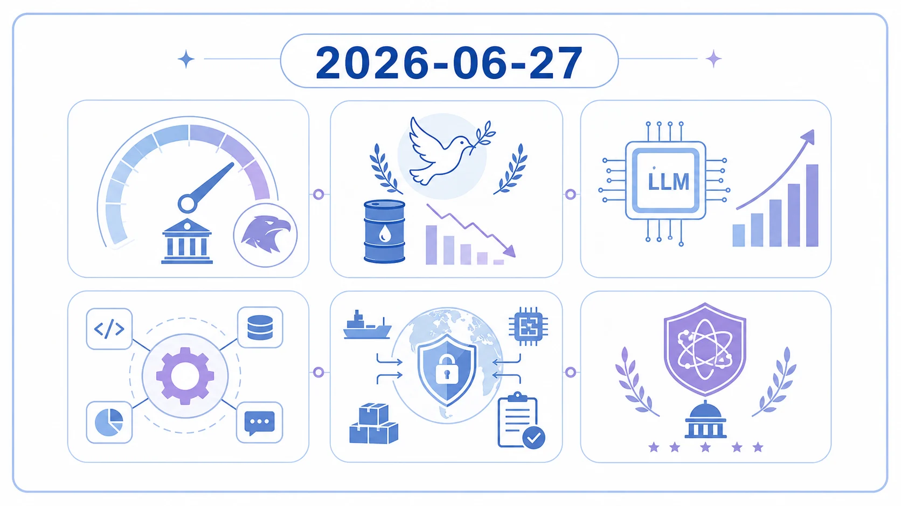

---

type: weekly_power_macro_intelligence
domain: Finance
week_end: 2026-06-27
source: agy
---

# Weekly Power & Macro Intelligence - 2026-06-27

*ChatGPT Image generated visual map for 2026-06-27; the report text below remains the source of record.*

## 0. 今週の支配的レジーム
- **中央銀行**: 利下げバイアスから利上げバイアス（tightening bias）への明確な転換。インフレ再燃リスクを最優先課題とするタカ派姿勢の強まり。
- **財政・政府**: 今週の適格根拠なし
- **関税・地政学**: イランとの暫定和平合意（US-Iran interim peace deal）の成立とそれに伴う原油価格の急落、ホルムズ海峡の再開交渉。
- **AI産業**: BroadcomとのLLM最適化推論チップの発表や「GPT-5.6 Preview」「Claude Tag」などの登場による、エージェント型ワークフローおよび半導体・インフラ需要の急拡大。
- **AI統治思想**: 国家安全保障と結びついた最先端AIモデルの輸出規制や、暗号攻撃・量子技術防衛に向けた大統領令を通じた国家管理・防衛重視のAI統治（AI Governance）への転換。

---

## 1. Market Metrics Dashboard
- **FactSet (S&P 500 Earnings Season Update - 各日付分)**:
  - アナリストはS&P 500の価格について、今後12ヶ月間で21%の上昇を予測（Industry Analysts Project 21% Increase in S&P 500 Price Over the Next 12 Months、John Butters報告）。
  - インフレ（Inflation）への言及回数は3四半期連続で増加し、3月15日から6月11日までの期間で220回の決算説明会で言及された。
  - AI（AI）への言及回数は、3月15日から6月11日までの期間に337回に達し、過去10年間で最高水準を記録。
  - Q2のボトムアップEPS見積もりは、4月〜5月にかけて2.5%増加（$78.84から$80.80へ上昇）。通常の過去5年・10年平均の減少傾向（1.6%減）に反して異例の上方修正となった（2026年5月29日時点の公式データ）。
- **S&P Global (S&P 500 EPS workbook)**:
  - 公表データ基準日（data_as_of）：2026-01-29（※公式のパブリックファイルは2026年1月をもって更新が終了）。
  - S&P 500 インデックスレベル基準値：6,969.01
  - 最新四半期行（latest quarterly row）：2025-09-30
  - 営業EPS（operating EPS）：72.03
  - 報告EPS（as reported EPS）：63.52
  - 1株当たり売上高（sales per share）：531.47
- **Yardeni Research (Morning Briefings / QuickTakes)**:
  - S&P 500は6月2日に史上最高値である 7,609.78 を記録した後、6月26日の金曜日終値までに3.4%下落。6月5日の調整局面では、S&P 500は 7,383.74（2.64%安）、Nasdaqは4.77%安となった。

- **指数EPSスコア**:
  - **S&P 500**: スコア未算定。
  - **S&P 500 IT**: スコア未算定。
  - **SOX proxy**: スコア未算定。
  - **Nasdaq-100**: スコア未算定。
  - **日経半導体**: スコア未算定。
  - **TOPIX**: スコア未算定。
  - **判定**: 様子見。
- **金・コモディティ**: 今週の適格根拠なし。
- **Pictet補助視点**: 今週の適格根拠なし。

## 2. 日銀/Fed: 割引率と為替
- **日銀の変化**: 今週の適格根拠なし
- **Fedの変化**: 2025年末の3回（計75bps）の利下げを経て、インフレリスクの上昇と労働市場の堅調さを背景に、前週のFOMCにて緩和バイアス（easing bias）から利上げバイアス（tightening bias）へピボット。新議長 Kevin Warsh はデビュー会見で dot は提供しなかったものの、物価安定の重要性を繰り返し強調する極めてタカ派的な姿勢を示した。
- **CME FedWatchとの乖離**: CME FedWatchに関する直接的な数値乖離の記述は存在しないが、直近のインフレ・雇用データの混在やFRBの急なタカ派ピボット、および利上げ期待の上昇（rising Fed rate hike expectations）が市場の警戒を誘っている。
- **円金利・ドル円・日本株への示唆**: 強い米国経済指標とFRBの利上げ懸念（rising Fed rate hike expectations）により、資本が米国へ再還流する動き（US share of ACW MSCI firming）が見られる。ドル高圧力および米金利の高止まりは円安と日本株マクロ環境に影響を及ぼす。

---

## 3. 日本政府/トランプ政権: 国家政策ショック
- **日本の財政・産業政策**: 高市政権の成長戦略や「骨太の方針」における実質賃金増加の議論（時間あたり労働生産性の引き上げと1人あたり労働時間の増加が焦点）。
- **JGB需給**: 今週の適格根拠なし
- **AI・半導体政策**: 今週の適格根拠なし
- **米国関税・輸出管理**: 最先端AIモデルに対する輸出規制措置が実施され、AI統治の転換点（米国政府が最先端AIを停止させた措置）となっている。
- **日本企業への波及**: ナフサ問題による物価上昇と供給不足懸念、さらに中国の重要鉱物輸出規制や軍需拡大に伴うタングステン価格急騰が、サプライチェーン再編に直面する日本企業へ下押し圧力を与える。

---

## 4. OpenAI/Anthropic: AI産業カーブ
- **モデル/製品の進化**: OpenAIが [GPT-5.6 Preview](https://openai.com/news/)（System Card公開）およびGPT-5を、Anthropicが [Claude Tag](https://www.anthropic.com/news)（チーム向け新機能）を発表。
- **enterprise adoption**: AWSが VP of Agentic AI の Swami Sivasubramanian のもとでエージェントを基盤としたAIスタックをローンチ。Bedrockに「Grok 4.3」を導入するなど、企業のAIエージェント活用が本格化。
- **AI safety / regulation**: 米国政府による最先端AIモデルの輸出規制措置の実施や、安全な自律エージェント運用に向けた「GPT-5.6 Preview System Card」の公開。
- **compute需要**: OpenAIとBroadcomが共同でLLM最適化推論チップを発表。AWSがNVIDIA Blackwell（RTX PRO 4500 Blackwell Server Edition）を搭載したAmazon EC2 G7インスタンスを発表し、推論インフラ需要が急拡大。
- **SBG NAV / AI株への示唆**: Broadcomとの半導体協業や Blackwell 採用など、AI半導体・電力インフラ（日本総研「AI競争の勝敗を左右する電力インフラ」）への投資テーマの裏付けとなり、ソフトバンクグループ（SBG）を含むAI・半導体・インフラ株のモメンタムを長期的に支える。

---

## 5. Altman/Dario: AI権力思想
- **今週の思想的変化**: 今週の適格根拠なし
- **国家との距離**: 今週の適格根拠なし
- **規制への姿勢**: 今週の適格根拠なし
- **民主化/集中/安全保障の論点**: 今週の適格根拠なし
- **投資テーマへの意味**: 今週の適格根拠なし

---

## 6. 投資仮説の更新
- **米株スイング**: 6月2日に record high の 7,609.78 を記録したS&P 500は、6月5日にかけ 7,383.74（2.64%安）へ下落（June Swoon）。バリュエーションの複数拡大（P/E倍率上昇）によるバブル警戒から、企業利益の成長が価格を上回る「FEMO（Fabulous Earnings Momentum）」への移行を注視。
- **日経/日本株**: 高市政権の成長戦略や実質賃金の動向を注視。ナフサ調達問題や電力インフラ不足がサプライチェーンや製造業の利益率を圧迫するリスクに備える。
- **SBG NAV**: BroadcomとOpenAIのチップ協業、NVIDIA Blackwell G7インスタンスの始動、および日本総研が指摘する電力インフラ需要の高まりは、SBG傘下のArmおよび関連AIポートフォリオの価値（NAV）を中長期的に支える。
- **AI半導体**: OpenAI×Broadcomのカスタム推論チップ開発、およびAWSのBlackwellサーバーEC2インスタンス導入により、高性能半導体およびそのインターコネクト技術を持つ企業への資本配分を強化。
- **製造業・素材**: タングステン価格急騰に見られる重要鉱物の中国規制・備蓄競争、およびナフサ供給不足は製造業のコスト増要因。S&P 500素材セクター（Materials）は利益成長に対して低ウェイトであり、Yardeni Researchはオーバーウェイトを推奨。
- **為替・金利**: 米FRB（新議長 Kevin Warsh）のタカ派ピボットと利上げ懸念（rising Fed rate hike expectations）により、ドル金利の高止まりとドル還流（強ドル維持）が継続する前提。

---

## 7. 反証リスト
- **既存仮説と矛盾した情報**: FRBの利下げバイアスの継続および年内の安定した金融緩和を見込む仮説。
- **重み**: 極めて重い。FOMCは前週に緩和（easing bias）から緊縮（tightening bias）へと明確にピボットしており、前提条件そのものが崩壊した。
- **対応**: ポジションの金利感応度を見直し、強気な金利低下シナリオに依存するグロース株の配分を縮小、好調な決算裏付けのある銘柄（FEMO株）およびエネルギー・素材などのインフレヘッジセクターへのローテーションを進める。

---

## 8. 来週の行動
- **売買**: S&P 500 Materials セクターの押し目買い検討。金利高環境に耐性のない金利高感応銘柄の削減。
- **調査**: [GPT-5.6 Preview System Card](https://openai.com/news/)の技術仕様およびエージェント実行能力、およびBroadcom×OpenAIのチップ性能の調査。
- **発信**: 「Kevin Warsh新FRB議長のタカ派ピボットが引き起こしたJune Swoonと、FEMOレジームへの移行」に関する解説記事の執筆。

---

## 9. 重要ソースTop 10

1. **GPT‑5.6 Preview System Card**
   - **source**: OpenAI News
   - **layer**: L3
   - **source_class**: frontier_ai_lab
   - **published_date**: 2026-06-26
   - **url**: [https://openai.com/news/](https://openai.com/news/)
   - **KAFKAにとっての意味**: 次世代フロンティアモデルのリリース前評価書であり、エージェント機能の向上とそれに伴うインフラ要件を規定する。
   - **用途**: 研究・記事化

2. **OpenAI and Broadcom unveil LLM-optimized inference chip**
   - **source**: OpenAI News
   - **layer**: L3
   - **source_class**: frontier_ai_lab
   - **published_date**: 2026-06-25
   - **url**: [https://openai.com/news/](https://openai.com/news/)
   - **KAFKAにとっての意味**: エヌビディア一強への対抗軸としてのカスタムシリコンの台頭、BroadcomのAI半導体バリューチェーンにおける地位強化。
   - **用途**: 投資・記事化

3. **Introducing Claude Tag**
   - **source**: Anthropic Newsroom
   - **layer**: L3
   - **source_class**: frontier_ai_lab
   - **published_date**: 2026-06-23
   - **url**: [https://www.anthropic.com/news](https://www.anthropic.com/news)
   - **KAFKAにとっての意味**: チーム協働におけるエージェント型UIの進化と、エンタープライズAI利用の敷居低下。
   - **用途**: 研究・記事化

4. **Is The Dollar Debasement Trade Kaput?**
   - **source**: Yardeni Research Morning Briefings
   - **layer**: L0
   - **source_class**: market_expectation
   - **published_date**: 2026-06-25
   - **url**: [https://www.yardeniquicktakes.com/](https://www.yardeniquicktakes.com/)
   - **KAFKAにとっての意味**: FRBのタカ派への方針転換と米国経済の強靭さによる、ドル安トレードの前提崩壊。
   - **用途**: 投資

5. **US MARKET CALL: June Swoon!**
   - **source**: Yardeni Research QuickTakes Archive Page 3
   - **layer**: L0
   - **source_class**: market_metrics
   - **published_date**: 2026-06-07
   - **url**: [https://www.yardeniquicktakes.com/page/3/](https://www.yardeniquicktakes.com/page/3/)
   - **KAFKAにとっての意味**: 雇用統計等の上振れと利上げ警戒がトリガーとなった6月株価調整の記録。
   - **用途**: 投資

6. **AWS Weekly Roundup (June 22, 2026)**
   - **source**: AWS News Blog
   - **layer**: L3
   - **source_class**: frontier_ai_lab
   - **published_date**: 2026-06-22
   - **url**: [https://aws.amazon.com/blogs/aws/](https://aws.amazon.com/blogs/aws/)
   - **KAFKAにとっての意味**: NVIDIA Blackwellを搭載したG7インスタンスの開始と、BedrockへのGrok 4.3等のマルチモデル統合。
   - **用途**: 投資・研究

7. **藤波匠／ビューポイント No.2026-012 AI競争の勝敗を左右する電力インフラ**
   - **source**: 日本総研 経済・政策レポート
   - **layer**: L5
   - **source_class**: official_macro
   - **published_date**: 2026-06-25
   - **url**: [https://www.jri.co.jp/report/year/](https://www.jri.co.jp/report/year/)
   - **KAFKAにとっての意味**: AI競争のボトルネックが計算資源から送配電・発電インフラへ完全に移行したことの証左。
   - **用途**: 投資・記事化

8. **米国政府はなぜ最先端AIを停止させたのか**
   - **source**: 大和総研 経済分析レポート
   - **layer**: L5
   - **source_class**: official_macro
   - **published_date**: 2026-06-23
   - **url**: [https://www.dir.co.jp/report/research/economics/index.html](https://www.dir.co.jp/report/research/economics/index.html)
   - **KAFKAにとっての意味**: 米国政権による安全保障目的のAI直接介入（輸出規制）とそのインパクト。
   - **用途**: 研究・記事化

9. **王婷／Economist Column No.2026-034 【サプライチェーン再編シリーズ⑦】タングステン価格急騰と重要鉱物サプライチェーン再編への追い風**
   - **source**: 日本総研 経済・政策レポート
   - **layer**: L5
   - **source_class**: official_macro
   - **published_date**: 2026-06-22
   - **url**: [https://www.jri.co.jp/report/year/](https://www.jri.co.jp/report/year/)
   - **KAFKAにとっての意味**: 中国規制と軍需拡大による重要鉱物サプライチェーンのリスクと投資妙味。
   - **用途**: 投資・記事化

10. **熊谷亮丸の経済・金融 Foresight 高市政権の成長戦略、骨太の方針で実質賃金は本当に増加するのか？**
    - **source**: 大和総研 経済分析レポート
    - **layer**: L5
    - **source_class**: official_macro
    - **published_date**: 2026-06-25
    - **url**: [https://www.dir.co.jp/report/research/economics/index.html](https://www.dir.co.jp/report/research/economics/index.html)
    - **KAFKAにとっての意味**: 国内実質賃金増加の実現可能性を測るためのマクロ枠組み（生産性と労働時間の分解）。
    - **用途**: 記事化

---

## 10. コンテンツ化候補

- **タイトル案**: 「June Swoon」から「FEMO」へ：強すぎる米国経済が引き起こしたFRBのタカ派大転換
  - **根拠URL**: [https://www.yardeniquicktakes.com/](https://www.yardeniquicktakes.com/)
  - **切り口**: 利下げ期待でバリュエーションを膨らませる「FOMO」相場が、Warsh新FRB議長の下での「利上げバイアスへのピボット」によって破壊され、企業業績そのもので株価を正当化する「FEMO」への移行が始まったメカニズム。
  - **想定読者**: 米国株投資家、マクロ経済に関心があるビジネスパーソン
  - **1段落要旨**: 2025年末に利下げを3回行ったFRBは、インフレ圧力の再燃を受け急遽タカ派へ転換した。これにより市場は一時的な調整（June Swoon）を迎えたが、これは単なる崩壊ではなく、期待先行のバブル相場から、堅調な実質経済成長と利益拡大を背景とした「Fabulous Earnings Momentum (FEMO)」レジームへの健全な移行期である可能性を分析する。

- **タイトル案**: 計算資源から「電力インフラ」へ：AI覇権競争の主戦場シフトと輸出規制の行方
  - **根拠URL**: [https://www.jri.co.jp/report/year/](https://www.jri.co.jp/report/year/) / [https://www.dir.co.jp/report/research/economics/index.html](https://www.dir.co.jp/report/research/economics/index.html)
  - **切り口**: GPT-5.6 PreviewやClaude Tag等の進化でAIエージェントの適用が進む中、日本総研が指摘する「電力インフラ」の制約と、大和総研が解説する最先端AI輸出規制の意図を交差させて解説。
  - **想定読者**: ITベンチャー経営者、半導体・エネルギー関連セクターの投資家
  - **1段落要旨**: OpenAIとBroadcomの推論チップ提携やAWSへのBlackwell導入に見られるように、AIモデルの実行とエージェント展開は加速している。しかし、そのボトルネックはすでにチップ単体から「電力グリッド」へと移行しており、さらに米国政府による最先端AIの輸出管理が安全保障上の強力なカードとして発動される中、今後のAIインフラ投資がどのように変容するかを地政学と技術の両面から明らかにする。

---
