# NASDAQ100 2x vs NASDAQ100 + Gold 200%

Reproducible long-horizon test for:

- NASDAQ100 1x
- NASDAQ100 daily 2x
- NASDAQ100 100% + Gold 100% daily rebalance
- NASDAQ100 100% + Gold 100% monthly rebalance
- Gold 1x
- Optional S&P 500 analogues
- USD and JPY investor views

Run:

```bash
python3 research/ndx-gold-leverage/run_analysis.py
```

Primary generated outputs land in `research/ndx-gold-leverage/outputs/`.

## Output Figures

The analysis generates the following PNG figures under `outputs/figures/`.

### Cumulative Wealth

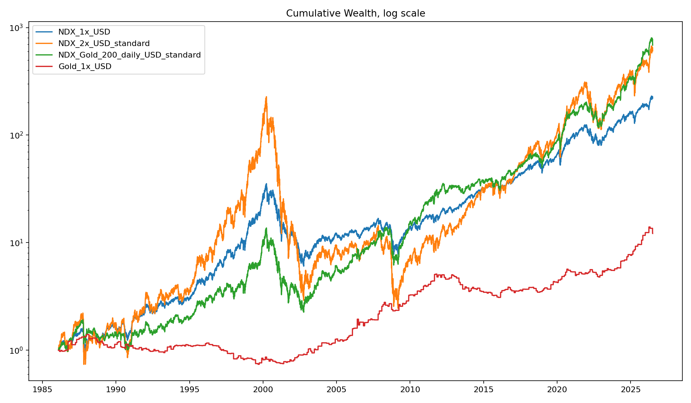

### Drawdowns

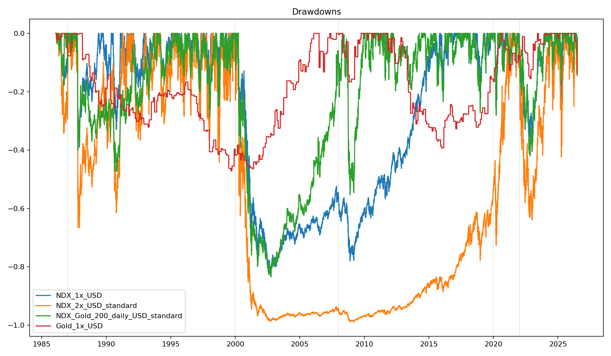

### Rolling CAGR

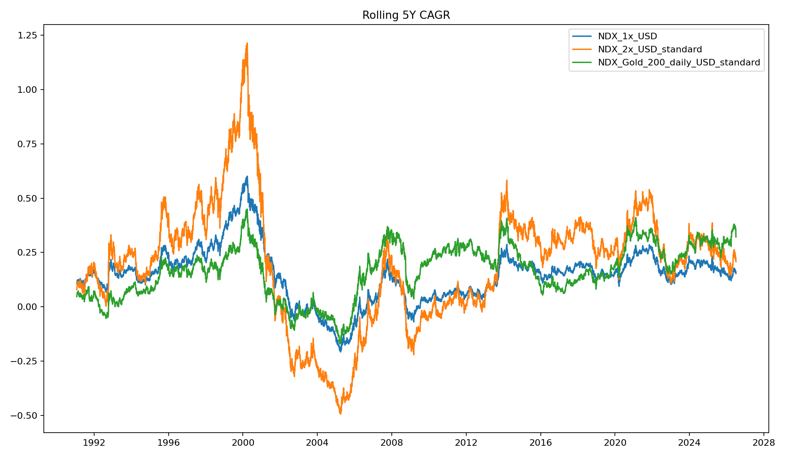

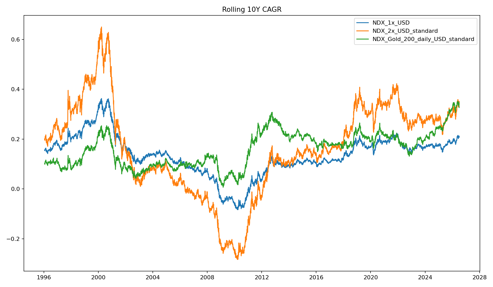

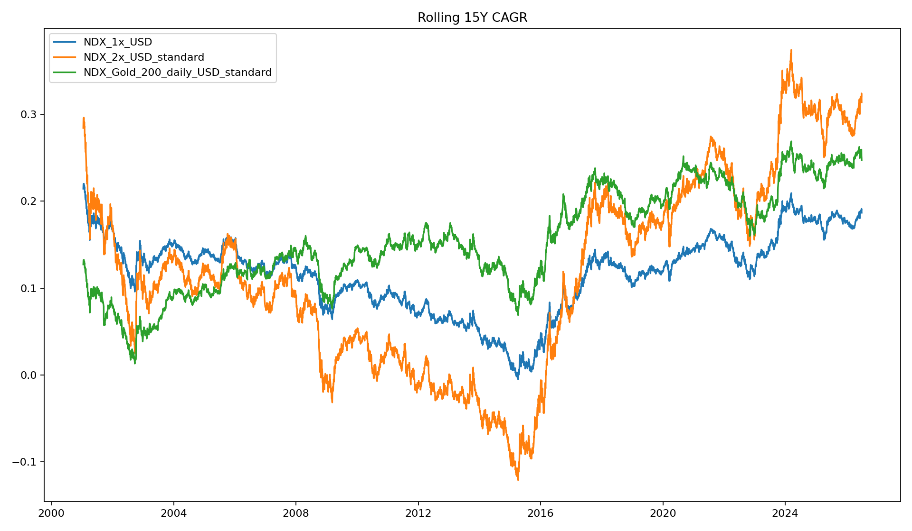

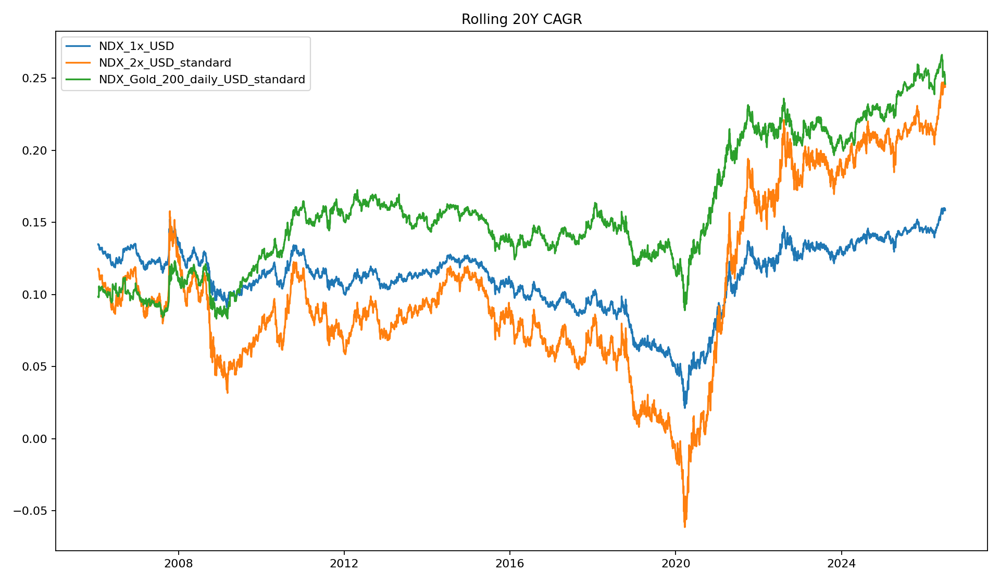

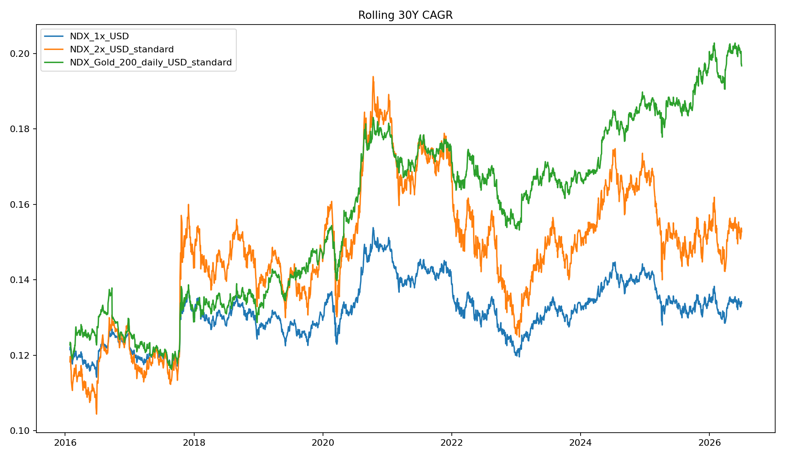

### Rolling Max Drawdown

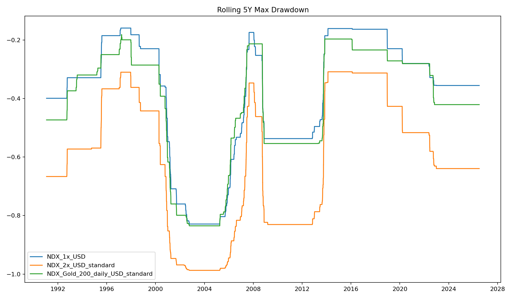

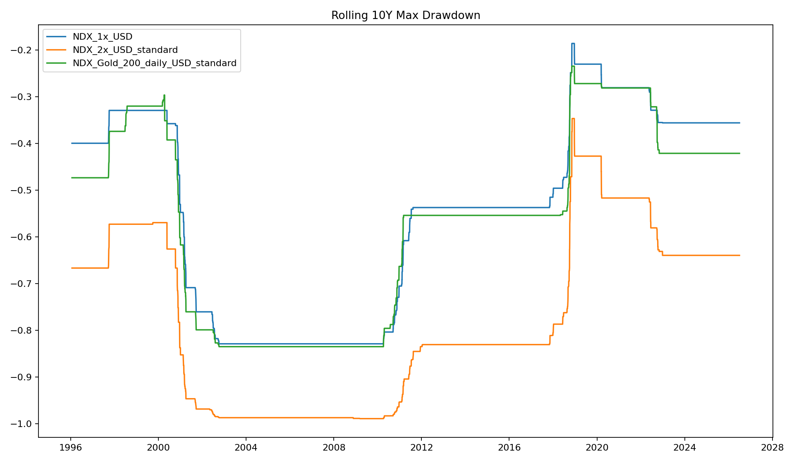

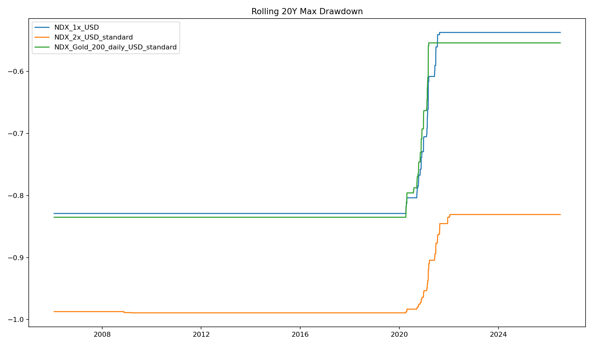

### Stock / Gold Relationship

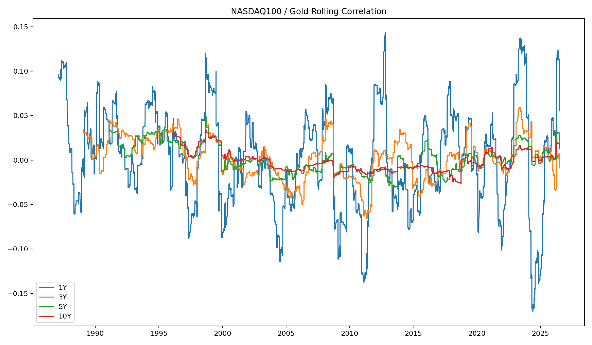

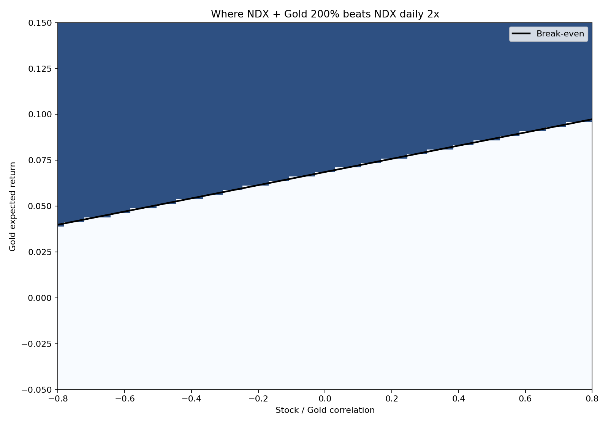
